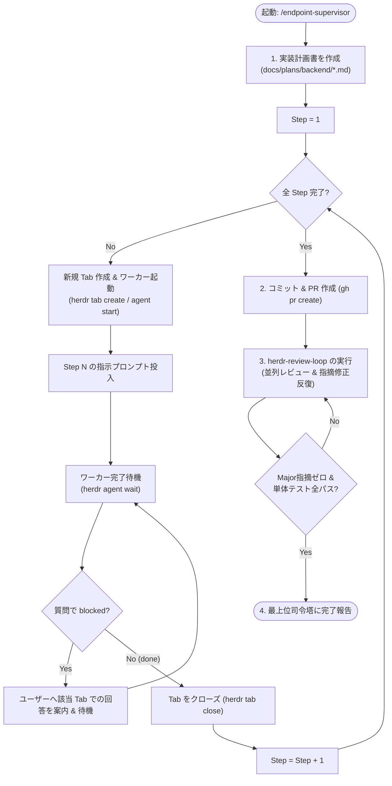

# Endpoint Supervisor (Layer 2)

このスキルは、**単一エンドポイントの実装ライフサイクル（計画策定 → ステップ別実装 → PR作成 → レビュー＆修正ループ）を自律完遂する監督者エージェント**です。
専用の Git Worktree および Herdr Workspace 内で動作し、直接大きなコード変更を行わず、**各ステップごとに専用のワーカーTab（1 Tab = 1 Agent）を作成・指示・破棄**して安全に進行します。

---

## 🎯 前提と原則

1. **環境前提**:
   - `HERDR_ENV=1` で動作していること（Herdr 管理下）。
   - 専用の `git worktree` ディレクトリ（`.worktrees/issue-<N>/`）配下であること。
2. **1 Tab = 1 Agent の原則**:
   - 実装作業（Step 1〜N）は必ず新規 Tab（`herdr tab create`）を作成し、その中のワーカーエージェントに委譲する。
   - 1 つの Step が完了したら、そのワーカー Tab をクローズ（`herdr tab close`）してコンテキストをクリーンに保つ。
3. **人間回答の尊重**:
   - ワーカーが質問で `blocked`（承認・確認待ち）になった場合、**監督者が回答を代行しない**。
   - 画面やログを確認し、ユーザーに「タブ `<tab_id>` で回答してください」と知らせ、ユーザーの直接入力を待つ。

---

## 📋 進行フェーズ



---

### Phase 1: 実装計画書（`docs/plans/backend/*.md`）の策定

1. 担当エンドポイントの仕様を確認：
   - `@docs/design/api_design/` 配下の該当 API 定義
   - `@docs/design/database_design.md` の関連テーブル定義
   - `@docs/design/process_design/` の業務フロー
   - `@backend/TESTING_GUIDE.md` のテスト作成規約（Code-as-Docs、アサーション規約）
2. 計画書ファイル `docs/plans/backend/<kebab-endpoint-name>.md` を作成：
   - **Step 1**: テストデータ・単体テストコード作成（`backend/<pkg>/<name>_test.go`）
   - **Step 2**: プログラム本体実装（`model`, `repository`, `service`, `handler`, `router`）
   - **Step 3**: 単体テスト実行（`backend/` で `go test -v ./...`）
   - **Step 4**: プログラム修正（失敗時）→ Step 3 に戻る

---

### Phase 2: ステップ個別実行（Step 1〜N）

計画書の各 Step に対し、個別のワーカー Tab を起動して作業させます。
下記プロンプトは入力例です。環境に応じて、そのタスクを行うために必要な適切なコマンドを実行してください。

```bash
# 1. Step N 専用 Tab の作成
TAB_RES=$(herdr tab create --cwd "$PWD" --label "step-${STEP_NUM}-worker" --no-focus)
TAB_ID=$(printf '%s\n' "$TAB_RES" | jq -r '.result.tab.tab_id')
PANE_ID=$(printf '%s\n' "$TAB_RES" | jq -r '.result.root_pane.pane_id')

# 2. ワーカー起動
WORKER_NAME="step-${STEP_NUM}-worker"
herdr agent start "$WORKER_NAME" --kind agy --pane "$PANE_ID"

# 3. プロンプト投入
PROMPT="/grill-me docs/plans/backend/${ENDPOINT_NAME}.md の Step. ${STEP_NUM} を実行してください。
- backend/TESTING_GUIDE.md の命名規則・Code-as-Docs 原則を厳守すること。
- 検証は backend/ ディレクトリで 'go test -v ./...' を実行すること。
- 疑問点や設計確認があれば、このタブでユーザーに質問して停止すること。
完了したらテスト結果と変更サマリを報告してください。"

herdr agent prompt "$WORKER_NAME" "$PROMPT"

# 4. 監視ループ
while true; do
  herdr agent wait "$WORKER_NAME" --timeout 300000 || true
  STATUS=$(herdr agent get "$WORKER_NAME" | jq -r '.result.agent.status // empty')

  if [ "$STATUS" = "blocked" ]; then
    echo "⚠️ ワーカー ($WORKER_NAME / Tab: $TAB_ID) が質問・確認でブロックされています。"
    echo "ユーザーの皆様へ: Herdr でタブ [$TAB_ID] に切り替えて回答を入力してください。"
    sleep 10
  elif [ "$STATUS" = "idle" ] || [ "$STATUS" = "done" ]; then
    echo "✅ ワーカー ($WORKER_NAME) が完了しました。"
    break
  fi
done

# 5. ワーカー Tab の破棄
herdr tab close "$TAB_ID"
```

---

### Phase 3: コミット & Pull Request の作成

全 Step の実装および `go test ./...` 通過を確認後、ブランチをプッシュして PR を作成します。

```bash
git add .
git commit -m "feat(backend): implement ${ENDPOINT_NAME} (closes #${ISSUE_NUM})"
git push -u origin HEAD

PR_RES=$(gh pr create \
  --title "feat(backend): ${ISSUE_TITLE}" \
  --body "## 概要
Issue #${ISSUE_NUM} のエンドポイント実装です。

## 実装内容
- 実装計画書: \`docs/plans/backend/${ENDPOINT_NAME}.md\`
- 単体テスト追加 (\`backend/TESTING_GUIDE.md\` 準拠)
- API 実装 (handler, service, repository, model, router)

## 検証結果
\`go test ./...\` 全単体テスト通過確認済み。" \
  --base main)

PR_NUM=$(gh pr view --json number -q .number)
echo "Pull Request #${PR_NUM} created: ${PR_RES}"
```

---

### Phase 4: レビュー＆修正ループ（`herdr-review-loop` 連携）

作成した PR に対し、既存のレビュー＆修正スキルを実行します。

```bash
PROMPT="/herdr-review-loop
PR #${PR_NUM} のレビューを実施し、指摘事項の修正と再レビューを行ってください。
レビュー観点:
1. テストの内容は適切・十分か (backend/TESTING_GUIDE.md 準拠か)
2. 動作は正常か、単体テストは全パスしているか
3. コード品質・エラーハンドリング・保守性に問題はないか
4. @docs/design/ 配下の仕様と矛盾・欠落していないか

Major 指摘が 0 件になり、全単体テストがパスするまで修正・再レビューを反復してください。"

# レビュー修正ループを実行
herdr agent prompt "$HERDR_PANE_ID" "$PROMPT" --wait
```

---

### Phase 5: 完了報告

レビュー指摘の解消およびテスト通過が完了したら、最上位司令塔（Top Orchestrator）に向けて以下の形式で完了報告を出力します。

```markdown
## ✅ エンドポイント実装・検証完了報告
- **Issue**: #{{ISSUE_NUM}} ({{ISSUE_TITLE}})
- **PR**: #{{PR_NUM}}
- **Status**: 全単体テストパス、Majorレビュー指摘 0件
- **次のアクション**: 最上位司令塔による人間の最終承認・PRマージ
```
