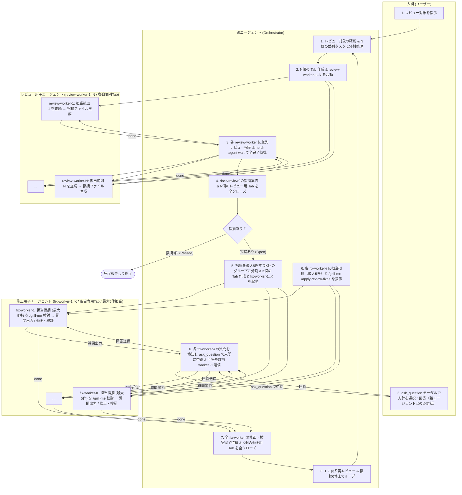

# herdr-review-loop Skill

このスキルは、`herdr` CLI（マルチエージェントオーケストレーションランタイム）を活用し、**親エージェント（Orchestrator）が子エージェント（Worker）のライフサイクル管理とタスクオーケストレーションを全自動制御**します。

レビュー対象が複数の場合は並列可能な範囲に分割して複数のレビュー用子エージェント（1 worker につき 1 tab）で並列査読を行い、レビュー完了後に一旦ワーカーを破棄します。指摘が存在する場合は、指摘ファイル群を修正対象・関連度ごとに1ワーカーあたり最大5件に分割し、グループ数に応じた修正用エージェント（`fix-worker-1..K`）を新規 Tab で起動して `/grill-me` と修正適用（`apply-review-fixes`）を並列実行します。各修正ワーカーからの質問は親エージェントが `ask_question` ツールを介してユーザーと中継し、すべてのレビュー指摘が解消されるまでこのサイクルを自動反復します。

---

## 🎯 役割とメンタルモデル



---

## 📋 実行フロー

### 1. レビュー対象の確認・分割整理とディレクトリの確定

1. ユーザーからの指示で指定されたレビュー対象（複数の仕様書・ファイル群、本ブランチの変更点、または特定ファイル内の複数セクション/観点など）を確認します。
2. **レビュー対象の分割整理**:
   - **複数ファイルの場合**: ファイル単位またはディレクトリ/モジュール単位に分割します。
   - **1ファイル内に複数のレビュー対象や観点がある場合**: 章・機能単位、または査読観点（例: データモデル/整合性観点、セキュリティ/バリデーション観点、API設計/エラーハンドリング観点など）ごとに分割します。
   - **単一ファイル・単一対象の場合**: 分割数は 1（`worker-1` のみ）とします。
3. `git branch --show-current` でブランチ名を取得し、スラッシュ等をハイフンに置換して `<sanitized-branch>` を確定します（例: `review-requirement-definition`）。
4. 指摘ファイル保存先ディレクトリ `docs/review/<sanitized-branch>/` を確認・特定します。

---

### 2. 分割数に応じた Tab 作成とレビュー用子エージェントの起動

分割した $N$ 個のレビュー対象（`TARGETS`）に応じて、**1 worker につき 1 つの Tab を新規作成**し、作成された Tab のルートペインで子エージェント（`worker-1`, `worker-2`, ..., `worker-N`）を起動します。

```bash
# 1. 分割したレビュー対象リスト（N個）を配列で定義
TARGETS=(
  "docs/spec/auth.md"
  "docs/spec/billing.md"
  "docs/spec/api.md"
)

# 2. 各対象ごとに Tab を作成し、worker-1..N を起動
REVIEW_TAB_IDS=()

for i in "${!TARGETS[@]}"; do
  WORKER_ID="worker-$((i+1))"

  # 1 worker につき 1 つの新規 Tab を作成（作業ディレクトリとラベルを指定、背景実行のため --no-focus）
  CREATE_RES=$(herdr tab create --cwd "$PWD" --label "$WORKER_ID" --no-focus)

  TAB_ID=$(printf '%s\n' "$CREATE_RES" | jq -r '.result.tab.tab_id')
  PANE_ID=$(printf '%s\n' "$CREATE_RES" | jq -r '.result.root_pane.pane_id')

  REVIEW_TAB_IDS+=("$TAB_ID")

  # 作成された Tab の root_pane でエージェントを起動
  herdr agent start "$WORKER_ID" --kind agy --pane "$PANE_ID"
done
```

> [!NOTE]
> 作成した各 Tab ID 配列（`REVIEW_TAB_IDS`）は、レビュー完了後のクローズ処理のために保持しておきます。

---

### 3. 子エージェントへの並列レビュー指示と完了待機

親エージェントから各子エージェントに対し、担当範囲を指定したプロンプトを非同期（`--wait` を付けない）で一斉送信し、並列査読を開始させた後、`herdr agent wait` で全ワーカーの完了を待機します。

#### 3-1. 並列プロンプトの一斉送信

```bash
# 全 worker に非同期（--wait なし）でプロンプトを一斉投入
for i in "${!TARGETS[@]}"; do
  WORKER_ID="worker-$((i+1))"
  TARGET="${TARGETS[$i]}"
  herdr agent prompt "$WORKER_ID" "/review /review-changes $TARGET"
done

# プロンプト受付とワーカー起動開始のための短い待機
sleep 2
```

#### 3-2. 全子エージェントの完了待機

各子エージェントの完了状態を `herdr agent wait` コマンドで順次待機します。
(`--until` は明示指定せずデフォルト動作を利用します。)

```bash
# 全 worker の査読完了を順次待機 & ステータス確認
for i in "${!TARGETS[@]}"; do
  WORKER_ID="worker-$((i+1))"
  # デフォルトで settled 状態（idle, done, blocked）を待機
  herdr agent wait "$WORKER_ID" --timeout 300000

  # 状態を確認し、blocked（ダイアログ/承認待ち）の場合は画面を確認
  STATUS=$(herdr agent get "$WORKER_ID" | jq -r '.result.agent.status // empty')
  if [ "$STATUS" = "blocked" ]; then
    echo "Warning: $WORKER_ID is blocked. Inspecting output:"
    herdr agent read "$WORKER_ID" --source recent-unwrapped --lines 30
  fi
done
```

これによって、すべての並列子エージェントがそれぞれの査読および `docs/review/<sanitized-branch>/` 配下への指摘ファイル生成を完了（または安定状態に到達）するまで親エージェントは自動待機します。

---

### 4. 成果報告の確認とレビュー用 Tab の全クローズ

1. `docs/review/<sanitized-branch>/` 配下の全 `.md` ファイルをスキャンし、ヘッダー付近に `- **Status**: Open` が含まれるファイルを抽出・集約します。
2. **レビュー用ワーカーの全 Tab をクローズしてリソース・履歴を解放します**：

```bash
# レビュー用ワーカーの全 Tab をクローズ
for TAB_ID in "${REVIEW_TAB_IDS[@]}"; do
  herdr tab close "$TAB_ID"
done
```

3. **終了判定**:
   - **`Status: Open` が 0件の場合**:
     - ユーザーに「すべてのレビューチェックを通過しました。修正が必要な指摘はありません。」と完了報告を行い、**処理を終了します**。
   - **`Status: Open` が 1件以上存在する場合**:
     - 次のステップ（Step 5）に進み、指摘のグループ分割と修正サイクルを開始します。

---

### 5. 指摘のグループ分割（最大5件/worker）と修正用 Tab / エージェントの起動

指摘事項が多い場合に 1 つのエージェントでコンテキスト溢れや対応漏れが発生するのを防ぐため、**1 つの fix-worker が担当する指摘ファイルは最大 5 件まで**とします。

1. **指摘ファイルのグループ化（最大5件 / グループ）**:
   - 抽出されたオープンな指摘ファイル群について、同一または関連するソースコード・仕様書を修正する指摘同士を優先してまとめます。
   - 1 グループあたりの指摘ファイル数が最大 5 件になるよう $K$ 個のグループ（`FIX_GROUP_1`, `FIX_GROUP_2`, ..., `FIX_GROUP_K`）に分割します。
2. **グループ数 $K$ に応じた新規 Tab 作成と `fix-worker-1..K` の起動**:

```bash
# 各グループごとに Tab を作成し、fix-worker-1..K を起動
FIX_TAB_IDS=()
NUM_FIX_GROUPS=${#FIX_GROUPS[@]} # グループ数 K

for i in $(seq 1 $NUM_FIX_GROUPS); do
  WORKER_ID="fix-worker-$i"
  RES_FIX=$(herdr tab create --cwd "$PWD" --label "$WORKER_ID" --no-focus)
  FIX_TAB=$(printf '%s\n' "$RES_FIX" | jq -r '.result.tab.tab_id')
  FIX_PANE=$(printf '%s\n' "$RES_FIX" | jq -r '.result.root_pane.pane_id')
  FIX_TAB_IDS+=("$FIX_TAB")

  herdr agent start "$WORKER_ID" --kind agy --pane "$FIX_PANE"
done
```

---

### 6. apply-review-fixes の並列指示と対話型方針ヒアリングの中継

各 `fix-worker-i` に担当する指摘ファイル（最大5件）を渡し、親エージェントが司令塔として質問の中継と進行管理を行います。**ユーザーは親エージェントとのみ対話します**。

#### 6-1. 各 fix-worker へのプロンプト一斉投入（非同期）

```bash
for i in $(seq 1 $NUM_FIX_GROUPS); do
  WORKER_ID="fix-worker-$i"
  # グループ i に割り当てられた最大5件の指摘ファイルリストを展開
  ISSUES="${FIX_GROUPS[$((i-1))]}"

  PROMPT="/grill-me /apply-review-fixes
担当指摘ファイル:
$ISSUES
上記の指摘内容（最大5件）を確認し、修正方針を検討してください。修正方針に選択肢や確認事項がある場合は、具体的な質問と選択肢を提示してください。"

  # 非同期（--wait なし）で送信
  herdr agent prompt "$WORKER_ID" "$PROMPT"
done

sleep 2
```

#### 6-2. 親エージェントによる質問の検知・ユーザーへの `ask_question` 中継

親エージェントは各 `fix-worker-i` の状態を順次巡回・監視します。子エージェントが方針検討を行い、質問を出力して待機状態（または settled / blocked 状態）になったことを検知した場合、**親エージェントが `ask_question` ツールを呼び出してユーザーへ提示**します。

1. **出力の読み取り**:
   ```bash
   herdr agent read "$WORKER_ID" --source recent-unwrapped --lines 50
   ```
2. **親エージェントによる `ask_question` の実行**:
   - 質問内容、どのワーカー（例: `fix-worker-1`）およびどの指摘ファイルに関するものかを明確にして `ask_question` モーダルを表示します。
   - ユーザーは選択肢からの選択、または自由記述入力で回答します。
3. **ユーザー回答の該当 worker への送信**:
   - 取得したユーザーの回答を該当する `fix-worker-i` にのみ送信し、修正作業を開始させます。

   ```bash
   herdr agent prompt "$WORKER_ID" "ユーザーからの回答: <ユーザーが選択・入力した回答テキスト>。この方針に従って修正作業（仕様書・コードの修正およびテスト検証）を進めてください。"
   ```

> [!IMPORTANT]
> - 各 fix-worker が独自に直接ユーザーと対話することはありません。
> - 質問が発生した fix-worker から順次即座に `ask_question` を通じてユーザーに回答を仰ぎ、回答が得られた worker から順次修正・テスト検証作業へ移行させます。

---

### 7. 修正・テスト検証の完了待機と修正用 Tab の全クローズ

1. 親エージェントは、全 `fix-worker-1..K` が仕様書・コードの修正、回帰テストの実行、および担当指摘ファイルのヘッダー更新（`- **Status**: Resolved`）と完了報告の追記を終え、完了（`done` / `idle`）になるまで待機します。

```bash
# 全 fix-worker の完了を順次待機
for i in $(seq 1 $NUM_FIX_GROUPS); do
  WORKER_ID="fix-worker-$i"
  herdr agent wait "$WORKER_ID" --timeout 600000
done
```

2. すべての `fix-worker` の修正・検証完了を確認後、**作成したすべての修正用 Tab をクローズしてリソースを解放します**：

```bash
# 全修正用 Tab をクローズ
for TAB_ID in "${FIX_TAB_IDS[@]}"; do
  herdr tab close "$TAB_ID"
done
```

---

### 8. 再レビュー＆修正サイクルの反復（Iteration）

1. 修正結果を再検証するため、**Step 1 に戻ります**。
2. レビュー対象を再度確認・分割し、新規にレビュー用 Tab / 子エージェントを起動して並列査読を実行します。
3. **Step 1 〜 Step 7 のサイクルを、Step 4 で `Status: Open` が完全に 0件になるまで繰り返します。**

---

### 9. 終了

レビューで指摘が 0件になった時点で、全体の修正履歴とレビュー通過結果をユーザーにまとめて報告し、ループを終了します。

---

## 🛠 トラブルシューティング

- **子エージェントが `blocked`（承認・ダイアログ待ち）になった場合**:
  `herdr agent read <target> --source recent-unwrapped` でプロンプトや質問内容を確認し、`herdr agent send-keys <target> enter` や `y`、または追加の `herdr agent prompt` で対応してください。
- **Tab / Pane の終了漏れが発生した場合**:
  `herdr tab list` で生存している不要な Tab を確認し、`herdr tab close <tab_id>` で明示的にクローズしてください。
- **`agent_prompt_stalled` エラーが発生した場合**:
  エージェントがプロンプトを受信しても 5秒以内に状態変化が観測されなかったことを示します。`herdr agent list` や `herdr agent read <target> --source recent-unwrapped` で状態を確認し、必要に応じて `herdr agent send-keys <target> enter` を送信して復帰させてください。
- **子エージェントの応答が停止した場合**:
  `herdr agent read <target> --source recent-unwrapped` で最新ログを確認し、ダイアログ待ち等の場合は `herdr agent send-keys <target> esc` や `enter` でレスキューします。
- **タイムアウトが発生した場合**:
  大規模なテスト実行やレビュー処理では、`--timeout 600000`（10分）のようにタイムアウト時間を長めに設定してください。
