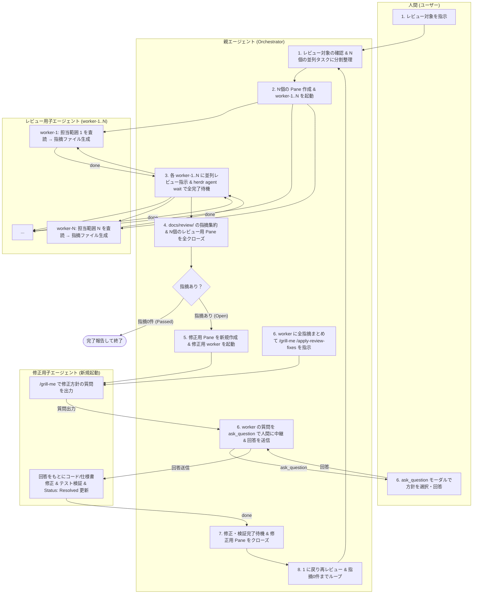

# herdr-review-loop Skill

このスキルは、`herdr` CLI（マルチエージェントオーケストレーションランタイム）を活用し、**親エージェント（Orchestrator）が子エージェント（Worker）のライフサイクル管理とタスクオーケストレーションを全自動制御**します。

レビュー対象が複数の場合は並列可能な範囲に分割して複数の子エージェントで並列査読を行い、レビュー完了後に一旦ワーカーを破棄します。指摘が存在する場合は新しく単一の修正用エージェントを起動して `/grill-me` と `ask_question` ツールによる方針ヒアリングおよび修正適用（`apply-review-fixes`）を一括して行い、すべてのレビュー指摘が解消されるまでこのサイクルを自動反復します。

---

## 🎯 役割とメンタルモデル



---

## 📋 実行フロー

### 1. レビュー対象の確認・分割整理とディレクトリの確定

1. ユーザーからの指示で指定されたレビュー対象（複数の仕様書・ファイル群、本ブランチの変更点、または特定ファイル内の複数セクション/観点など）を確認します。
2. **レビュー対象の分割整理**:
   - **複数ファイルの場合**: ファイル単位またはディレクトリ/モジュール単位に分割します。
   - **1ファイル内に複数のレビュー対象や観点がある場合**: 章・機能単位、または査読観点（例: データモデル/整合性観点、セキュリティ/バリデーション観点、API設計/エラーハンドリング観点など）ごとに分割します。
   - **単一ファイル・単一対象の場合**: 分割数は 1（`worker-1` のみ）とします。
3. `git branch --show-current` でブランチ名を取得し、スラッシュ等をハイフンに置換して `<sanitized-branch>` を確定します（例: `review-requirement-definition`）。
4. 指摘ファイル保存先ディレクトリ `docs/review/<sanitized-branch>/` を確認・特定します。

---

### 2. 分割数に応じた Pane 作成とレビュー用子エージェントの起動

分割した $N$ 個のレビュー対象（`TARGETS`）に応じて、親エージェントの作業領域とは別に Pane を分割作成し、子エージェント（`worker-1`, `worker-2`, ..., `worker-N`）を起動します。

```bash
# 1. 分割したレビュー対象リスト（N個）を配列で定義
TARGETS=(
  "docs/spec/auth.md"
  "docs/spec/billing.md"
  "docs/spec/api.md"
)

# 2. 各対象ごとに Pane を作成し、worker-1..N を起動
PANE_IDS=()
PREV_PANE=""

for i in "${!TARGETS[@]}"; do
  WORKER_ID="worker-$((i+1))"

  if [ $i -eq 0 ]; then
    # 最初の worker は親 Pane から右に分割
    SPLIT_RES=$(herdr pane split --current --direction right --no-focus)
  else
    # 2つ目以降の worker は直前の worker Pane から下に分割
    SPLIT_RES=$(herdr pane split --pane "$PREV_PANE" --direction down --no-focus)
  fi

  PANE_ID=$(printf '%s\n' "$SPLIT_RES" | jq -r '.result.pane.pane_id')
  PANE_IDS+=("$PANE_ID")
  PREV_PANE="$PANE_ID"

  # エージェントを起動
  herdr agent start "$WORKER_ID" --kind agy --pane "$PANE_ID"
done
```

> [!NOTE]
> 作成した各 Pane ID 配列（`PANE_IDS`）は、レビュー完了後のクローズ処理のために保持しておきます。

---

### 3. 子エージェントへの並列レビュー指示と完了待機

親エージェントから各子エージェントに対し、担当範囲を指定したプロンプトを非同期（`--wait` を付けない）で一斉送信し、並列査読を開始させた後、`herdr agent wait` で全ワーカーの完了を順次待機します。

#### 3-1. 並列プロンプトの一斉送信

```bash
# 全 worker に非同期（--wait なし）でプロンプトを一斉投入
for i in "${!TARGETS[@]}"; do
  WORKER_ID="worker-$((i+1))"
  TARGET="${TARGETS[$i]}"
  herdr agent prompt "$WORKER_ID" "/review /review-changes $TARGET"
done
```

#### 3-2. 全子エージェントの完了待機

各子エージェントの完了状態（`done`）を `herdr agent wait` コマンドで順次待機します：

```bash
# 全 worker の査読完了を順次待機
for i in "${!TARGETS[@]}"; do
  WORKER_ID="worker-$((i+1))"
  herdr agent wait "$WORKER_ID" --until idle --until done --timeout 300000
done
```

これによって、すべての並列子エージェントがそれぞれの査読および `docs/review/<sanitized-branch>/` 配下への指摘ファイル生成を完了するまで親エージェントは自動待機します。

---

### 4. 成果報告の確認とレビュー用 Pane の全クローズ

1. `docs/review/<sanitized-branch>/` 配下の全 `.md` ファイルをスキャンし、ヘッダー付近に `- **Status**: Open` が含まれるファイルを抽出・集約します。
2. **レビュー用ワーカーの全 Pane をクローズしてリソース・履歴を解放します**：

```bash
# レビュー用ワーカーの全 Pane をクローズ
for PANE_ID in "${PANE_IDS[@]}"; do
  herdr pane close "$PANE_ID"
done
```

3. **終了判定**:
   - **`Status: Open` が 0件の場合**:
     - ユーザーに「すべてのレビューチェックを通過しました。修正が必要な指摘はありません。」と完了報告を行い、**処理を終了します**。
   - **`Status: Open` が 1件以上存在する場合**:
     - 次のステップ（Step 5）に進み、修正サイクルを開始します。

---

### 5. 修正用 Pane の新規作成と修正用エージェントの起動

修正適用フェーズ（Step 6）は並列化せず、全指摘間の整合性を保ちながら一貫して修正作業を進めるため、**新規に Pane を1つ作成し、単一の修正用エージェント（`worker`）を起動**します。

```bash
RES_FIX=$(herdr pane split --current --direction right --no-focus)
FIX_PANE=$(printf '%s\n' "$RES_FIX" | jq -r '.result.pane.pane_id')
herdr agent start worker --kind agy --pane "$FIX_PANE"
```

---

### 6. apply-review-fixes の指示と対話型方針ヒアリング (`/grill-me` + `ask_question`)

#### 6-1. 修正用エージェントへの一括修正指示
Step 4 で検出された**全オープン指摘ファイルをまとめて指定**し、`/grill-me /apply-review-fixes` を指示します：

```bash
PROMPT="/grill-me /apply-review-fixes
対象指摘ファイル:
- docs/review/<sanitized-branch>/issue-1.md
- docs/review/<sanitized-branch>/issue-2.md
...
上記の指摘内容をすべて確認し、修正方針を検討してください。修正方針に選択肢や確認事項がある場合は、具体的な質問と選択肢を提示してください。"

herdr agent prompt worker "$PROMPT" --wait --until idle --until done --until blocked --timeout 300000
```

#### 6-2. 子エージェントからの質問の読み取り
子エージェントは `/grill-me` により方針に関する質問を出力して待機状態になります。親エージェントはターミナル出力を読み取ります：

```bash
herdr agent read worker --source recent-unwrapped --lines 50
```

#### 6-3. 親エージェントが `ask_question` ツールでユーザーに提示
親エージェントは、子エージェントから出力された質問内容・選択肢をそのまま Antigravity の `ask_question` ツールに渡し、ユーザーに選択式＋自由記述のモーダルを表示します。

> [!IMPORTANT]
> `ask_question` ツールを使用することで、ユーザーは提示された複数の選択肢（Options）から選択できるだけでなく、デフォルトで用意された自由記述入力欄（write-in）を使って独自の追加指示を行うことができます。

#### 6-4. ユーザー回答を子エージェントへ送信
ユーザーから返ってきた回答内容をそのまま `worker` エージェントへ送信します：

```bash
herdr agent prompt worker "ユーザーからの回答: <ユーザーが選択・入力した回答テキスト>。この方針に従って修正作業（仕様書・コードの修正およびテスト検証）を進めてください。" --wait --until idle --until done --until blocked --timeout 600000
```

※子エージェントから更なる追加の質問が出力された場合は、同様に `ask_question` ツールを介してユーザーへ中継します。

---

### 7. 修正・テスト検証の完了待機と修正用 Pane のクローズ

1. `worker` エージェントが仕様書・コードの修正、回帰テストの実行、および問題ファイルのヘッダー更新（`- **Status**: Resolved`）と完了報告の追記を終え、`done`（または `idle`）になるまで待機します。
2. 修正・検証の完了を確認後、**修正用 Pane をクローズして終了します**：

```bash
herdr pane close "$FIX_PANE"
```

---

### 8. 再レビュー＆修正サイクルの反復（Iteration）

1. 修正結果を再検証するため、**Step 1 に戻ります**。
2. レビュー対象を再度確認・分割し、新規にレビュー用 Pane / 子エージェントを起動して並列査読を実行します。
3. **Step 1 〜 Step 7 のサイクルを、Step 4 で `Status: Open` が完全に 0件になるまで繰り返します。**

---

### 9. 終了

レビューで指摘が 0件になった時点で、全体の修正履歴とレビュー通過結果をユーザーにまとめて報告し、ループを終了します。

---

## 🛠 トラブルシューティング

- **Pane の終了漏れが発生した場合**:
  `herdr pane list` で生存している不要な Pane を確認し、`herdr pane close <pane_id>` で明示的にクローズしてください。
- **`agent_prompt_stalled` エラーが発生した場合**:
  エージェントがプロンプトを受信しても 5秒以内に状態変化が観測されなかったことを示します。`herdr agent list` や `herdr agent read <target> --source recent-unwrapped` で状態を確認し、必要に応じて `herdr agent send-keys <target> enter` を送信して復帰させてください。
- **子エージェントの応答が停止した場合**:
  `herdr agent read <target> --source recent-unwrapped` で最新ログを確認し、ダイアログ待ち等の場合は `herdr agent send-keys <target> esc` や `enter` でレスキューします。
- **タイムアウトが発生した場合**:
  大規模なテスト実行やレビュー処理では、`--timeout 600000`（10分）のようにタイムアウト時間を長めに設定してください。
