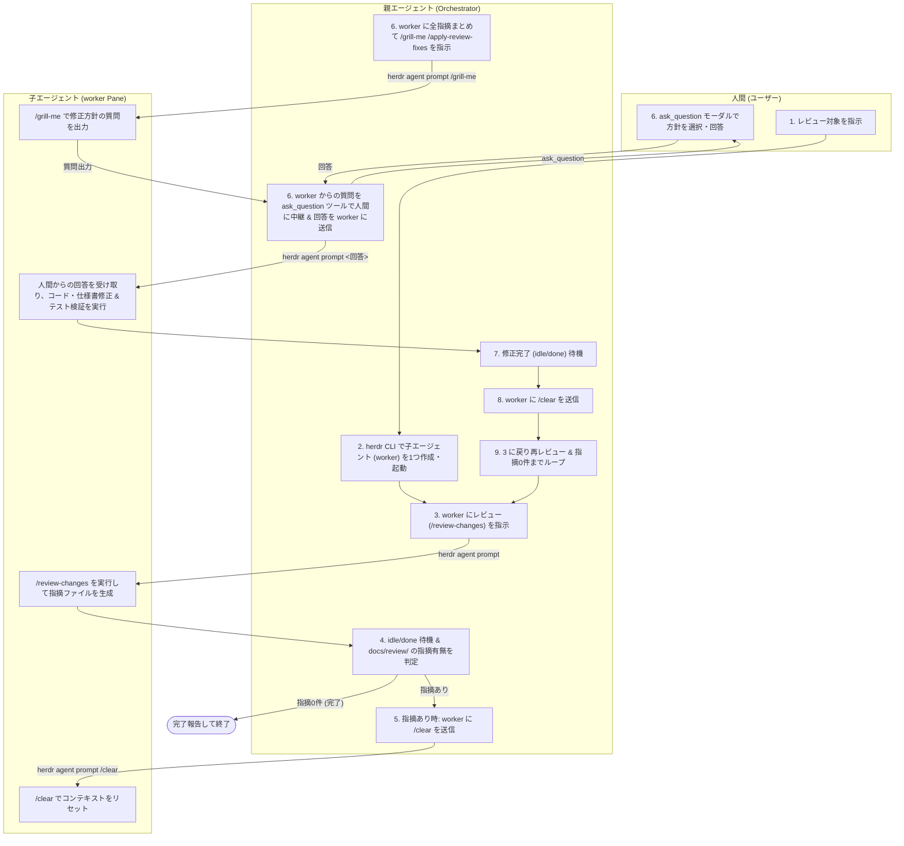

# herdr-review-loop Skill

このスキルは、`herdr` CLI（マルチエージェントオーケストレーションランタイム）を活用し、**親エージェント（Orchestrator）が単一の子エージェント（Worker）を全自動制御**します。
レビュー実行・指摘抽出・`/clear` による履歴リセット・`/grill-me` による人間への方針ヒアリング（`ask_question` ツールの活用）・修正適用・再レビュー検証ループを自動反復し、すべてのレビュー指摘が解消されるまで完結させます。

---

## 🎯 役割とメンタルモデル



---

## 📋 実行フロー

### 1. レビュー対象の確認とブランチ名・ディレクトリの確定

1. ユーザーからの指示で指定されたレビュー対象（特定の仕様書・ファイル群、または「本ブランチの変更点」等）を確認します。
2. `git branch --show-current` でブランチ名を取得し、スラッシュ等をハイフンに置換して `<sanitized-branch>` を確定します（例: `review-requirement-definition`）。
3. 指摘ファイル保存先ディレクトリ `docs/review/<sanitized-branch>/` を確認・特定します。

---

### 2. herdr 環境の確認および単一子エージェント (worker) の起動

1. `herdr agent list` を実行し、現在生存中のエージェントを確認します。
2. `worker` という名前のエージェントが存在しない場合は、以下の手順で別 Pane を1つ作成し、子エージェントを起動します：

```bash
# 1. 右側に Pane を分割（フォーカスは親エージェントのまま維持）
SPLIT_RES=$(herdr pane split --current --direction right --no-focus)
WORKER_PANE=$(printf '%s\n' "$SPLIT_RES" | jq -r '.result.pane.pane_id')

# 2. worker エージェントを起動 (kind には agy または環境に応じたエージェントを指定)
herdr agent start worker --kind agy --pane "$WORKER_PANE"
```

> [!NOTE]
> 既に `worker` エージェントが存在している場合は、新規作成をスキップして既存の `worker` を再利用します。

---

### 3. 子エージェントへのレビュー指示と完了待機

親エージェントから `worker` エージェントにプロンプトを送信し、レビューの完了を待機します：

```bash
# レビュー対象が特定ファイルの場合
herdr agent prompt worker "/review /review-changes <target_file_or_dir>" --wait --until done --timeout 300000

# レビュー対象がブランチ全体の変更の場合
herdr agent prompt worker "/review /review-changes" --wait --until done --timeout 300000
```

`--wait --until done` により、子エージェントが対象の査読および `docs/review/<sanitized-branch>/` 配下への指摘ファイル生成を完了して `done` 状態になるまで親エージェントは自動待機します。

---

### 4. 成果報告の確認と終了判定

1. `worker` エージェントの実行結果、および `docs/review/<sanitized-branch>/` 配下の全 `.md` ファイルをスキャンします。
2. ヘッダー付近に `- **Status**: Open` が含まれるファイルを抽出します。
3. **`Status: Open` が 0件の場合（または `summary.md` で `Status: Passed` の場合）**:
   - レビューで修正すべき指摘事項は見つかりませんでした。
   - ユーザーに「すべてのレビューチェックを通過しました。修正が必要な指摘はありません。」と完了報告を行い、**処理を終了します**。
4. **`Status: Open` が 1件以上存在する場合**:
   - 次のステップ（Step 5）に進み、修正サイクルを開始します。

---

### 5. 子エージェントの履歴クリア (`/clear`)

レビュー時の長い会話履歴やコンテキストによるトークン消費・混乱を防ぐため、親エージェントから `worker` エージェントへ `/clear` を送信します：

```bash
herdr agent prompt worker "/clear" --wait --until done --timeout 30000
```

---

### 6. apply-review-fixes の指示と対話型方針ヒアリング (`/grill-me` + `ask_question`)

#### 6-1. 子エージェントへの一括修正指示
Step 4 で検出された**全オープン指摘ファイルをまとめて指定**し、`/grill-me /apply-review-fixes` を指示します：

```bash
PROMPT="/grill-me /apply-review-fixes
対象指摘ファイル:
- docs/review/<sanitized-branch>/issue-1.md
- docs/review/<sanitized-branch>/issue-2.md
...
上記の指摘内容をすべて確認し、修正方針を検討してください。修正方針に選択肢や確認事項がある場合は、具体的な質問と選択肢を提示してください。"

herdr agent prompt worker "$PROMPT" --wait --until idle --timeout 300000
```

#### 6-2. 子エージェントからの質問の読み取り
子エージェントは `/grill-me` により方針に関する質問を出力して `idle` 状態になります。親エージェントはターミナル出力を読み取ります：

```bash
herdr agent read worker --source recent-unwrapped --lines 50
```

#### 6-3. 親エージェントが `ask_question` ツールでユーザーに提示
親エージェントは、子エージェントから出力された質問内容・選択肢をそのまま Antigravity の `ask_question` ツールに渡し、ユーザーに選択式＋自由記述のモーダルを表示します。

> [!IMPORTANT]
> `ask_question` ツールを使用することで、ユーザーは提示された複数の選択肢（Options）から選択できるだけでなく、デフォルトで用意された自由記述入力欄（write-in）を使って独自の追加指示を行うことができます。

#### 6-4. ユーザー回答を子エージェントへ送信
ユーザーから返ってきた回答内容をそのまま `worker` エージェントへ送信します：

```bash
herdr agent prompt worker "ユーザーからの回答: <ユーザーが選択・入力した回答テキスト>。この方針に従って修正作業（仕様書・コードの修正およびテスト検証）を進めてください。" --wait --until idle --timeout 600000
```

※子エージェントから更なる追加の質問が出力された場合は、同様に `ask_question` ツールを介してユーザーへ中継します。

---

### 7. 修正・テスト検証の完了待機

`worker` エージェントが仕様書・コードの修正、回帰テストの実行、および問題ファイルのヘッダー更新（`- **Status**: Resolved`）と完了報告の追記を終え、`idle` または `done` になるまで待機します。

---

### 8. 子エージェントの履歴クリア (`/clear`)

修正作業が完了したら、次回のレビュー検証に向けて再度会話履歴をクリアします：

```bash
herdr agent prompt worker "/clear" --wait --until idle --timeout 30000
```

---

### 9. 再レビュー＆修正サイクルの反復（Iteration）

1. 修正結果を再検証するため、**Step 3 に戻ります**。
2. 親エージェントが `worker` に `/review-changes` を再指示します。
3. **Step 3 〜 Step 8 のサイクルを、Step 4 で `Status: Open` が完全に 0件になるまで繰り返します。**

---

### 10. 終了

レビューで指摘が 0件になった時点で、全体の修正履歴とレビュー通過結果をユーザーにまとめて報告し、ループを終了します。

---

## 🛠 トラブルシューティング

- **`agent_prompt_stalled` エラーが発生した場合**:
  エージェントがプロンプトを受信しても 5秒以内に状態変化が観測されなかったことを示します。`herdr agent list` や `herdr agent read worker --source recent-unwrapped` で状態を確認し、必要に応じて `herdr agent send-keys worker enter` を送信して復帰させてください。
- **子エージェントの応答が停止した場合**:
  `herdr agent read worker --source recent-unwrapped` で最新ログを確認し、ダイアログ待ち等の場合は `herdr agent send-keys worker esc` や `enter` でレスキューします。
- **タイムアウトが発生した場合**:
  大規模なテスト実行やレビュー処理では、`--timeout 600000`（10分）のようにタイムアウト時間を長めに設定してください。
