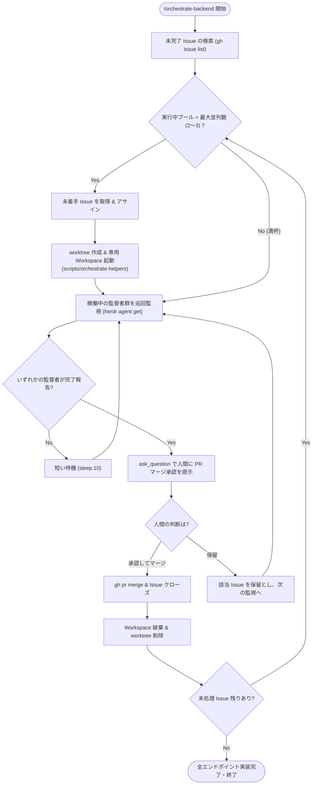

# Orchestrate Backend (Layer 1: Top Orchestrator)

このスキルは、**未実装のバックエンド API エンドポイントを複数並列で自動実装・レビュー・マージまで監督する最上位司令塔エージェント**です。
メインリポジトリ直下のメイン Workspace (`w1`) で常駐し、各エンドポイントごとに専用の `git worktree` と Herdr Workspace を立ち上げて `endpoint-supervisor` に委譲します。

---

## 🎯 運用原則

1. **並列度制限（プール管理）**:
   - 同時に稼働させるエンドポイント監督者は**最大 2〜3 件**とし、マージが完了して Workspace がクローズされたら次の Issue に着手する。
2. **完全な環境分離**:
   - 各エンドポイントは `.worktrees/issue-<N>/` 配下の専用ディレクトリで作業し、ポート競合や Git ブランチ干渉を排除する。
3. **人間の最終承認（Quality Gate）**:
   - レビュー Major 指摘が 0 件になり、単体テスト（`go test ./...`）が全パスした段階で、**必ず司令塔が `ask_question` ツールで人間に PR マージの可否を提示**する。
4. **自動クリーンアップ**:
   - PR マージ後、不要になった Herdr Workspace と Git Worktree を直ちに自動削除する。

---

## 📋 司令塔の監視・オーケストレーションループ



---

## 🛠️ 実行手順

以下記載のコマンドは入力例です。環境に応じて、そのタスクを行うために必要な適切なコマンドを実行してください。

### Step 1: 未着手 Issue の走査とプール投入

```bash
# 1. 現在稼働中の監督者 Workspace 数を確認 (上限: 2〜3)
RUNNING_COUNT=$(herdr workspace list | grep -c "ep-issue-" || true)
MAX_CONCURRENT=2

if [ "$RUNNING_COUNT" -lt "$MAX_CONCURRENT" ]; then
  # 2. 未着手の backend Issue を取得
  ISSUE_JSON=$(gh issue list --state open --json number,title --limit 5 | jq '.[0] // empty')
  
  if [ -n "$ISSUE_JSON" ]; then
    ISSUE_NUM=$(printf '%s\n' "$ISSUE_JSON" | jq -r '.number')
    ISSUE_TITLE=$(printf '%s\n' "$ISSUE_JSON" | jq -r '.title')
    
    # 担当者に自分をアサイン
    gh issue edit "$ISSUE_NUM" --add-assignee "@me"
    
    # エンドポイント識別子（ケバブケース）を生成
    ENDPOINT_NAME=$(echo "$ISSUE_TITLE" | tr '[:upper:]' '[:lower:]' | tr -cs 'a-z0-9' '-' | sed 's/^-//;s/-$//')
    
    # 3. 補助スクリプトで worktree & workspace を作成し監督者を起動
    # (Windows の場合は scripts/orchestrate-helpers.ps1 を呼び出し)
    ./scripts/orchestrate-helpers.sh create-worktree "$ISSUE_NUM" "$ENDPOINT_NAME"
  fi
fi
```

---

### Step 2: 監督者エージェント群の巡回監視

司令塔は、起動した各監督者エージェント（`sup-issue-<N>`）の状態を定期巡回します。

```bash
# 稼働中の監督者エージェントを走査
herdr agent list | grep "sup-issue-" | while read -r LINE; do
  AGENT_NAME=$(echo "$LINE" | awk '{print $1}')
  STATUS=$(herdr agent get "$AGENT_NAME" | jq -r '.result.agent.status // empty')

  # 質問でブロック中の場合はユーザーに通知
  if [ "$STATUS" = "blocked" ]; then
    echo "📢 [通知] 監督者または子ワーカー ($AGENT_NAME) が質問待ちです。該当タブで回答してください。"
  fi

  # 完了報告の確認
  if [ "$STATUS" = "idle" ] || [ "$STATUS" = "done" ]; then
    RECENT_LOG=$(herdr agent read "$AGENT_NAME" --source recent-unwrapped --lines 30)
    if echo "$RECENT_LOG" | grep -q "エンドポイント実装・検証完了報告"; then
      PR_NUM=$(echo "$RECENT_LOG" | grep -o 'PR: #[0-9]*' | tr -dc '0-9')
      ISSUE_NUM=$(echo "$AGENT_NAME" | sed 's/sup-issue-//')
      echo "🎉 Issue #${ISSUE_NUM} (PR #${PR_NUM}) の実装・検証が完了しました。"
    fi
  fi
done
```

---

### Step 3: 人間へのマージ最終承認（`ask_question`）

監督者から完了報告を受信したら、**司令塔自身が `ask_question` ツールを起動**して人間にマージ可否を提示します。

```json
{
  "questions": [
    {
      "question": "Issue #<ISSUE_NUM>: <TITLE> (PR #<PR_NUM>) の単体テストが全パスし、レビュー指摘が解消されました。PR をマージして完了しますか？",
      "options": [
        "(Recommended) 承認して main ブランチにマージする",
        "マージを保留し、後で手動確認する"
      ],
      "is_multi_select": false
    }
  ]
}
```

---

### Step 4: PR マージ & 自動クリーンアップ

人間から「承認して main ブランチにマージする」が得られたら、マージを実行して環境を片付けます。

```bash
# 1. PR のマージとブランチ削除
gh pr merge "$PR_NUM" --squash --delete-branch
gh issue close "$ISSUE_NUM" --comment "PR #${PR_NUM} にて実装・マージ完了しました。"

# 2. Herdr Workspace ID の取得
WS_ID=$(herdr workspace list | grep "ep-issue-${ISSUE_NUM}" | awk '{print $1}')

# 3. 補助スクリプトでクリーンアップ
./scripts/orchestrate-helpers.sh cleanup-worktree "$ISSUE_NUM" "$WS_ID"
```

---

### Step 5: ループ継続判定

`gh issue list --state open` を再確認し、オープンなバックエンド Issue が残っていれば Step 1 に戻って次の Issue をプールに投入します。残りが 0 件になれば全体の完了報告を出力して終了します。

## 補足情報

- herdrの使用方法については、 `$ herdr --skill` コマンドの実行結果、および https://herdr.dev/docs/agent-automation/ の内容を参考にしてください。