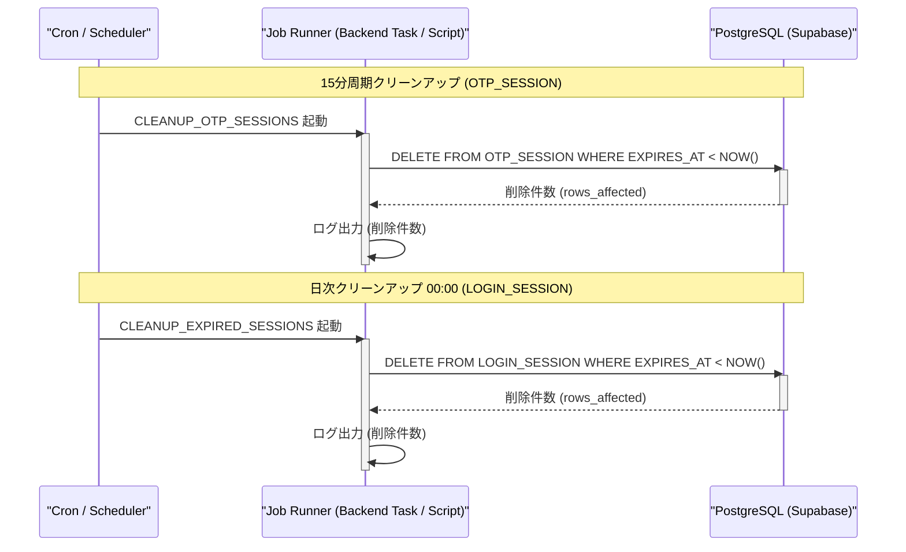

# Job API Design (ジョブ処理・定期バッチ詳細設計書)

**対象**: 実装担当者・運用担当者向け  
**前提**: `docs/requirements.md`, `docs/database_design.md`, `docs/api_design.md` を踏まえていること

---

## 1. ジョブ種別一覧

本システムにおけるバックグラウンド・定期実行処理（Cron ジョブ）の一覧です。

| job_type | 説明 | トリガー / 起動タイミング | 処理対象 | 実行方式 | 冪等性 |
| --- | --- | --- | --- | --- | --- |
| `CLEANUP_OTP_SESSIONS` | 期限切れの OTP セッションレコードの削除 | 15分ごと Cron スケジュール | `OTP_SESSION` テーブル (`EXPIRES_AT < NOW()`) | SQL DELETE | 保証 |
| `CLEANUP_EXPIRED_SESSIONS` | 期限切れの ログインセッションレコードの削除 | 毎日 00:00 Cron スケジュール | `LOGIN_SESSION` テーブル (`EXPIRES_AT < NOW()`) | SQL DELETE | 保証 |

---

## 2. ジョブ詳細仕様

### 2-1. OTP セッションクリーンアップ (`CLEANUP_OTP_SESSIONS`)

- **目的**: 5分間の有効期限が過ぎた仮登録・認証用の `OTP_SESSION` テーブルの不要レコードを削除し、DB の肥大化を防止する。
- **実行頻度**: 15分ごと (`*/15 * * * *`)
- **クリーンアップ SQL**:
```sql
DELETE FROM OTP_SESSION
WHERE EXPIRES_AT < NOW();
```
- **実行ログ記録**:
  - 削除成功時: 削除件数を `INFO` ログに出力（例: `[INFO] Cleaned up 12 expired OTP sessions.`）

### 2-2. ログインセッションクリーンアップ (`CLEANUP_EXPIRED_SESSIONS`)

- **目的**: 1週間（10080分）の有効期限が経過した `LOGIN_SESSION` レコードを削除し、インデックスサイズおよびストレージ領域をクリーンに保つ。
- **実行頻度**: 毎日 00:00 (`0 0 * * *`)
- **クリーンアップ SQL**:
```sql
DELETE FROM LOGIN_SESSION
WHERE EXPIRES_AT < NOW();
```
- **実行ログ記録**:
  - 削除成功時: 削除件数を `INFO` ログに出力（例: `[INFO] Cleaned up 45 expired login sessions.`）

---

## 3. ジョブステータス & 処理フロー

定期クリーンアップ処理のシーケンス図です。



---

## 4. エラーハンドリング & モニタリング

### 4-1. エラーハンドリング
- **DB接続一時失敗時**: 5秒間隔で最大3回リトライを行う。
- **エラーログフォーマット**:
```json
{
  "timestamp": "2026-08-08T15:00:00Z",
  "level": "ERROR",
  "job_type": "CLEANUP_OTP_SESSIONS",
  "error_message": "Failed to connect to database: connection timeout",
  "retry_count": 3
}
```

### 4-2. アラート通知
- バッチ処理が連続で失敗した場合、運用管理者通知用メーリングリスト/チャネル（`requirements.md` 運用・保守性要件）に通知を送信する。

---

## 5. 環境変数・設定値一覧

| 変数名 | 説明 | デフォルト値 / 例 |
| --- | --- | --- |
| `CRON_OTP_CLEANUP_SCHEDULE` | OTPセッションクリーンアップCron式 | `*/15 * * * *` |
| `CRON_SESSION_CLEANUP_SCHEDULE` | ログインセッションクリーンアップCron式 | `0 0 * * *` |
| `JOB_DB_TIMEOUT_SECONDS` | バッチ実行時のDBタイムアウト時間（秒） | `30` |
| `JOB_MAX_RETRIES` | リトライ上限回数 | `3` |
