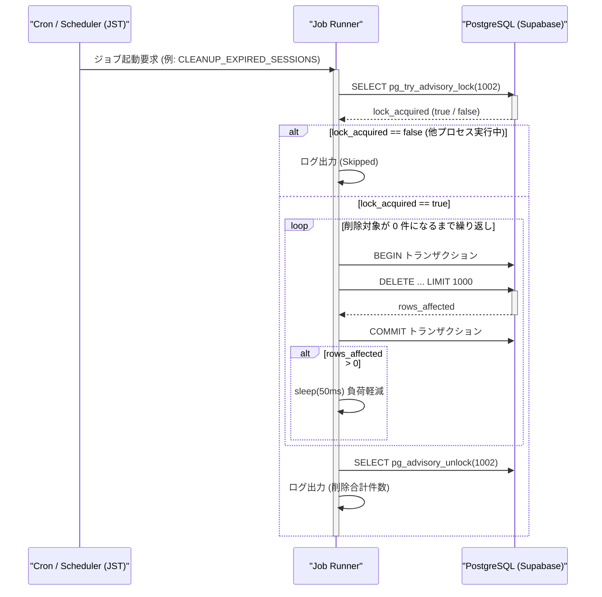

# Job API Design (ジョブ処理・定期バッチ詳細設計書)

**対象**: 実装担当者・運用担当者向け  
**前提**: `docs/req-def/requirements.md`, `docs/design/database_design.md`, `docs/design/api_design.md` を踏まえていること

---

## 1. ジョブ種別一覧

本システムにおけるバックグラウンド・定期実行処理（Cron ジョブ）の一覧です。  
※ スケジューラの基準タイムゾーンはすべて **日本標準時 (JST / `Asia/Tokyo`)** です。

| job_type | 説明 | トリガー / 起動タイミング (JST) | 処理対象テーブル | 実行方式 | 冪等性 / 排他制御 |
| --- | --- | --- | --- | --- | --- |
| `CLEANUP_OTP_SESSIONS` | 期限切れの OTP セッションレコードの削除 | 15分ごと (`*/15 * * * *`) | `OTP_SESSION` | チャンク分割 SQL DELETE | 冪等 / Advisory Lock |
| `CLEANUP_EXPIRED_SESSIONS` | 期限切れのログインセッションレコードの削除 | 毎日 00:00 (`0 0 * * *`) | `LOGIN_SESSION` | チャンク分割 SQL DELETE | 冪等 / Advisory Lock |
| `CLEANUP_ACCESS_LOGS` | 保持期間（90日）経過したアクセスログの削除 | 毎日 01:00 (`0 1 * * *`) | `ACCESS_LOG` | チャンク分割 SQL DELETE | 冪等 / Advisory Lock |
| `CLEANUP_AUTH_LOGS` | 保持期間（365日）経過したログイン・メール認証ログの削除 | 毎日 02:00 (`0 2 * * *`) | `LOGIN_LOG`, `MAIL_AUTH_LOG` | チャンク分割 SQL DELETE | 冪等 / Advisory Lock |
| `CLEANUP_RATE_LIMITS` | 解除日時経過かつ24時間以上経過したレートリミットレコードの削除 | 毎日 03:00 (`0 3 * * *`) | `LOGIN_IP_RATE_LIMIT` | チャンク分割 SQL DELETE | 冪等 / Advisory Lock |

---

## 2. ジョブ共通設計

### 2-1. 多重起動防止・排他制御（Advisory Lock）
マルチインスタンス・水平スケール構成や処理遅延による重複起動を防ぐため、PostgreSQL の Advisory Lock（`pg_try_advisory_lock`）を利用します。
- 各ジョブ固有のロックキー（64bit整数ハッシュ）を割り当てます。
- ジョブ起動直後にロック獲得を試み、ロックが取得できなかった場合（他インスタンスまたは同一プロセスで実行中）は、待機せず即座に処理をスキップして正常終了（ログ出力あり）とします。
- 処理完了時（成功・失敗・中断問わず `finally` / `defer` 節）に `pg_advisory_unlock` を実行してロックを解放します。

| job_type | ロックキー識別子 (例: int64 ハッシュ値) |
| --- | --- |
| `CLEANUP_OTP_SESSIONS` | `1001` |
| `CLEANUP_EXPIRED_SESSIONS` | `1002` |
| `CLEANUP_ACCESS_LOGS` | `1003` |
| `CLEANUP_AUTH_LOGS` | `1004` |
| `CLEANUP_RATE_LIMITS` | `1005` |

### 2-2. チャンク分割バッチ削除方式（Lock & WAL 負荷軽減）
大量データ削除による長時間ロックの保持、WAL 急増、オンライン API 処理とのデッドロックを防ぐため、全ジョブ共通で**チャンク分割バッチ削除**を実施します。

1. **バッチサイズ（`JOB_CLEANUP_BATCH_SIZE`）**: 1回あたりの削除上限（デフォルト: 1,000件）。
2. **トランザクション分離**: 各チャンク（1,000件）ごとに個別のトランザクションでコミットします。
3. **ループ処理**: 削除件数が 0 件になるまで繰り返し実行します。
4. **ウェイト（`JOB_CLEANUP_INTERVAL_MS`）**: チャンク間に微小なウェイト（デフォルト: 50ms）を設け、DB CPU/I/O 負荷およびレプリケーション遅延を防止します。

```sql
-- チャンク削除クエリの基本パターン（PostgreSQL CTE による削除）
WITH target_rows AS (
    SELECT <primary_key>
    FROM <target_table>
    WHERE <cleanup_condition>
    ORDER BY <primary_key> ASC
    LIMIT :batch_size
)
DELETE FROM <target_table>
WHERE <primary_key> IN (SELECT <primary_key> FROM target_rows);
```

---

## 3. ジョブ詳細仕様

### 3-1. OTP セッションクリーンアップ (`CLEANUP_OTP_SESSIONS`)
- **目的**: 全体最大有効期限（15分）が経過したレコード、または明示的に無効化・失効済み（`STATUS IN ('expired', 'completed')`）かつ単発有効期限（5分）が過ぎた `OTP_SESSION` テーブルの不要レコードを削除し、DB 領域をクリーンに保つ。
- **実行頻度**: 15分ごと (`*/15 * * * *` JST)
- **クリーンアップ SQL**:
```sql
WITH target_rows AS (
    SELECT OTP_SESSION_ID
    FROM OTP_SESSION
    WHERE MAX_EXPIRES_AT < NOW()
       OR (STATUS IN ('expired', 'completed') AND EXPIRES_AT < NOW())
    LIMIT :batch_size
)
DELETE FROM OTP_SESSION
WHERE OTP_SESSION_ID IN (SELECT OTP_SESSION_ID FROM target_rows);
```
- **実行ログ記録**:
  - スキップ時: `[INFO] Job CLEANUP_OTP_SESSIONS is already running. Skipped.`
  - 削除成功時: `[INFO] Cleaned up total {count} expired OTP sessions across {chunk_count} batches.`

### 3-2. ログインセッションクリーンアップ (`CLEANUP_EXPIRED_SESSIONS`)
- **目的**: 1ヶ月（43200分、Sliding Expiration により延長された最終有効期限 `EXPIRES_AT < NOW()`）が経過した `LOGIN_SESSION` レコードを削除し、インデックスサイズおよびストレージ領域をクリーンに保つ。
- **実行頻度**: 毎日 00:00 (`0 0 * * *` JST)
- **クリーンアップ SQL**:
```sql
WITH target_rows AS (
    SELECT SESSION_ID
    FROM LOGIN_SESSION
    WHERE EXPIRES_AT < NOW()
    LIMIT :batch_size
)
DELETE FROM LOGIN_SESSION
WHERE SESSION_ID IN (SELECT SESSION_ID FROM target_rows);
```
- **実行ログ記録**:
  - スキップ時: `[INFO] Job CLEANUP_EXPIRED_SESSIONS is already running. Skipped.`
  - 削除成功時: `[INFO] Cleaned up total {count} expired login sessions across {chunk_count} batches.`

### 3-3. アクセスログクリーンアップ (`CLEANUP_ACCESS_LOGS`)
- **目的**: 保持期間（90日間）が経過した `ACCESS_LOG` レコードを物理削除し、テーブル容量の肥大化を防止する。
- **実行頻度**: 毎日 01:00 (`0 1 * * *` JST)
- **クリーンアップ SQL**:
```sql
WITH target_rows AS (
    SELECT LOG_ID
    FROM ACCESS_LOG
    WHERE CREATED_AT < NOW() - INTERVAL '90 days'
    LIMIT :batch_size
)
DELETE FROM ACCESS_LOG
WHERE LOG_ID IN (SELECT LOG_ID FROM target_rows);
```
- **実行ログ記録**:
  - スキップ時: `[INFO] Job CLEANUP_ACCESS_LOGS is already running. Skipped.`
  - 削除成功時: `[INFO] Cleaned up total {count} access log records across {chunk_count} batches.`

### 3-4. 認証ログクリーンアップ (`CLEANUP_AUTH_LOGS`)
- **目的**: 保持期間（1年間 / 365日間）が経過した `LOGIN_LOG` および `MAIL_AUTH_LOG` レコードを物理削除する。
- **実行頻度**: 毎日 02:00 (`0 2 * * *` JST)
- **クリーンアップ SQL**:
  1. `LOGIN_LOG` パージ:
  ```sql
  WITH target_rows AS (
      SELECT LOG_ID
      FROM LOGIN_LOG
      WHERE CREATED_AT < NOW() - INTERVAL '365 days'
      LIMIT :batch_size
  )
  DELETE FROM LOGIN_LOG
  WHERE LOG_ID IN (SELECT LOG_ID FROM target_rows);
  ```
  2. `MAIL_AUTH_LOG` パージ:
  ```sql
  WITH target_rows AS (
      SELECT LOG_ID
      FROM MAIL_AUTH_LOG
      WHERE CREATED_AT < NOW() - INTERVAL '365 days'
      LIMIT :batch_size
  )
  DELETE FROM MAIL_AUTH_LOG
  WHERE LOG_ID IN (SELECT LOG_ID FROM target_rows);
  ```
- **実行ログ記録**:
  - スキップ時: `[INFO] Job CLEANUP_AUTH_LOGS is already running. Skipped.`
  - 削除成功時: `[INFO] Cleaned up total {count_login} login logs and {count_mail} mail auth logs.`

### 3-5. レートリミットクリーンアップ (`CLEANUP_RATE_LIMITS`)
- **目的**: 遮断解除日時（`BLOCKED_UNTIL`）を経過し、かつ `LAST_FAILED_AT` から1日（24時間）以上経過した不要な `LOGIN_IP_RATE_LIMIT` レコードを物理削除する。
- **実行頻度**: 毎日 03:00 (`0 3 * * *` JST)
- **クリーンアップ SQL**:
```sql
WITH target_rows AS (
    SELECT IP_ADDRESS
    FROM LOGIN_IP_RATE_LIMIT
    WHERE (BLOCKED_UNTIL IS NULL OR BLOCKED_UNTIL < NOW())
      AND LAST_FAILED_AT < NOW() - INTERVAL '1 day'
    LIMIT :batch_size
)
DELETE FROM LOGIN_IP_RATE_LIMIT
WHERE IP_ADDRESS IN (SELECT IP_ADDRESS FROM target_rows);
```
- **実行ログ記録**:
  - スキップ時: `[INFO] Job CLEANUP_RATE_LIMITS is already running. Skipped.`
  - 削除成功時: `[INFO] Cleaned up total {count} expired rate limit records across {chunk_count} batches.`

---

## 4. 処理フロー & シーケンス図

定期クリーンアップ処理の共通実行シーケンスです。



---

## 5. エラーハンドリング & モニタリング

### 5-1. エラーハンドリング & リトライ戦略
- **リトライ対象エラー（一時エラー）**:
  - DB 接続タイムアウト / 一時的ネットワークエラー
  - コネクションプール枯渇
  - デッドロック検知（PostgreSQL エラーコード `40P01`）
  - クエリ実行タイムアウト（一時的な高負荷）
- **リトライ不可エラー（恒久エラー）**:
  - SQL 構文エラー / 型不整合（スキーマ不一致）
  - テーブル・カラム未存在エラー
  - 認証・認可エラー
  - ※ リトライせず即座に `ERROR` ログを出力してジョブを異常終了します。
- **リトライ方式**:
  - **指数バックオフ + ジッター (Exponential Backoff with Full Jitter)** を採用します。
  - 最大リトライ回数: 3 回
  - 待機時間計算式: $T = \min(\text{base} \times 2^{\text{attempt}}, \text{max\_wait}) \times \text{rand}(0, 1)$  
    （例: base = 1秒, max_wait = 10秒の場合: 1回目 ~1秒, 2回目 ~2秒, 3回目 ~4秒）

### 5-2. 構造化エラーログフォーマット
ジョブ失敗時は、ログ収集基盤（CloudWatch, Datadog 等）で容易にパース・監視できるように JSON 形式の構造化ログを出力します。

```json
{
  "timestamp": "2026-08-08T00:00:05.123+09:00",
  "level": "ERROR",
  "job_type": "CLEANUP_EXPIRED_SESSIONS",
  "message": "Job failed after retries",
  "error": "pq: deadlock detected (40P01)",
  "retry_count": 3,
  "execution_time_ms": 7520,
  "stack_trace": "..."
}
```

### 5-3. 監視・アラート方針
- 要件定義書（`docs/req-def/requirements.md` 非機能要件: 運用・保守性）の規定に基づき、**システムからの能動的なメール送信やメーリングリスト宛通知は行いません**。
- ジョブ異常終了はすべて標準出力/ログファイルに `ERROR` レベルで記録され、外部ログ監視基盤のアラート検知（ログフィルターやメトリクス監視）により運用管理者が検知・対処します。

---

## 6. 環境変数・設定値一覧

| 変数名 | 説明 | デフォルト値 / 例 | 備考 |
| --- | --- | --- | --- |
| `CRON_TIMEZONE` | Cron スケジューラの基準タイムゾーン | `Asia/Tokyo` | JST 基準で動作 |
| `CRON_OTP_CLEANUP_SCHEDULE` | OTP セッションクリーンアップ Cron 式 | `*/15 * * * *` | 15分ごと |
| `CRON_SESSION_CLEANUP_SCHEDULE` | ログインセッションクリーンアップ Cron 式 | `0 0 * * *` | 毎日 00:00 JST |
| `CRON_ACCESS_LOG_CLEANUP_SCHEDULE` | アクセスログクリーンアップ Cron 式 | `0 1 * * *` | 毎日 01:00 JST |
| `CRON_AUTH_LOG_CLEANUP_SCHEDULE` | 認証ログクリーンアップ Cron 式 | `0 2 * * *` | 毎日 02:00 JST |
| `CRON_RATE_LIMIT_CLEANUP_SCHEDULE` | レートリミットクリーンアップ Cron 式 | `0 3 * * *` | 毎日 03:00 JST |
| `JOB_CLEANUP_BATCH_SIZE` | 1回のチャンク削除件数上限 | `1000` | ロック時間短縮 |
| `JOB_CLEANUP_INTERVAL_MS` | チャンク削除間の待機インターバル (ミリ秒) | `50` | I/O・負荷軽減 |
| `JOB_DB_TIMEOUT_SECONDS` | バッチ実行時の DB クエリタイムアウト時間 (秒) | `30` | |
| `JOB_MAX_RETRIES` | 一時エラー発生時の最大リトライ回数 | `3` | 指数バックオフ |
