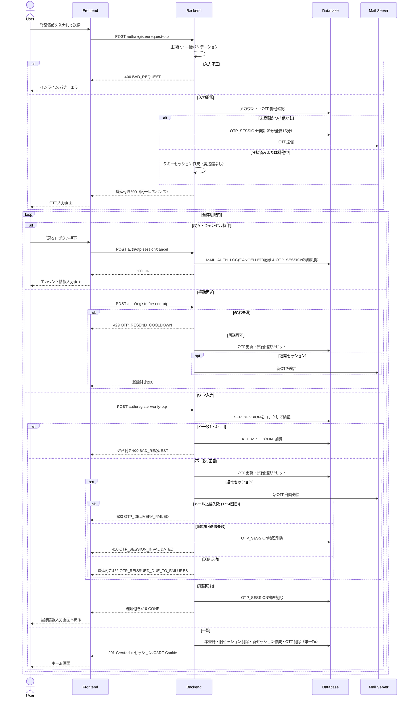

# 1. アカウント作成 (Account Creation)

## 1.1 対象画面・API

| 処理 | API | 認証 / CSRF | 正常応答 |
| :--- | :--- | :--- | :--- |
| 登録情報送信・OTP発行 | `POST auth/register/request-otp` | 不要 | `200 OK` |
| OTP検証・本登録 | `POST auth/register/verify-otp` | 不要 | `201 Created` |
| OTP手動再送 | `POST auth/register/resend-otp` | 不要 | `200 OK` |
| OTPセッション破棄・キャンセル | `POST auth/otp-session/cancel` | 不要 | `200 OK` |

画面は「アカウント情報入力画面」から「OTP入力画面」へ遷移し、本登録成功後は自動ログイン状態でホーム画面へ遷移する。OTP画面には先頭4文字とドメイン以外を10文字固定幅で伏せたメールアドレス、OTPの残り有効時間、再送ボタン、および再送後60秒のカウントダウンを表示する。

フロントエンドが有効期限内の新規登録用 `otp_session_id` を保持している場合は、アカウント情報入力画面を表示せずOTP入力画面へ復帰し、`request-otp` を再実行しない。手続き完了・全体期限切れ・セッション失効時、またはユーザーによる戻る・キャンセル操作（`POST auth/otp-session/cancel` 呼び出し）時に保持状態を削除する。

全API応答には `Content-Type: application/json; charset=utf-8`、`Cache-Control: no-store, no-cache, must-revalidate`、`Pragma: no-cache` を付与する。エラー本文は共通の `error.code`、`error.message`、`error.details`（対象なしの場合も `[]`）形式とする。

## 1.2 登録情報送信・OTP発行

### 1.2.1 入力と前処理

リクエスト本文は `username`、`email`、`password` を必須とする。JSON構文・必須項目・型を検証した後、ユーザー名とメールアドレスの前後の空白文字を除去し、メールアドレスを小文字へ正規化する。次の全項目を一括検証し、違反時はOTPを発行せず、遅延なしで `400 Bad Request`（`BAD_REQUEST`）を返す。

- ユーザー名: 2〜20文字、半角英数字のみ。同名ユーザーは許可する。
- メールアドレス: 有効な形式、255文字以下。
- パスワード: 8〜128文字で、英大文字・英小文字・数字・許可記号（全32種、API共通仕様1.4節準拠）の4種類中3種類以上を含む。
- ユーザー名またはメールアドレスのローカル部が4文字以上の場合、それらを大文字小文字を区別せずパスワード内に含まない。

平文パスワードおよび平文OTPはDB・アプリケーションログへ記録しない。登録予定パスワードとOTPは、それぞれ独立したソルトを使用してハッシュ化する。

### 1.2.2 実処理・ダミー処理・排他制御

入力検証通過後、DBトランザクション内で有効アカウントのメールアドレスと `OTP_SESSION.PENDING_EMAIL` を確認する。通常処理に進めるのは、正規化済みメールアドレスが有効な `LOGIN_ACCOUNT` に存在せず、かつ同メールアドレスに `STATUS IN ('active', 'verified')` のOTPセッションが存在しない場合だけとする。

- 通常処理: `PURPOSE='SIGNUP'`、`STATUS='active'`、`ATTEMPT_COUNT=0`、`SEND_COUNT=0`、`LAST_SENT_AT=NOW()`、`OTP_EXPIRES_AT=NOW()+5分`、`SESSION_EXPIRES_AT=NOW()+15分` として `OTP_SESSION` を作成し、登録予定ユーザー名・正規化済みメールアドレス・登録予定パスワードハッシュ・OTPハッシュを保存する。コミット後にOTPメールを送信する。
- ダミー処理: 登録済み、他の有効OTPセッションにより排他中、または既存セッションがある状態で `request-otp` が再度呼ばれた場合は、実OTPを発行・送信せず、新しい推測困難なダミー `otp_session_id` を発行して `OTP_SESSION` に保存する。`IS_DUMMY=true` を最終判定とし、`USER_ID`、`PENDING_USERNAME`、`PENDING_EMAIL`、`PENDING_PASSWORD_HASH`、`OTP_HASH` はNULL、マスク済みメール、試行・送信回数、配信状態、個別・全体期限、作成日時は通常どおり保持する。対象メールは `MAIL_AUTH_LOG.EMAIL` にだけ記録し、部分一意インデックスを侵害しない。
- 競合処理: 判定後に同一メールアドレスのアカウント登録またはOTP作成が競合し、一意制約に抵触した場合はトランザクションをロールバックしてダミー処理へ切り替える。内部競合や登録状況をクライアントへ露出しない。

有効OTPセッションの有無や `LAST_SENT_AT` からの経過時間にかかわらず、`request-otp` では `429` を返さない。既存セッションがある場合はそのセッションを更新せずダミー処理とし、通常・ダミーとも `1.0s ± 0.1s` に応答時間を揃えて同一構造の `200 OK` を返す。`429 OTP_RESEND_COOLDOWN` は、発行済み `otp_session_id` を受け取る `resend-otp` にのみ適用する。

```json
{
  "otp_session_id": "otp_sess_a1b2c3d4e5",
  "masked_email": "user**********@example.com",
  "expires_in_seconds": 300,
  "cooldown_seconds": 60
}
```

`MAIL_AUTH_LOG` には `AUTH_TYPE='SIGNUP'`、`EVENT_TYPE='ISSUED'`、対象メール、IPアドレス、成否、ダミー区分を記録する。`ACCESS_LOG` にはユーザーID `null`、IPアドレス、メソッドを含むエンドポイント、対象リソースIDを記録する。

## 1.3 OTP検証・本登録

### 1.3.1 評価順序

1. JSON構文、`otp_session_id` と `otp` の必須・型、およびOTPが英数字8桁であることを検証する。不備は遅延および `ATTEMPT_COUNT` 加算なしで `400 BAD_REQUEST` とする。
2. OTPの前後の空白を除去して大文字へ正規化する。対象セッションを更新ロック付きで取得し、`PURPOSE='SIGNUP'`、`STATUS='active'`、個別期限 `OTP_EXPIRES_AT`、全体期限 `SESSION_EXPIRES_AT` を検証する。
3. セッション不在・用途不一致・非activeは遅延付き `400 BAD_REQUEST`、期限切れは遅延付き `410 GONE` とする。全体期限切れでは対象OTPセッションを物理削除し、`MAIL_AUTH_LOG` へ `EVENT_TYPE='EXPIRED'` を記録する。フロントエンドはアカウント情報入力画面へ戻す。
4. OTP不一致1〜4回目は `ATTEMPT_COUNT` を1加算し、`VERIFY_FAILED` を記録して、`1.0s ± 0.1s` 後に `400 BAD_REQUEST` を返す。
5. 不一致5回目は、通常セッションでは新OTPを生成・送信し、`OTP_HASH`、`OTP_EXPIRES_AT=min(NOW()+5分, SESSION_EXPIRES_AT)`、`LAST_SENT_AT` を更新、`SEND_COUNT` を1加算して `ATTEMPT_COUNT=0` とする。ダミーでは生成・送信せず同等の状態遷移だけを行う。いずれも `AUTO_RESEND` を記録する。
   - 実メール送信に成功した場合（ダミー含む）: `1.0s ± 0.1s` 後に `422 OTP_REISSUED_DUE_TO_FAILURES` を返して画面上に「入力試行回数の上限に達したため、新しい認証コードを再送信しました」と表示し、入力欄をクリアして60秒クールダウンを開始する。
   - 実メール送信に失敗した場合（1〜4回目の送信失敗）: `DELIVERY_STATUS='sendable'`、`SEND_FAILED_COUNT+=1` とし、`503 Service Unavailable`（code: `"OTP_DELIVERY_FAILED"`）を返却する。画面側では「新しい認証コードの送信に失敗しました。再送信ボタンから再試行してください」と案内する。
   - 自動再送を含めて5回連続で送信失敗となった場合: 対象セッションを物理削除し、`410 Gone`（code: `"OTP_SESSION_INVALIDATED"`）を返却してアカウント情報入力画面へ戻す。
6. OTP一致時は人工遅延を加えず、本登録トランザクションへ進む。ダミーセッションは一致成功しない。

### 1.3.2 本登録トランザクション

次を単一DBトランザクションで実行し、いずれかが失敗した場合は全件ロールバックする。

1. `OTP_SESSION` を更新ロックし、active・用途・両期限を再検証する。
2. 正規化済み `PENDING_EMAIL` に有効アカウントが存在しないことを再確認する。競合登録済みの場合は本登録せず、登録有無を露出しない遅延付き `400 BAD_REQUEST` とする。
3. UUIDを採番し、`LOGIN_ACCOUNT` に登録予定値、`IS_DELETED=false`、作成・更新日時を登録する。
4. リクエストCookieに既存の `sync_task_sid` がある場合、その旧 `LOGIN_SESSION` だけを物理削除する。
5. 推測困難なログインセッションIDとCSRFトークンを生成し、`LOGIN_SESSION` にユーザーID、User-Agent、`EXPIRES_AT=NOW()+30日` を登録する。
6. 使用済み `OTP_SESSION` を物理削除して排他を解除する。
7. `MAIL_AUTH_LOG` に `VERIFY_SUCCESS`、`ACCESS_LOG` にAPIアクセスを記録してコミットする。

成功時はユーザー情報を含む `201 Created` と次のCookieを返し、ホーム画面へ遷移する。旧Cookieがあれば同名Cookieで上書きする。

- `Set-Cookie: sync_task_sid=<session_token>; HttpOnly; Secure; SameSite=Lax; Path=/; Max-Age=2592000`
- `Set-Cookie: XSRF-TOKEN=<csrf_token>; Secure; SameSite=Lax; Path=/; Max-Age=2592000`

Cookie値、OTP、パスワードハッシュ、CSRFトークンはログへ出力しない。

## 1.4 OTP手動再送・セッションキャンセル

### 1.4.1 OTP手動再送
`POST auth/register/resend-otp` は `otp_session_id` を必須とする。構文・必須検証違反は遅延なしの `400 BAD_REQUEST` とする。その後、対象を更新ロックし、`PURPOSE='SIGNUP'`、`STATUS='active'`、`SESSION_EXPIRES_AT` 内であることを確認する。

- セッション不在・用途不一致・非active: `1.0s ± 0.1s` 後に `400 BAD_REQUEST`。
- 全体期限切れ: セッションを物理削除し `EXPIRED` を記録後、`1.0s ± 0.1s` 後に `410 GONE`。アカウント情報入力画面へ戻す。
- `LAST_SENT_AT` から60秒未満: `429 OTP_RESEND_COOLDOWN`。残り秒数の間ボタンを非活性にする。
- 再送可能: 通常セッションでは新OTPを生成・送信し、ダミーでは実送信しない。`OTP_HASH`、`OTP_EXPIRES_AT=min(NOW()+5分, SESSION_EXPIRES_AT)`、`LAST_SENT_AT` を更新し、`ATTEMPT_COUNT=0`、`SEND_COUNT=SEND_COUNT+1` とする。`RESEND_REQUESTED` をダミー区分付きで記録し、`1.0s ± 0.1s` 後に同一構造の `200 OK` を返す。

実メール送信に失敗した場合は `DELIVERY_STATUS='sendable'`、`SEND_FAILED_COUNT=SEND_FAILED_COUNT+1` とし、`503 OTP_DELIVERY_FAILED` を返却する（同一の `otp_session_id` レコードを直接更新するためセッションIDは変更されず、保持している `otp_session_id` で再送操作が可能）。失敗送信には60秒クールダウンを適用しない。送信成功時は `DELIVERY_STATUS='sent'`、`SEND_FAILED_COUNT=0` とする。連続5回目の失敗では対象セッションを物理削除し、`410 OTP_SESSION_INVALIDATED` を返してアカウント情報入力画面へ戻す。

再送回数自体に上限は設けない。ただし初回発行から15分の `SESSION_EXPIRES_AT` は延長しない。

### 1.4.2 OTPセッション破棄・キャンセル
ユーザーが「戻る」ボタンを押下したり画面から離脱した場合、クライアント側の `otp_session_id` を破棄するとともに、`POST auth/otp-session/cancel` を呼び出す。
- サーバー側は対象の `OTP_SESSION` を特定し、`MAIL_AUTH_LOG` に `AUTH_TYPE='SIGNUP'`、`EVENT_TYPE='CANCELLED'` を記録した上で、`OTP_SESSION` レコードを DB から直ちに物理削除する。
- 処理完了後は遅延なしで `200 OK`（`{"message": "OTP session cancelled successfully."}`）を返却する。

## 1.5 全体シーケンス



## 1.6 失効・ログ・異常時

- 個別OTP期限は発行・再送から5分、手続きとメールアドレス排他の上限は初回発行から15分とする。再送で全体期限は延長しない。
- リクエスト時に期限切れを検知した場合は即時に物理削除する。残存する期限切れOTPセッションは15分ごとのCron（`*/15 * * * *`、JST）で物理削除する。
- メール送信失敗時は成功扱いにせず、上記の再送可能化・連続失敗回数・5回到達時の補償削除を適用する。応答には再送に必要な `otp_session_id` 以外の内部情報を含めない。
- DB例外時はトランザクションをロールバックし、パスワード、OTP、Cookie、ハッシュ値、詳細な一意制約名を応答やログへ露出しない。
- `MAIL_AUTH_LOG` は日時、UID（新規登録では `null`）、対象メール、`SIGNUP`、IP、イベント、成否、ダミー区分を記録して365日保持する。`ACCESS_LOG` は日時、UID `null`、IP、エンドポイント、リソースIDを記録して90日保持する。期限超過分は所定の日次Cronで物理削除する。

