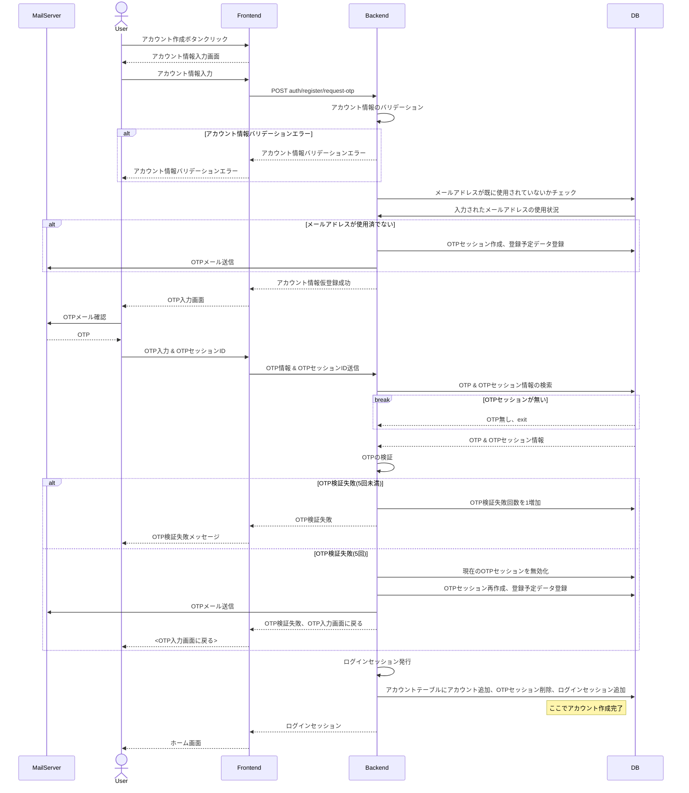

# 1. アカウント作成 (Account Creation)

```mermaid
sequenceDiagram
	participant MailServer
	actor User
	participant Frontend
	participant Backend
	participant DB
	
	User->>Frontend: アカウント作成ボタンクリック
	Frontend-->>User: アカウント情報入力画面
	User->>Frontend: アカウント情報入力
	Frontend->>Backend: POST auth/register/request-otp
	Backend->>Backend: アカウント情報のバリデーション
	alt アカウント情報バリデーションエラー
		Backend-->>Frontend: アカウント情報バリデーションエラー
		Frontend-->>User: アカウント情報バリデーションエラー
	end
	Backend->>DB: メールアドレスが既に使用されていないかチェック
	DB->>Backend: 入力されたメールアドレスの使用状況

	alt メールアドレスが使用済でない
		Backend->>DB: OTPセッション作成、登録予定データ登録
		Backend->>MailServer: OTPメール送信
	end
	%% もしメールアドレスが使用済なら、成功したように見せつつメールは送らない
	Backend-->>Frontend: アカウント情報仮登録成功
	Frontend-->>User: OTP入力画面
	User->>MailServer: OTPメール確認
	MailServer-->>User: OTP
	User->>Frontend: OTP入力 & OTPセッションID
	Frontend->>Backend: OTP情報 & OTPセッションID送信
	Backend->>DB: OTP & OTPセッション情報の検索
	break OTPセッションが無い
		DB-->>Backend: OTP無し、exit
	end
	DB-->>Backend: OTP & OTPセッション情報
	Backend->>Backend: OTPの検証
	alt OTP検証失敗(5回未満)
		Backend->>DB: OTP検証失敗回数を1増加
		Backend-->>Frontend: OTP検証失敗
		Frontend-->>User: OTP検証失敗メッセージ
	else OTP検証失敗(5回)
		Backend->>DB: 現在のOTPセッションを無効化
		Backend->>DB: OTPセッション再作成、登録予定データ登録
		Backend->>MailServer: OTPメール送信
		Backend-->>Frontend: OTP検証失敗、OTP入力画面に戻る
		Frontend-->>User: <OTP入力画面に戻る>
	end
	Backend->>Backend: ログインセッション発行
	Backend->>DB: アカウントテーブルにアカウント追加、OTPセッション削除、ログインセッション追加
	note left of DB: ここでアカウント作成完了
	Backend-->>Frontend: ログインセッション
	Frontend-->>User: ホーム画面
```
