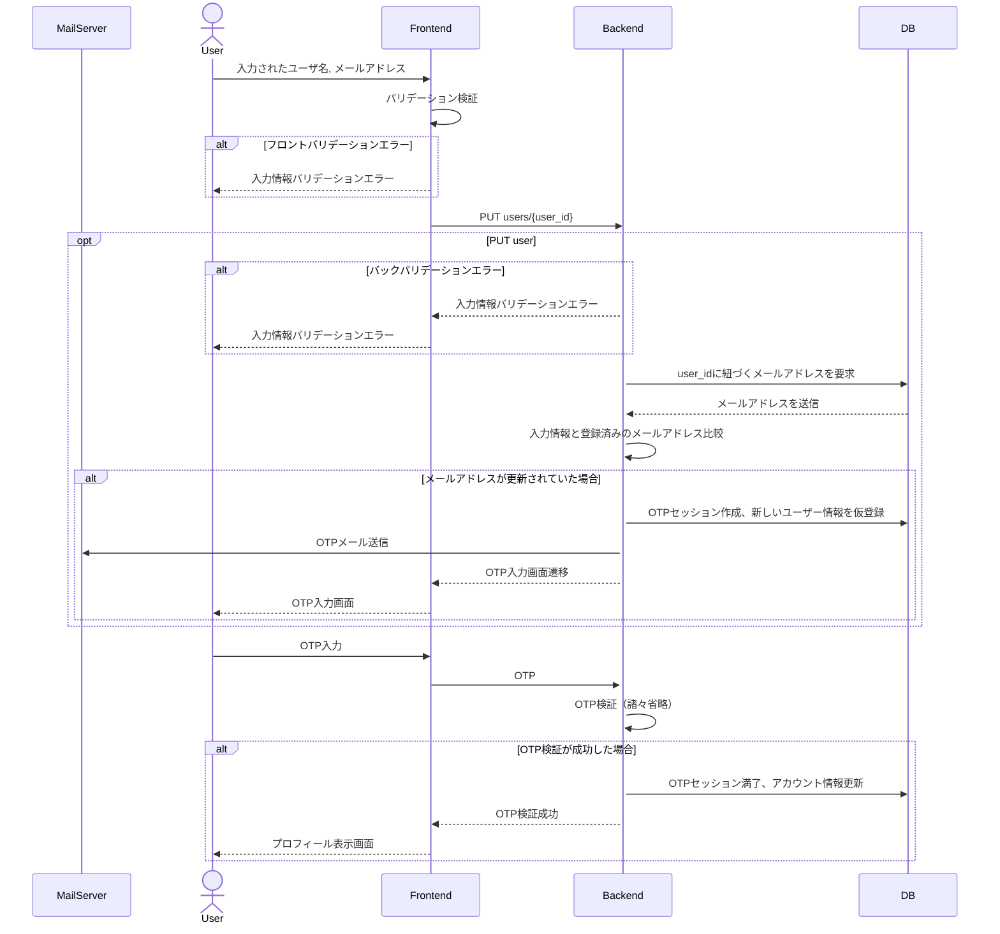

# 2. アカウント編集 (Account Edit)

プロフィール編集画面にて「決定」ボタンがクリックされた後の処理

```mermaid
sequenceDiagram
	participant MailServer
	actor User
	participant Frontend
	participant Backend
	participant DB

	User->>Frontend: 入力されたユーザ名, メールアドレス
	Frontend->>Frontend: バリデーション検証
	alt フロントバリデーションエラー
		Frontend-->>User: 入力情報バリデーションエラー
	end
	Frontend->>Backend: PUT users/{user_id}
	activate Backend
	%%put内でユーザ名の検証 - メアド検証 - OTP飛ばす - 画面遷移
	opt PUT user
		alt バックバリデーションエラー
			Backend-->>Frontend: 入力情報バリデーションエラー
			Frontend-->>User: 入力情報バリデーションエラー
		end
		Backend->>DB: user_idに紐づくメールアドレスを要求
		DB-->>Backend: メールアドレスを送信
		Backend->>Backend: 入力情報と登録済みのメールアドレス比較
		alt メールアドレスが更新されていた場合
			Backend->>DB: OTPセッション作成、新しいユーザー情報を仮登録
			Backend->>MailServer: OTPメール送信
			Backend-->>Frontend: OTP入力画面遷移
			Frontend-->>User: OTP入力画面
		end
	end

	User->>Frontend: OTP入力
	Frontend->>Backend: OTP
	Backend->>Backend: OTP検証（諸々省略）
	alt OTP検証が成功した場合
		Backend->>DB: OTPセッション満了、アカウント情報更新
		Backend-->>Frontend: OTP検証成功
		Frontend-->>User: プロフィール表示画面
	end
	%%変更完了を通知しプロフィール画面へ
```
