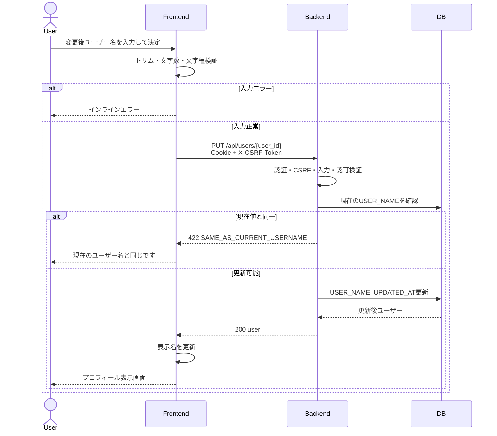
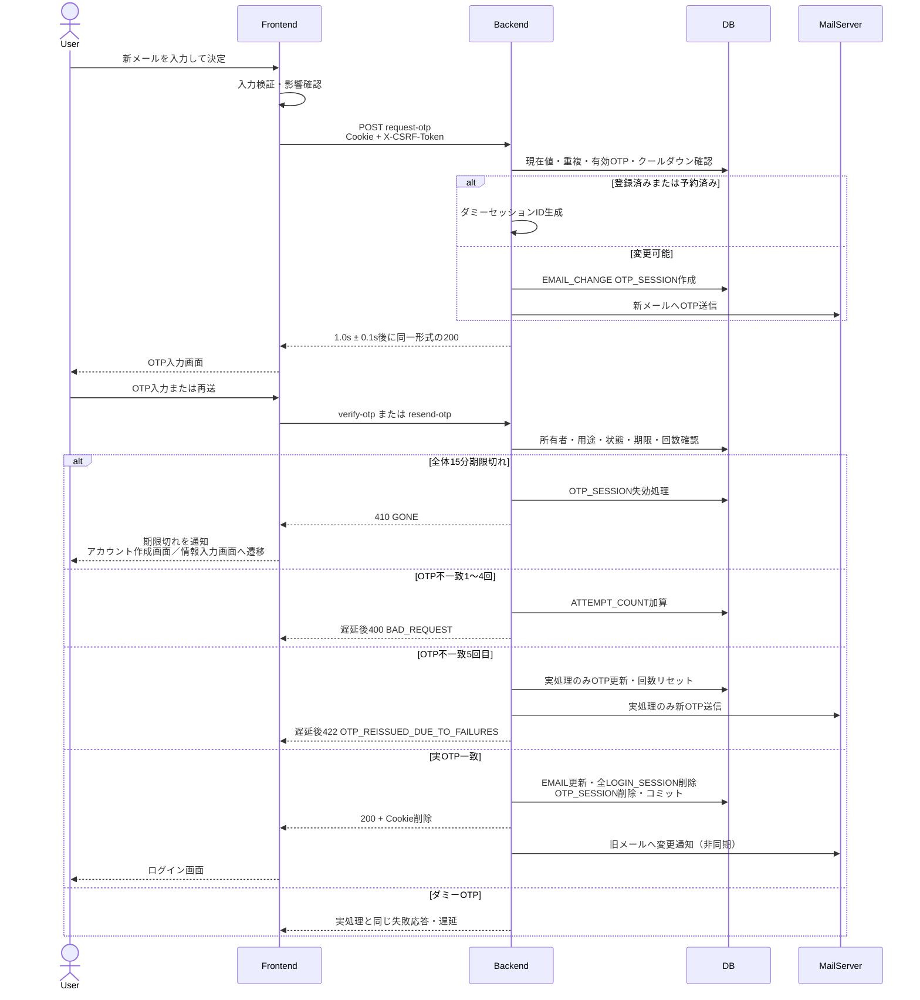

# 2. アカウント編集 (Account Edit)

## 2.1 対象・前提

- 対象は「プロフィール編集画面」と「アカウント関連/OTP入力画面」とする。
- 認証には `sync_task_sid` Cookieを使用し、全状態変更APIに `X-CSRF-Token` を付与する。
- 初期値は `GET /api/users/{user_id}` で取得する。ユーザー名変更は即時確定、メールアドレス変更は新アドレス宛OTPの検証成功時に確定する。
- ユーザー名とメールアドレスは別APIで変更する。両方を変更する場合はユーザー名を先に確定し、続いてメール変更OTPを要求する。後続OTPの中断・失効時も確定済みユーザー名は戻さない。
- 全API応答に `Cache-Control: no-store, no-cache, must-revalidate` と `Pragma: no-cache` を付与し、表示値はエスケープする。

## 2.2 送信時の分岐

| 現在値との差分 | 処理 |
| :--- | :--- |
| ユーザー名のみ | `PUT /api/users/{user_id}` 成功後、プロフィール表示画面へ遷移 |
| メールアドレスのみ | 全セッション失効の確認ダイアログ後、`POST /api/auth/change-email/request-otp` を実行 |
| 両方 | ユーザー名更新成功後、メール変更OTPを要求 |
| 差分なし | 更新せず、現在値と同一であることを表示 |

## 2.3 ユーザー名変更

1. 前後をトリムし、2〜20文字かつ半角英大文字・英小文字・数字のみかを検証する。
2. `PUT /api/users/{user_id}` に `{"username":"<変更後ユーザー名>"}` を送る。メールアドレス等の変更不可フィールドは送信せず、含まれてもバックエンドは無視する。
3. バックエンドは認証（401 `UNAUTHORIZED`）、CSRF（403 `FORBIDDEN`）、JSON・必須項目・型・文字数・文字種（400 `BAD_REQUEST`）、パスのユーザーIDとセッションユーザーIDの一致（404 `NOT_FOUND`）、現在値との一致（422 `SAME_AS_CURRENT_USERNAME`）の順に検証する。
4. 正常時は `LOGIN_ACCOUNT.USER_NAME` と `UPDATED_AT` を同一トランザクションで更新し、更新後ユーザーを200で返す。ユーザー名の重複は許可する。
5. フロントエンドは表示名を即時更新する。ログインセッションを維持し、再認証・OTP・メール通知は行わない。

## 2.4 メール変更OTP要求・排他

1. 新メールアドレスの前後の半角・全角空白、タブ、改行をトリムして小文字化し、255文字以下かつ有効な形式かを検証する。正規化後の現在値と同一なら422 `SAME_AS_CURRENT_EMAIL` とし、OTPを発行しない。
2. 全端末からログアウトし、新メールで再ログインが必要になる旨を確認後、`POST /api/auth/change-email/request-otp` に `new_email` を送る。
3. バックエンドは認証・CSRF、入力、現在値同一、同一ユーザーの60秒クールダウンの順に検証する。
4. 新メールが有効な他ユーザーの `LOGIN_ACCOUNT.EMAIL` と重複するか、他手続きの有効な `OTP_SESSION.PENDING_EMAIL` に予約されていればダミー処理とする。
5. 実処理では `PURPOSE='EMAIL_CHANGE'`、`USER_ID=<認証ユーザー>`、正規化済み `PENDING_EMAIL`、`STATUS='active'` の `OTP_SESSION` を作る。許可された26文字から8桁OTPを安全に生成し、ソルト付きハッシュのみ保存する。`OTP_EXPIRES_AT=発行時+5分`、`SESSION_EXPIRES_AT=初回発行時+15分`、`ATTEMPT_COUNT=0` とする。
6. `uq_otp_session_active_pending_email` を排他の最終境界とし、一意制約競合時も重複を公開せずダミーへ切り替える。予約は検証確定または全体期限切れまで維持する。
7. 実処理のみ新メールへOTPを送信する。ダミーではOTPを発行・送信せず、推測不能なダミーセッションIDを返す。
8. 実・ダミーとも先頭4文字＋固定10文字マスク＋ドメインの `masked_email`、`expires_in_seconds=300` を同じ200で返し、応答を `1.0s ± 0.1s` に揃える。発行結果は `MAIL_AUTH_LOG` に `AUTH_TYPE='EMAIL_CHANGE'`、イベント、成否、`IS_DUMMY`、ユーザーID、対象メール、IP、日時を記録する。
9. 手続き中は `LOGIN_ACCOUNT.EMAIL` を更新せず、旧メールをログイン識別子として維持する。

## 2.5 OTP入力・再送・検証

### 画面制御

- OTP入力画面には全体15分タイマー、OTP入力欄、戻る、再送信、決定を表示する。送信先は先頭4文字とドメインのみ表示し、中間は常に10文字分マスクする。
- 直前送信から60秒は再送ボタンを非活性にする。個別OTPの5分期限切れ時は再送を促す。再送しても全体15分期限を延長しない。

### 手動再送

`POST /api/auth/change-email/resend-otp` に `otp_session_id` を送る。認証・CSRF、入力、所有者、`PURPOSE='EMAIL_CHANGE'`、`STATUS='active'`、全体期限、60秒クールダウンの順に検証する。実セッションは新OTPを送信し、`OTP_HASH`、`OTP_EXPIRES_AT`、`LAST_SENT_AT` を更新、`ATTEMPT_COUNT=0`、`SEND_COUNT=SEND_COUNT+1` とする。ダミーは送信せず同じ表示を返す。成功応答は双方 `1.0s ± 0.1s` とし、再送イベントを `MAIL_AUTH_LOG` に記録する。

### OTP検証

1. OTPをトリムして大文字化し、8桁英数字かをフロント・バック双方で確認する。
2. `POST /api/auth/change-email/verify-otp` に `otp_session_id` と `otp` を送る。
3. 認証・CSRF、入力形式、所有者、用途、状態、`OTP_EXPIRES_AT`、`SESSION_EXPIRES_AT` の順に検証する。形式不正では試行回数を加算しない。他者所有は403 `FORBIDDEN`、期限切れは410 `GONE` とする。
4. 不一致1〜4回目は `ATTEMPT_COUNT` を加算し、`1.0s ± 0.1s` 後に400 `BAD_REQUEST` を返す。
5. 5回目は実セッションだけ旧OTPを失効して新OTPを自動発行・送信する。ダミーは送信しない。双方とも回数をリセットし、`1.0s ± 0.1s` 後に422 `OTP_REISSUED_DUE_TO_FAILURES` を返し、「新しいOTPを再送しました」と表示する。全体期限は延長しない。
6. ダミーは常に失敗とし、画面、コード、構造、応答時間から実・ダミーを識別不能にする。
7. `VERIFY_SUCCESS`、`VERIFY_FAILED`、`AUTO_RESEND`、`EXPIRED` を `MAIL_AUTH_LOG` に記録する。

## 2.6 メール変更確定・全セッション失効

実OTPの照合成功時は次を行う。

1. トランザクション内で対象 `LOGIN_ACCOUNT` をロックし、`OTP_SESSION.USER_ID` と認証ユーザーの一致、未削除、新メールが他の有効アカウントで未使用であることを再検証する。
2. `LOGIN_ACCOUNT.EMAIL=PENDING_EMAIL`、`UPDATED_AT=NOW()` に更新する。
3. 当該ユーザーの全 `LOGIN_SESSION`（現在、他端末、他ブラウザを含む）と使用済みメール変更 `OTP_SESSION` を物理削除してコミットする。
4. 200応答に `sync_task_sid` と `XSRF-TOKEN` の `Max-Age=0` 削除ヘッダーを付ける。フロントも認証状態を破棄し、ログイン画面へ遷移して新メールでの再ログインを要求する。
5. コミット後、更新前に退避した旧メールへ変更完了通知を非同期送信する。通知失敗で確定済み変更はロールバックせず、失敗を記録する。

## 2.7 エラー・期限切れ時の画面動作

| HTTP / code | 画面動作 |
| :--- | :--- |
| 400 `BAD_REQUEST` | 入力欄下またはフォーム上部にエラー。OTP失敗は実・ダミーで同一表示 |
| 401 `UNAUTHORIZED` | ログイン画面へ遷移 |
| 403 `FORBIDDEN` | 操作中止。他者所有OTPの情報は表示しない |
| 404 `NOT_FOUND` | 存在を秘匿した汎用エラー |
| 410 `GONE` | 手続きを終了して期限切れを通知し、アカウント作成画面／情報入力画面へ遷移。レコードは15分ごとのCronでも物理削除 |
| 422 `SAME_AS_CURRENT_USERNAME` | 「現在のユーザー名と同じです」 |
| 422 `SAME_AS_CURRENT_EMAIL` | 「現在のメールアドレスと同じです」 |
| 422 `OTP_REISSUED_DUE_TO_FAILURES` | 「新しいOTPを再送しました」。入力回数をリセット |
| 429 `OTP_RESEND_COOLDOWN` | 残り時間を表示し再送ボタンを非活性 |
| 500 `INTERNAL_SERVER_ERROR` | 更新確定とは扱わず汎用エラー |
