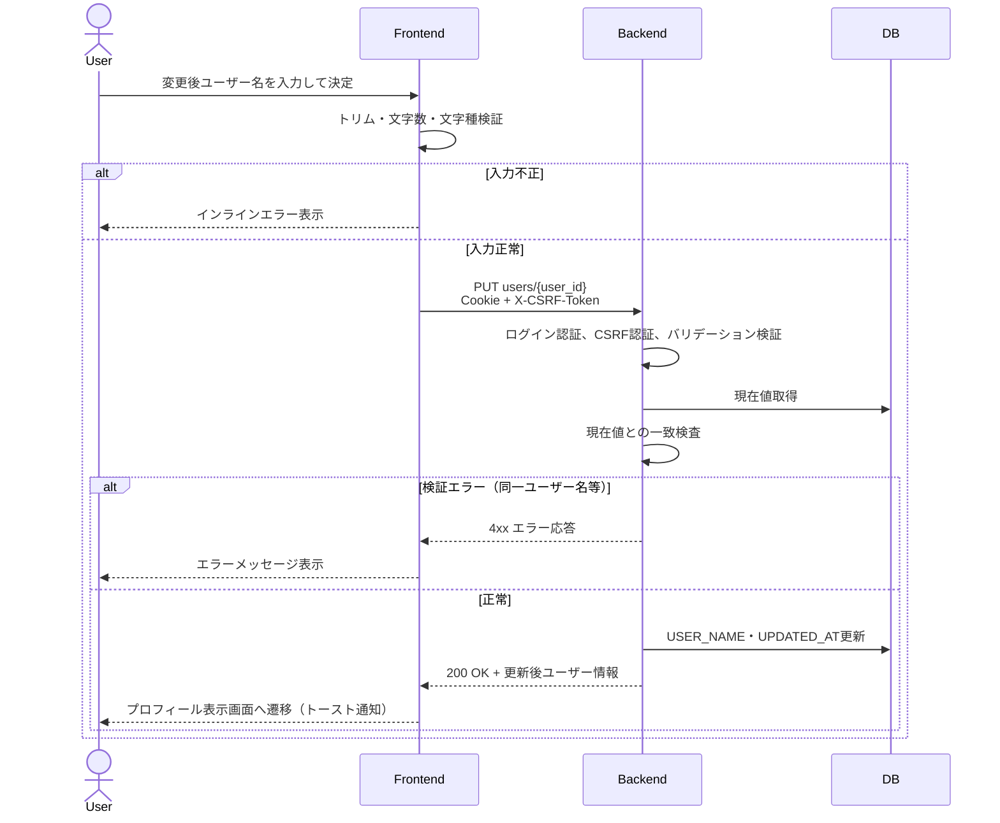
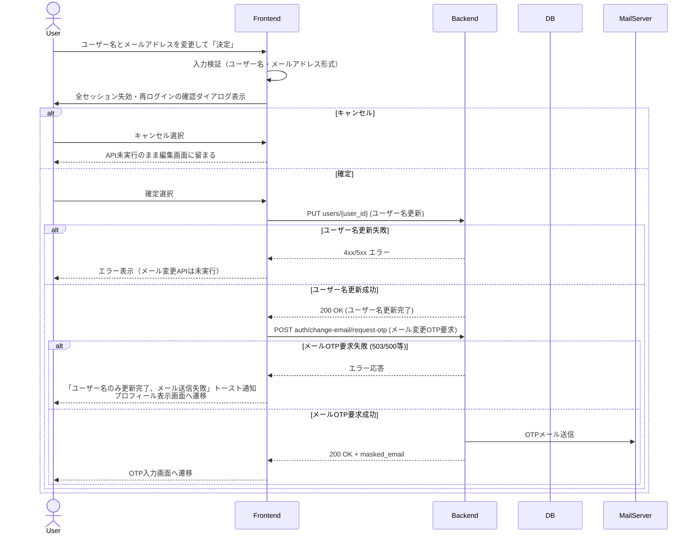
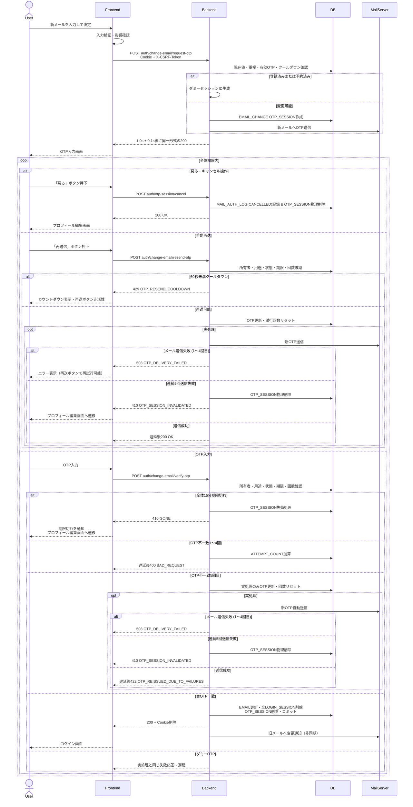

# 2. アカウント編集 (Account Edit)

## 2.1 対象・前提

- 対象は「プロフィール編集画面」と「アカウント関連/OTP入力画面」とする。
- 認証には `sync_task_sid` Cookieを使用し、全状態変更APIに `X-CSRF-Token` を付与する。
- 初期値は `GET users/{user_id}` で取得する。ユーザー名変更は即時確定、メールアドレス変更は新アドレス宛OTPの検証成功時に確定する。
- ユーザー名とメールアドレスは別APIで変更する。両方を変更する場合は、確認ダイアログ確定後にユーザー名を先に確定し、続いてメール変更OTPを要求する。後続OTPの中断・失効・送信失敗時も確定済みユーザー名は戻さない。
- 全API応答に `Cache-Control: no-store, no-cache, must-revalidate` と `Pragma: no-cache` を付与し、表示値はエスケープする。
- フロントエンドが有効期限内のメール変更用 `otp_session_id` を保持している場合はOTP入力画面へ復帰し、`request-otp` を再実行しない。保持状態は変更完了・全体期限切れ・セッション失効時に削除する。

## 2.2 送信時の分岐

| 現在値との差分 | 処理 |
| :--- | :--- |
| ユーザー名のみ | `PUT users/{user_id}` 成功後、プロフィール表示画面へ遷移 |
| メールアドレスのみ | `POST auth/change-email/request-otp` を実行してOTP入力画面へ遷移 |
| 両方 | 「決定」ボタン押下時に全セッション失効・再ログインの確認ダイアログを表示。キャンセル時はユーザー名更新も含め一切のAPIを実行せず編集画面に留まる。確定後、まず `PUT users/{user_id}` を実行。ユーザー名更新成功後、直ちに `POST auth/change-email/request-otp` を実行 |
| 差分なし | 更新せず、現在値と同一であることを表示 |

## 2.3 ユーザー名変更

1. 前後をトリムし、2〜20文字かつ半角英大文字・英小文字・数字のみかを検証する。
2. `PUT users/{user_id}` に `{"username":"<変更後ユーザー名>"}` を送る。メールアドレス等の変更不可フィールドは送信せず、含まれてもバックエンドは無視する。
3. バックエンドは認証（401 `UNAUTHORIZED`）、CSRF（403 `FORBIDDEN`）、JSON・必須項目・型・文字数・文字種（400 `BAD_REQUEST`）、パスのユーザーIDとセッションユーザーIDの一致（404 `NOT_FOUND`）、現在値との一致（422 `SAME_AS_CURRENT_USERNAME`）の順に検証する。
4. 正常時は `LOGIN_ACCOUNT.USER_NAME` と `UPDATED_AT` を同一トランザクションで更新し、更新後ユーザーを200で返す。ユーザー名の重複は許可する。
5. フロントエンドは表示名を即時更新する。ログインセッションを維持し、再認証・OTP・メール通知は行わない。

## 2.3.1 ユーザー名・メールアドレス両方変更時の処理詳細

1. **ステップ1 (ユーザー名更新)**: `PUT users/{user_id}` を実行。
    - 失敗した場合: エラーメッセージを表示し、メール変更APIは呼び出さずに編集画面に留まる。
2. **ステップ2 (メール変更OTP要求)**: ステップ1成功後、直ちに `POST auth/change-email/request-otp` を実行。
    - 成功した場合: OTP入力画面へ遷移する。
    - 失敗した場合（送信失敗503、サーバーエラー500等）: 「ユーザー名は更新されましたが、認証メールの送信に失敗しました。プロフィール画面から再度メール変更をお試しください」といったトースト通知を表示し、プロフィール表示画面へ遷移する（すでに確定したユーザー名はロールバックしない）。

## 2.4 メールアドレス変更の開始 (request-otp)

1. 新メールアドレスをトリム・小文字化し、形式・文字数（255文字以下）を検証する。
2. 全端末からログアウトし、新メールで再ログインが必要になる旨を確認後、`POST auth/change-email/request-otp` に `new_email` を送る。
3. バックエンドは認証（401 `UNAUTHORIZED`）、CSRF（403 `FORBIDDEN`）、形式・必須項目（400 `BAD_REQUEST`）の順に検証する。
4. 新メールが現在のメールと一致する場合は 422 `SAME_AS_CURRENT_EMAIL` を返す。
5. 直前送信から60秒以内の再要求時はアカウント列挙防止のため実際のメール送信を行わず、残クールダウン秒数（`cooldown_seconds`）を含めて 200 OK を返却する（429 `OTP_RESEND_COOLDOWN` を返却するのは発行済み `otp_session_id` を送信する `resend-otp` のみ）。
6. `uq_otp_session_active_pending_email` を排他の最終境界とし、一意制約競合時も重複を公開せずダミーへ切り替える。予約は検証確定または全体期限切れまで維持する。
7. 実処理のみ新メールへOTPを送信する。重複・予約中、または既存セッションがある状態で `request-otp` が再度呼ばれた場合は、既存セッションを更新せずダミーセッションを新規作成する。ダミーでは `IS_DUMMY=true` を最終判定とし、所有者認可用の `USER_ID=<認証ユーザー>` とマスク済みメールだけを保持し、`PENDING_USERNAME`、`PENDING_EMAIL`、`PENDING_PASSWORD_HASH`、`OTP_HASH` はNULLとする。試行・送信回数、配信状態、個別・全体期限、作成日時は通常どおり保存する。
8. 実・ダミーとも先頭4文字＋固定10文字マスク＋ドメインの `masked_email`、`expires_in_seconds=300` を同じ200で返し、応答を `1.0s ± 0.1s` に揃える。発行結果は `MAIL_AUTH_LOG` に `AUTH_TYPE='EMAIL_CHANGE'`、イベント、成否、`IS_DUMMY`、ユーザーID、対象メール、IP、日時を記録する。
9. 手続き中は `LOGIN_ACCOUNT.EMAIL` を更新せず、旧メールをログイン識別子として維持する。

## 2.5 OTP入力・再送・検証

### 画面制御

- OTP入力画面には全体15分タイマー、OTP入力欄、戻る、再送信、決定を表示する。送信先は先頭4文字とドメインのみ表示し、中間は常に10文字分マスクする。
- 直前送信から60秒は再送ボタンを非活性にする。個別OTPの5分期限切れ時は再送を促す。再送しても全体15分期限を延長しない。

### OTP手動再送・セッションキャンセル

#### 手動再送
`POST auth/change-email/resend-otp` に `otp_session_id` を送る。認証・CSRF、入力、所有者、`PURPOSE='EMAIL_CHANGE'`、`STATUS='active'`、全体期限、60秒クールダウンの順に検証する。実セッションは新OTPを送信し、`OTP_HASH`、`OTP_EXPIRES_AT`、`LAST_SENT_AT` を更新、`ATTEMPT_COUNT=0`、`SEND_COUNT=SEND_COUNT+1` とする。ダミーは送信せず同じ表示を返す。成功応答は双方 `1.0s ± 0.1s` とし、再送イベントを `MAIL_AUTH_LOG` に記録する。

実メール送信に失敗した場合は `DELIVERY_STATUS='sendable'`、`SEND_FAILED_COUNT=SEND_FAILED_COUNT+1` とし、`503 OTP_DELIVERY_FAILED` を返却する（同一の `otp_session_id` レコードを直接更新するためセッションIDは変更されず、保持している `otp_session_id` で再送操作が可能）。失敗送信には60秒クールダウンを適用しない。成功時は `DELIVERY_STATUS='sent'`、`SEND_FAILED_COUNT=0` とする。連続5回目の失敗では対象セッションを物理削除し、`410 OTP_SESSION_INVALIDATED` を返してプロフィール編集画面へ戻す。

#### セッション破棄・キャンセル
ユーザーが「戻る」ボタンを押下したり画面から離脱した場合、クライアント側の `otp_session_id` を破棄するとともに、`POST auth/otp-session/cancel` を呼び出す。
- サーバー側は対象の `OTP_SESSION` を特定し、`MAIL_AUTH_LOG` に `AUTH_TYPE='EMAIL_CHANGE'`、`EVENT_TYPE='CANCELLED'` を記録した上で、`OTP_SESSION` レコードを DB から直ちに物理削除する。
- 処理完了後は遅延なしで `200 OK`（`{"message": "OTP session cancelled successfully."}`）を返却する。

### OTP検証

1. OTPをトリムして大文字化し、8桁英数字かをフロント・バック双方で確認する。
2. `POST auth/change-email/verify-otp` に `otp_session_id` と `otp` を送る。
3. 認証・CSRF、入力形式、所有者、用途、状態、`OTP_EXPIRES_AT`、`SESSION_EXPIRES_AT` の順に検証する。形式不正では試行回数を加算しない。他者所有は403 `FORBIDDEN`、期限切れは410 `GONE` とする。
4. 不一致1〜4回目は `ATTEMPT_COUNT` を加算し、`1.0s ± 0.1s` 後に400 `BAD_REQUEST` を返す。
5. 5回目は実セッションだけ旧OTPを失効して新OTPを自動発行・送信する。ダミーは送信しない。双方とも回数をリセットし、`AUTO_RESEND` を記録する。
   - 実メール送信に成功した場合（ダミー含む）: `1.0s ± 0.1s` 後に `422 OTP_REISSUED_DUE_TO_FAILURES` を返し、画面上に「入力試行回数の上限に達したため、新しい認証コードを再送信しました」と表示して入力欄をクリアし、60秒クールダウンを開始する。
   - 実メール送信に失敗した場合（1〜4回目の送信失敗）: `DELIVERY_STATUS='sendable'`、`SEND_FAILED_COUNT+=1` とし、`503 Service Unavailable`（code: `"OTP_DELIVERY_FAILED"`）を返却する。画面側では「新しい認証コードの送信に失敗しました。再送信ボタンから再試行してください」と案内する。
   - 自動再送を含めて5回連続で送信失敗となった場合: 対象セッションを物理削除し、`410 Gone`（code: `"OTP_SESSION_INVALIDATED"`）を返却してプロフィール編集画面へ戻す。
6. ダミーは常に失敗とし、画面、コード、構造、応答時間から実・ダミーを識別不能にする。
7. `VERIFY_SUCCESS`、`VERIFY_FAILED`、`AUTO_RESEND`、`EXPIRED` を `MAIL_AUTH_LOG` に記録する。

## 2.6 メール変更確定・全セッション失効

実OTPの照合成功時は次を行う。

1. トランザクション内で対象 `LOGIN_ACCOUNT` をロックし、`OTP_SESSION.USER_ID` と認証ユーザーの一致、未削除、新メールが他の有効アカウントで未使用であることを再検証する。
2. `LOGIN_ACCOUNT.EMAIL=PENDING_EMAIL`、`UPDATED_AT=NOW()` に更新する。
3. 当該ユーザーの全 `LOGIN_SESSION`（現在、他端末、他ブラウザを含む）と使用済みメール変更 `OTP_SESSION` を物理削除してコミットする。
4. 200応答に `sync_task_sid` と `XSRF-TOKEN` の `Max-Age=0` 削除ヘッダーを付ける。フロントも認証状態を破棄し、ログイン画面へ遷移して新メールでの再ログインを要求する。
5. コミット後、更新前に退避した旧メールへ変更完了通知を非同期送信する。通知失敗で確定済み変更はロールバックせず、失敗を記録する。

## 2.7 エラー・期限切れ時の画面動作

| HTTP / code | 画面動作 |
| :--- | :--- |
| 400 `BAD_REQUEST` | 入力欄下またはフォーム上部にエラー。OTP失敗は実・ダミーで同一表示 |
| 401 `UNAUTHORIZED` | ログイン画面へ遷移 |
| 403 `FORBIDDEN` | 操作中止。他者所有OTPの情報は表示しない |
| 404 `NOT_FOUND` | 存在を秘匿した汎用エラー |
| 410 `GONE` | 手続きを終了して期限切れを通知し、プロフィール編集画面へ遷移。レコードは15分ごとのCronでも物理削除 |
| 410 `OTP_SESSION_INVALIDATED` | メール送信が5回連続で失敗したため手続きを終了し、プロフィール編集画面へ遷移 |
| 503 `OTP_DELIVERY_FAILED` | メール送信失敗を表示し、同じセッションIDで再送を許可 |
| 422 `SAME_AS_CURRENT_USERNAME` | 「現在のユーザー名と同じです」 |
| 422 `SAME_AS_CURRENT_EMAIL` | 「現在のメールアドレスと同じです」 |
| 422 `OTP_REISSUED_DUE_TO_FAILURES` | 「新しいOTPを再送しました」。入力回数をリセット |
| 429 `OTP_RESEND_COOLDOWN` | 残り時間を表示し再送ボタンを非活性 |
| 500 `INTERNAL_SERVER_ERROR` | 更新確定とは扱わず汎用エラー |
