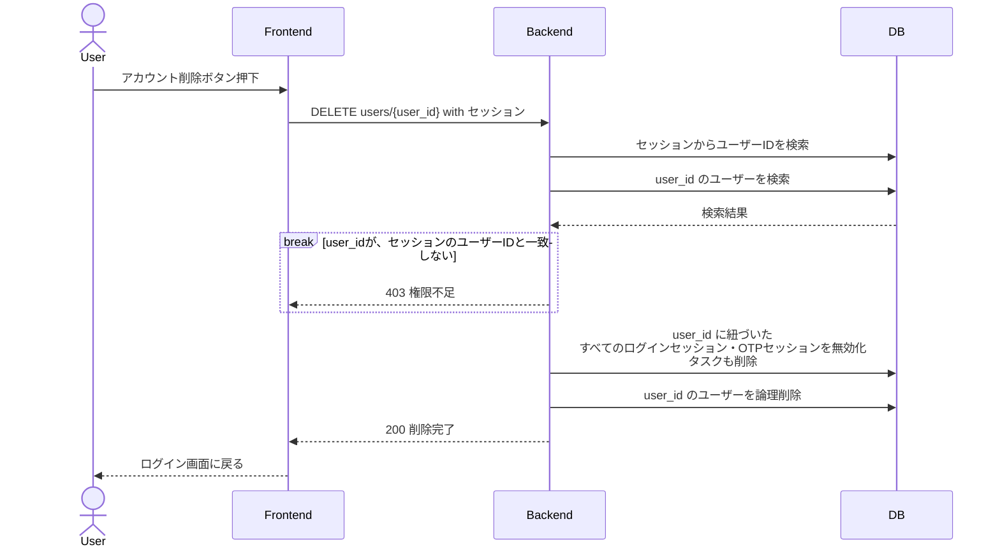

# 3. アカウント削除 (Account Delete)

```mermaid
sequenceDiagram
	actor User
	participant Frontend
	participant Backend
	participant DB
	
	User->>Frontend: アカウント削除ボタン押下
	Frontend->>Backend: DELETE users/{user_id} with セッション
	Backend->>DB: セッションからユーザーIDを検索
	Backend->>DB: user_id のユーザーを検索
	DB-->>Backend: 検索結果
	break user_idが、セッションのユーザーIDと一致しない
		Backend-->>Frontend: 403 権限不足
	end
	Backend->>DB: user_id に紐づいた<br>すべてのログインセッション・OTPセッションを無効化<br>タスクも削除
	Backend->>DB: user_id のユーザーを論理削除
	Backend-->>Frontend: 200 削除完了
	Frontend-->>User: ログイン画面に戻る
```
