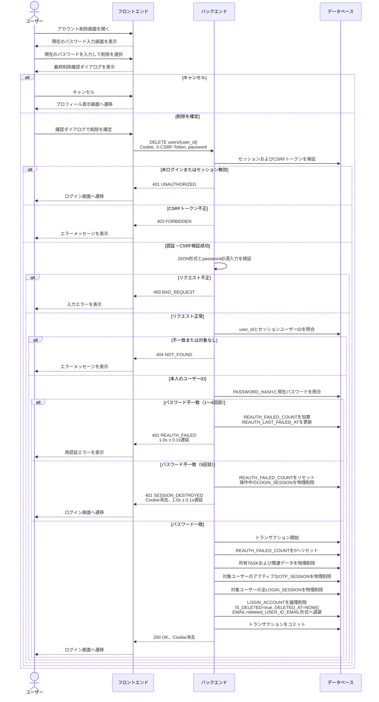

# 3. アカウント削除 (Account Delete)

## 3.1 概要

ログイン中のユーザー本人が、現在のパスワードによる再認証と削除確認を経てアカウントを削除する。削除成功時は、所有するタスクおよび関連データを物理削除し、アカウント本体を論理削除する。あわせて対象ユーザーの全ログインセッションとアクティブなOTPセッションを物理削除し、クライアントの認証Cookieを消去してログイン画面へ遷移する。

## 3.2 前提・入出力

- 画面: アカウント削除/パスワード再認証画面
- API: `DELETE users/{user_id}`
- 認証: `sync_task_sid` Cookieによるログインセッション認証が必須
- CSRF: Double Submit Cookie方式。`XSRF-TOKEN` Cookieの値を `X-CSRF-Token` ヘッダーに設定する
- パスパラメータ: `user_id`（ログインセッションのユーザーIDと一致必須）
- リクエストボディ: `{"password":"<現在のパスワード>"}`
- 成功レスポンス: `200 OK`
- 成功時Cookie消去:
  - `sync_task_sid=; HttpOnly; Secure; SameSite=Lax; Path=/; Max-Age=0`
  - `XSRF-TOKEN=; Secure; SameSite=Lax; Path=/; Max-Age=0`

## 3.3 処理シーケンス

## 3.4 バックエンド処理詳細

API設計で定める次の順序で評価する。前段の検証でエラーとなった場合、後続処理および削除処理は実行しない。

1. `sync_task_sid` に対応する `LOGIN_SESSION` の存在と有効期限を確認し、`XSRF-TOKEN` Cookieと `X-CSRF-Token` ヘッダーの一致を検証する。
2. リクエストボディが正しいJSONであり、文字列型の `password` が入力されていることを検証する。この段階の不備では再認証失敗回数を加算しない。
3. パスパラメータの `user_id` とセッションの `USER_ID` が一致し、未削除の対象アカウントが存在することを確認する。不一致または不存在は、存在有無を秘匿するため `404 NOT_FOUND` とする。この段階の不備でも再認証失敗回数を加算しない。
4. 入力パスワードと `LOGIN_ACCOUNT.PASSWORD_HASH` を安全なハッシュ照合で再認証する。
5. 再認証成功時は `REAUTH_FAILED_COUNT` を0へリセットし、削除処理を単一DBトランザクションで実行する。途中で失敗した場合は全処理をロールバックし、タスクのみ削除済み、またはアカウントのみ論理削除済みとなる部分完了を防ぐ。

### 再認証失敗時

- 失敗ごとに `LOGIN_ACCOUNT.REAUTH_FAILED_COUNT` を加算し、`REAUTH_LAST_FAILED_AT` を現在日時へ更新する。
- 1〜4回目は `401 REAUTH_FAILED` を返し、画面上のインラインエラーまたはアラートバナーに再認証失敗を表示する。
- 5回目は `REAUTH_FAILED_COUNT` を0へリセットし、操作中の `LOGIN_SESSION` のみを物理削除する。他端末・他ブラウザのセッションはこの失敗処理では削除しない。
- 5回目は `401 SESSION_DESTROYED` と両Cookieの削除ヘッダーを返し、フロントエンドはログイン画面へ遷移する。
- パスワード不一致の応答には、1〜5回目のいずれもTiming Attack対策として `1.0s ± 0.1s` の遅延を適用する。

### 削除確定時

単一DBトランザクション内で次を実施する。

1. 対象ユーザーが所有する `TASK` とその関連データを即座に物理削除する。
2. 対象ユーザーに紐づくアクティブな `OTP_SESSION` を物理削除する。
3. 対象ユーザーに紐づく `LOGIN_SESSION` を、他端末・他ブラウザ分を含めてすべて物理削除する。
4. `LOGIN_ACCOUNT` を次のとおり更新して論理削除する。
   - `IS_DELETED = TRUE`
   - `DELETED_AT = NOW()`
   - `EMAIL = deleted_<USER_ID>_<EMAIL>` 形式へ退避し、元メールアドレスでの再登録を可能にする
5. コミット後に `200 OK` と両Cookieの削除ヘッダーを返す。フロントエンドはローカルの認証状態を破棄してログイン画面へ遷移する。

## 3.5 エラー処理

| HTTP | エラーコード | 条件 | フロントエンド処理 |
| :---: | :--- | :--- | :--- |
| 400 | `BAD_REQUEST` | JSON不正、`password` 欠落・不正 | フォームに入力エラーを表示 |
| 401 | `UNAUTHORIZED` | 未ログイン、セッション無効・期限切れ | ログイン画面へ遷移 |
| 401 | `REAUTH_FAILED` | パスワード不一致（1〜4回目） | 再認証エラーを表示し再入力を許可 |
| 401 | `SESSION_DESTROYED` | パスワード不一致（5回目） | Cookieを消去しログイン画面へ遷移 |
| 403 | `FORBIDDEN` | CSRFトークン欠落・不一致 | エラーを表示し削除しない |
| 404 | `NOT_FOUND` | 他ユーザーID指定または対象不存在 | リソースの存在を秘匿したエラーを表示 |
| 500 | `INTERNAL_SERVER_ERROR` | 削除トランザクション失敗等 | ロールバックし、アラートバナーにエラーを表示 |

## 3.6 セキュリティ・整合性上の注意

- 削除確認ダイアログは誤操作防止のUIであり、本人確認はバックエンドの現在パスワード再認証で担保する。
- `user_id` はクライアント入力を信用せず、必ずログインセッションの `USER_ID` と照合する。
- 状態変更を伴う `DELETE` のため、有効なCSRFトークンがないリクエストでは削除処理を開始しない。
- 削除成功後は全ログインセッションが失効するため、同一端末を含むすべての端末で以後のAPIアクセスを `401 UNAUTHORIZED` とする。
- 論理削除済みアカウントの元メールアドレスによるログインは未登録アカウントと同じ認証失敗として扱い、削除済みであることを外部へ開示しない。
