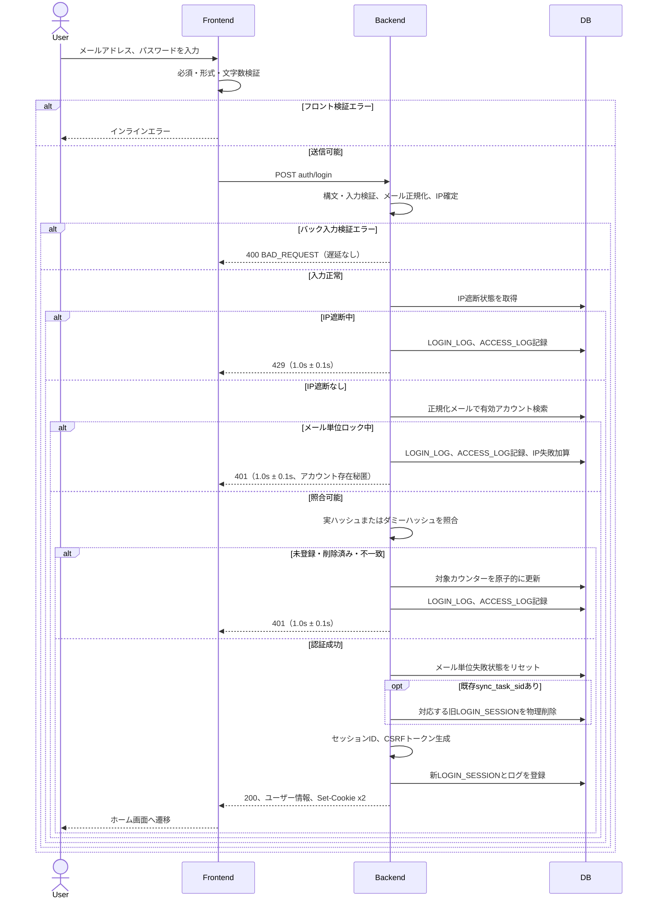

# 4. ログイン (Login)

## 4.1 対象・前提

- 対象APIは `POST auth/login`（認証・CSRF検証不要）。ログイン識別子はメールアドレスであり、ユーザー名ではログインできない。
- HTTPSを必須とし、全API応答に `Cache-Control: no-store, no-cache, must-revalidate` と `Pragma: no-cache` を付与する。
- サーバー時刻でロック、遮断、セッション期限を判定する。同一メール・同一IPへの並行要求では対象行をロックし、失敗回数加算と制限設定を原子的に行う。
- クライアントIPは信頼済みリバースプロキシの情報から確定し、任意の転送ヘッダーを信用しない。

## 4.2 入出力

```json
{
  "email": "user@example.com",
  "password": "Password123!"
}
```

| 項目 | 処理 |
| --- | --- |
| `email` | 必須文字列。前後の半角・全角スペース、タブ、改行を除去し、小文字へ正規化して検索・比較・ログ記録に用いる |
| `password` | 必須文字列、8〜128文字。値自体はトリム・正規化しない |

成功時は `200 OK` とユーザー情報を返し、次のCookieを発行してホーム画面へ遷移する。

- `sync_task_sid=<session_token>; HttpOnly; Secure; SameSite=Lax; Path=/; Max-Age=2592000`
- `XSRF-TOKEN=<csrf_token>; Secure; SameSite=Lax; Path=/; Max-Age=2592000`

`XSRF-TOKEN` は Double Submit Cookie 方式で使うため `HttpOnly` を付与しない。

| HTTP / code | 条件 | 遅延 | 表示 |
| --- | --- | --- | --- |
| `400 / BAD_REQUEST` | JSON不正、必須項目欠落、型・文字数違反 | なし | インラインエラーまたはフォーム上部アラート |
| `401 / UNAUTHORIZED` | 未登録、削除済み、パスワード不一致、メール単位ロック中 | `1.0s ± 0.1s` | 一律「メールアドレスまたはパスワードが正しくありません」 |
| `429 / RATE_LIMIT_EXCEEDED` | IP単位遮断中（5分間のインターバルを開けずに30回連続で失敗で15分遮断） | `1.0s ± 0.1s` | 登録有無を示さない試行制限メッセージ |
| `500 / INTERNAL_SERVER_ERROR` | サーバー内部エラー | - | 汎用エラー |

エラーは共通形式 `error.code`, `error.message`, `error.details` を用い、詳細なしでも `details: []` とする。登録・削除状態を本文や応答時間から判別できる情報は返さない。

## 4.3 処理フロー



## 4.4 バックエンド詳細

### 4.4.1 入力検証・検索・評価順序

1. JSON構文、`email` と `password` の存在・型を検証する。不正時は `400` とし、失敗カウンターを加算しない。
2. メールを共通要件どおりトリム・小文字化する。パスワードは加工せずハッシュ照合へ渡す。
3. `LOGIN_IP_RATE_LIMIT.BLOCKED_UNTIL > NOW()` なら照合せず `429`。遮断中の要求で期限を延長しない。
4. `LOGIN_ACCOUNT.EMAIL` が正規化メールと一致し、`IS_DELETED = FALSE` の行を検索する。削除時のメールは退避されるため、削除済みは未登録と同じ該当なし経路となる。
5. 有効アカウントの `LOGIN_LOCK_UNTIL > NOW()` の場合は、アカウント存在秘匿のため直ちに429エラーとはせず、パスワード照合において正しいパスワードであっても認証拒否として `401 UNAUTHORIZED`（遅延 `1.0s ± 0.1s`）を返却する。ロック中の要求で回数・期限を延長しない。
6. 制限対象外の場合のみ一定時間比較で照合する。該当なしでも実ハッシュ相当のコストを持つ固定ダミーハッシュを照合する。パスワード平文・各ハッシュはログへ出力しない。

### 4.4.2 認証失敗

トランザクション内で次を更新する。

- 有効アカウントがある場合、`LOGIN_LAST_FAILED_AT` から15分を超えていれば `LOGIN_FAILED_COUNT` を0に戻し、今回分を加算する。15分のインターバルを挟まず5回連続失敗で `LOGIN_LOCK_UNTIL = NOW() + 30 minutes` とする。ロックは固定30分で延長しない。
- 未登録・削除済みを含む全認証失敗で `LOGIN_IP_RATE_LIMIT` をIPキーでUPSERTする。`LAST_FAILED_AT` から5分を超えていれば `FAILED_COUNT` を0に戻し、今回分を加算する。5分のインターバルを挟まず累計30回で `BLOCKED_UNTIL = NOW() + 15 minutes` とする。
- 未登録・削除済みには有効な `LOGIN_ACCOUNT` 行がないためメール単位カウンターは更新せず、IP単位制限で保護する。
- メール単位ロックアウト時は、制限到達となった今回の照合失敗およびロックアウト期間中の次回以降の要求も、アカウント存在を秘匿するため一貫して `401 UNAUTHORIZED` を返却する。IP単位遮断時のみ `429 RATE_LIMIT_EXCEEDED` とする。
- `401` と `429` は、DB処理を含む総応答時間がランダムジッター付き `1.0s ± 0.1s` になるよう調整する。既に上限を超えた場合は追加待機しない。

### 4.4.3 認証成功・セッション発行

1. `LOGIN_FAILED_COUNT = 0`, `LOGIN_LAST_FAILED_AT = NULL`, `LOGIN_LOCK_UNTIL = NULL` とする。IPカウンターはIP全体の攻撃検知用のため単一ログイン成功ではリセットしない。
2. 受信Cookieに `sync_task_sid` があれば、対応する旧 `LOGIN_SESSION` のみ物理削除する。存在しなくても継続し、他端末のセッションは削除しない。
3. セッション固定を防ぐため受信IDを再利用せず、推測困難な新セッションIDとCSRFトークンを暗号学的安全な乱数で生成する。
4. `LOGIN_SESSION` に `SESSION_ID`, `USER_ID`, `EXPIRES_AT = NOW() + 30 days`, `USER_AGENT`, `CREATED_AT` を登録する。DB登録完了前にCookieを発行しない。
5. 2つのCookieを同じ30日有効期限で発行する。成功には人工遅延を加えない。

旧セッション削除、新セッション登録、成功時リセットは可能な限り同一トランザクションとし、失敗時はロールバックして新Cookieを発行しない。

## 4.5 ログ

| テーブル | 記録内容 |
| --- | --- |
| `LOGIN_LOG` | `USER_ID`（未特定はNULL）、正規化済み`EMAIL`、`IP_ADDRESS`、`IS_SUCCESS`、`IS_SESSION_USED = FALSE`、`ACCESS_AT` |
| `ACCESS_LOG` | `USER_ID`（未特定はNULL）、`IP_ADDRESS`、`ENDPOINT = POST auth/login`、`RESOURCE_ID = NULL`、`ACCESS_AT` |

- `ACCESS_LOG` は入力検証エラー、`401`、`429`、成功を記録する。`LOGIN_LOG` は正規化済みメールを確定できるログイン試行について記録する（`EMAIL` が `NOT NULL` のため、メール欠落・型不正で値を確定できない要求は `ACCESS_LOG` のみ）。パスワード、セッションID、CSRFトークン、ハッシュは記録しない。
- ログ保存失敗は運用監視へ通知し、秘匿情報を含む詳細をクライアントへ返さない。
- `LOGIN_LOG` は365日、`ACCESS_LOG` は90日保持し、所定の日次Cronで期限超過分を物理削除する。

## 4.6 既存セッション確認とSliding Expiration

ログイン画面遷移時に `sync_task_sid` があれば、フロントエンドの認証ガードは認証必須APIで確認する。有効ならホームへ遷移し、無効・不在・期限切れならフォームを表示する。

認証必須APIで有効なセッションを利用するたびに次を行う。

1. `LOGIN_SESSION` の `EXPIRES_AT > NOW()` と未削除ユーザーを確認する。
2. 有効なら `EXPIRES_AT = NOW() + 30 days` へ更新する。
3. `sync_task_sid` と、有効なDouble Submit用CSRFトークンを格納した `XSRF-TOKEN` の `Max-Age=2592000` を再設定し、Cookie期限をDB期限へ同期する。
4. 無効なら期限切れ行を物理削除し、両Cookieを `Max-Age=0` で消去してログイン画面を表示する。

`POST auth/login` 自体は未認証APIのためSliding Expiration対象外。期限切れ `LOGIN_SESSION` は毎日00:00 JSTのCronでも物理削除する。

## 4.7 フロントエンド制御

- メール欄、パスワード欄（マスク・表示切替）、ログインボタン、アカウント作成・パスワードリセットへのリンクを表示する。
- 送信中は多重押下を抑止する。サーバー側でも並行要求を安全に処理する。
- `400` は `error.details` に従い項目下へ、`401` は誤り項目を示さない共通文言で、`429` はフォーム上部へ表示する。
- 認証失敗後はパスワードをクリアする。認証情報をURL、ブラウザログ、解析イベントへ含めない。
