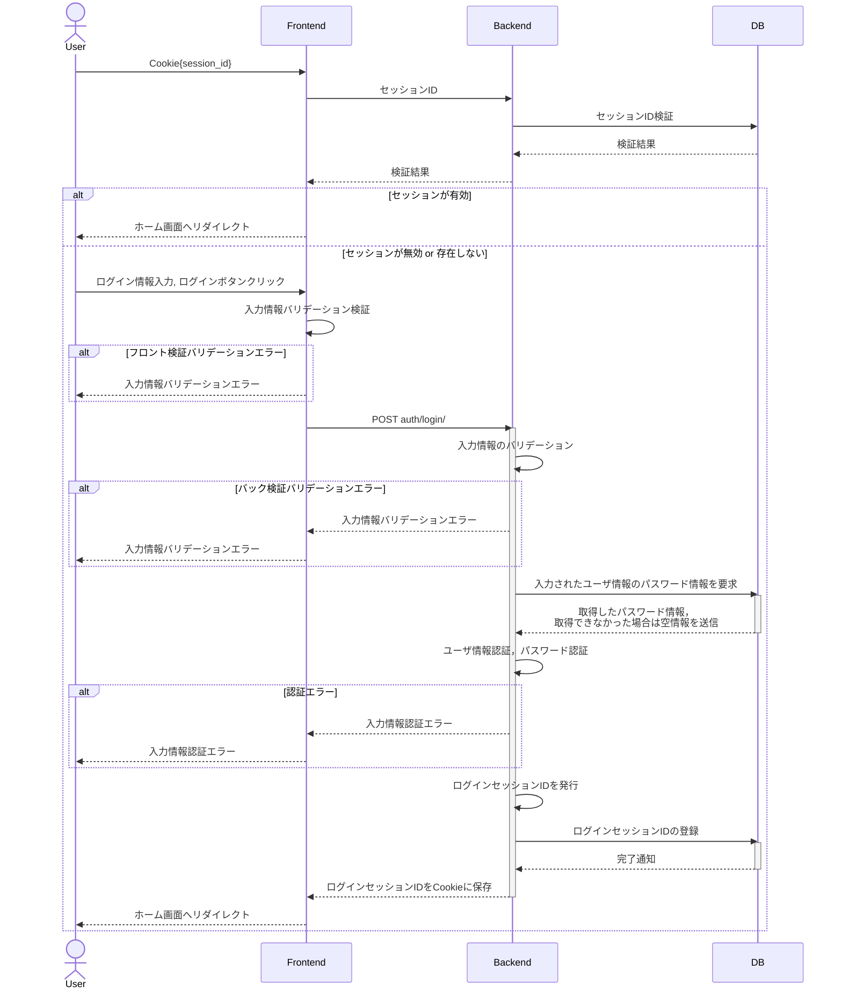

# 4. ログイン (Login)

```mermaid
sequenceDiagram
	actor User
	participant Frontend
	participant Backend
	participant DB

	User->>Frontend: Cookie{session_id}
	Frontend->>Backend: セッションID
	Backend->>DB: セッションID検証
	DB-->>Backend: 検証結果
	Backend-->>Frontend: 検証結果
	alt セッションが有効
		Frontend-->>User: ホーム画面へリダイレクト
	else セッションが無効 or 存在しない
		User->>Frontend: ログイン情報入力, ログインボタンクリック
		Frontend->>Frontend: 入力情報バリデーション検証
		alt フロント検証バリデーションエラー
			Frontend-->>User: 入力情報バリデーションエラー
		end
		Frontend->>Backend: POST auth/login/
		activate Backend
		Backend->>Backend: 入力情報のバリデーション
		alt バック検証バリデーションエラー
			Backend-->>Frontend: 入力情報バリデーションエラー
			Frontend-->>User: 入力情報バリデーションエラー
		end
		Backend->>DB: 入力されたユーザ情報のパスワード情報を要求
		activate DB
		DB-->>Backend: 取得したパスワード情報，<br>取得できなかった場合は空情報を送信
		deactivate DB
		Backend->>Backend: ユーザ情報認証，パスワード認証
		alt 認証エラー
			Backend-->>Frontend: 入力情報認証エラー
			Frontend-->>User: 入力情報認証エラー
		end
		Backend->>Backend: ログインセッションIDを発行
		Backend->>DB: ログインセッションIDの登録
		activate DB
		DB-->>Backend: 完了通知
		deactivate DB
		Backend-->>Frontend: ログインセッションIDをCookieに保存
		deactivate Backend
		Frontend-->>User: ホーム画面へリダイレクト
	end
```
