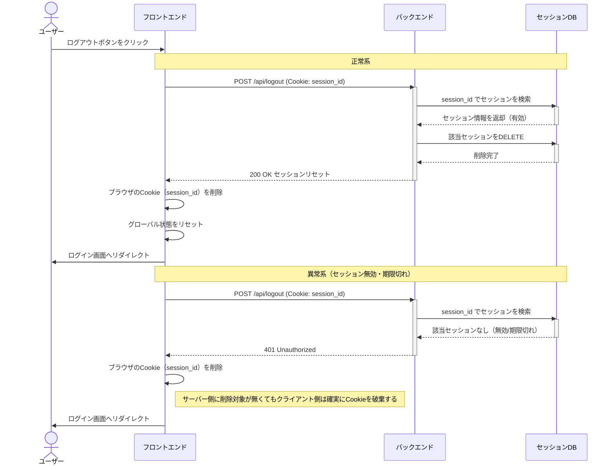

# 5. ログアウト (Logout)

```mermaid
sequenceDiagram
	actor User as ユーザー
	participant FE as フロントエンド
	participant BE as バックエンド
	participant DB as セッションDB

	User->>FE: ログアウトボタンをクリック

	Note over FE,DB: 正常系
	FE->>BE: POST /api/logout (Cookie: session_id)
	activate BE
	BE->>DB: session_id でセッションを検索
	activate DB
	DB-->>BE: セッション情報を返却（有効）
	deactivate DB
	BE->>DB: 該当セッションをDELETE
	activate DB
	DB-->>BE: 削除完了
	deactivate DB
	BE-->>FE: 200 OK セッションリセット
	deactivate BE
	FE->>FE: ブラウザのCookie（session_id）を削除
	FE->>FE: グローバル状態をリセット
	FE->>User: ログイン画面へリダイレクト

	Note over FE,DB: 異常系（セッション無効・期限切れ）
	FE->>BE: POST /api/logout (Cookie: session_id)
	activate BE
	BE->>DB: session_id でセッションを検索
	activate DB
	DB-->>BE: 該当セッションなし（無効/期限切れ）
	deactivate DB
	BE-->>FE: 401 Unauthorized
	deactivate BE
	FE->>FE: ブラウザのCookie（session_id）を削除
	Note right of FE: サーバー側に削除対象が無くてもクライアント側は確実にCookieを破棄する
	FE->>User: ログイン画面へリダイレクト
```
