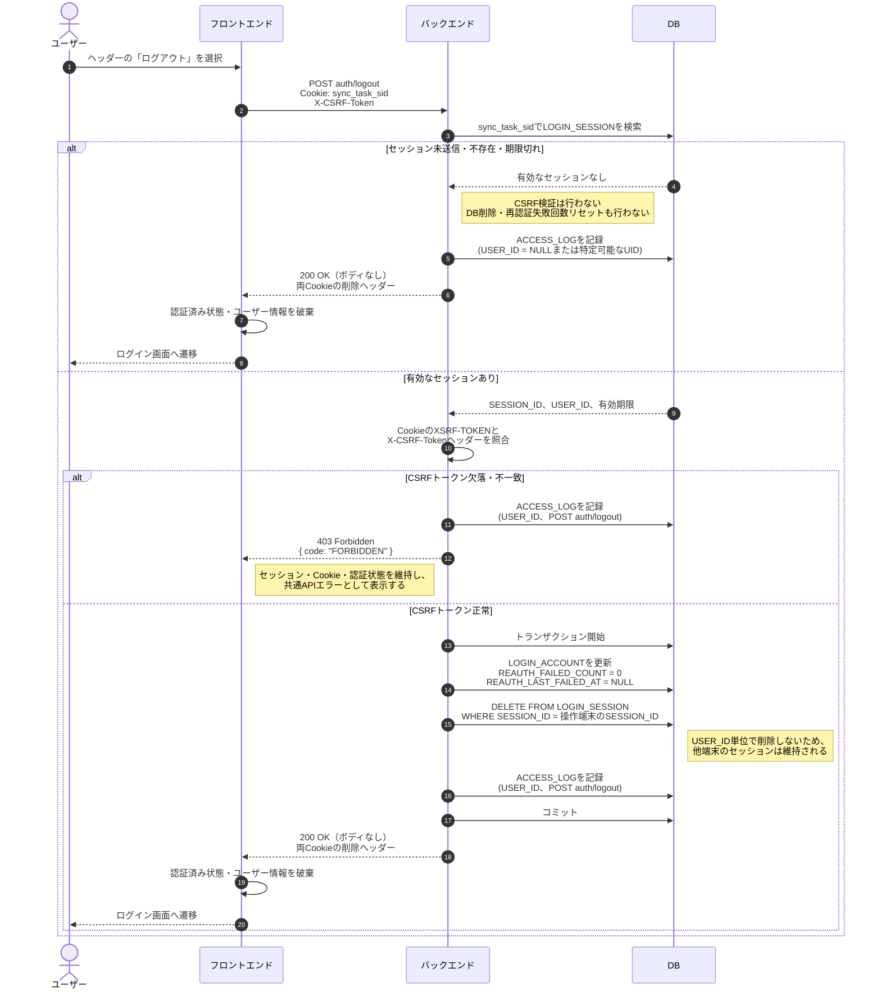

# 5. ログアウト (Logout)

## 1. 概要

- 対象APIは `POST auth/logout` とする。
- 有効なログインセッションが存在する場合だけ `X-CSRF-Token` を検証する。
- 正常時は操作端末の `LOGIN_SESSION` だけを物理削除し、他端末・他ブラウザのセッションは維持する。
- セッションが未送信、既に削除済み、または期限切れの場合も `200 OK` とし、ログアウトを冪等にする。
- 成功応答ではセッションCookie `sync_task_sid` とCSRFトークンCookie `XSRF-TOKEN` の両方を削除する。
- ログアウト完了後、フロントエンドは認証状態を破棄してログイン画面へ遷移する。

## 2. 処理フロー

## 3. バックエンド処理詳細

### 3.1 セッション判定とCSRF検証順序

1. Cookie `sync_task_sid` からセッションIDを取得し、`LOGIN_SESSION` を検索する。
2. Cookie未送信、レコード不存在、または `EXPIRES_AT <= 現在時刻` の場合は無効セッションとして扱う。この場合、CSRFトークンの欠落・不一致を理由にエラーへせず、成功応答へ進む。
3. `EXPIRES_AT > 現在時刻` の有効なセッションが存在する場合だけ、Double Submit Cookie方式によりCookie `XSRF-TOKEN` とヘッダー `X-CSRF-Token` を検証する。
4. 有効セッションに対するCSRFトークンの欠落・不一致時は `403 Forbidden`（`FORBIDDEN`）を返す。セッション削除、再認証失敗回数のリセット、およびCookie削除は行わない。

### 3.2 有効セッションのログアウト

CSRF検証成功後、次の更新を同一トランザクションで実行する。

1. セッションの `USER_ID` に対応する `LOGIN_ACCOUNT.REAUTH_FAILED_COUNT` を `0`、`REAUTH_LAST_FAILED_AT` を `NULL` に更新する。
2. リクエストCookieに対応する `LOGIN_SESSION.SESSION_ID` のレコードだけを物理削除する。`USER_ID` に属する全セッションの一括削除は行わない。
3. APIアクセスログを記録してコミットする。

更新または削除に失敗した場合はロールバックし、共通エラー仕様に従って `500 Internal Server Error`（`INTERNAL_SERVER_ERROR`）を返す。DB処理が完了していないため、成功時のCookie削除応答および画面遷移は行わない。

### 3.3 無効・期限切れセッションのログアウト

- セッションレコードの削除対象および紐付くアカウントが確定できないため、`LOGIN_ACCOUNT` の再認証失敗回数は更新しない。
- 期限切れレコードが残存していても、本APIの成功条件として削除完了を要求しない。期限切れ `LOGIN_SESSION` は日次Cron（毎日00:00 JST）による物理削除対象とする。
- 常に `200 OK` と両Cookieの削除ヘッダーを返し、再実行しても同じ外部結果となるようにする。

## 4. レスポンス・Cookie・画面制御

### 4.1 成功応答

- HTTPステータス: `200 OK`
- レスポンスボディ: なし
- Cookie削除ヘッダー:
  - `Set-Cookie: sync_task_sid=; HttpOnly; Secure; SameSite=Lax; Path=/; Max-Age=0`
  - `Set-Cookie: XSRF-TOKEN=; Secure; SameSite=Lax; Path=/; Max-Age=0`

フロントエンドは成功応答を受信したら、保持しているユーザー情報、認証済みフラグ、キャッシュ等のログイン依存状態を破棄し、ログイン画面へリダイレクトする。`sync_task_sid` は `HttpOnly` のためJavaScriptから直接削除せず、サーバーの `Set-Cookie` により消去する。

### 4.2 エラー応答

| 条件 | HTTP | コード | セッション・Cookie | 画面制御 |
| --- | --- | --- | --- | --- |
| 有効セッションでCSRFトークンが欠落・不一致 | 403 | `FORBIDDEN` | 維持 | ログアウト完了扱いにせず、共通APIエラーを表示 |
| DB更新・削除・ログ記録に失敗 | 500 | `INTERNAL_SERVER_ERROR` | 維持 | ログアウト完了扱いにせず、再試行可能なエラーを表示 |

## 5. ログ記録

各リクエストについて `ACCESS_LOG` に次を記録する。

| カラム | 設定値 |
| --- | --- |
| `LOG_ID` | 新規UUID |
| `USER_ID` | 有効セッションから特定できる場合はUID、未特定時は `NULL` |
| `IP_ADDRESS` | リクエスト元IPアドレス |
| `ENDPOINT` | `POST auth/logout` |
| `RESOURCE_ID` | `NULL` |
| `ACCESS_AT` | アクセス日時 |

ログにはセッションID、CSRFトークン、Cookie値を出力しない。`ACCESS_LOG` は90日間保持し、日次Cron（毎日01:00 JST）で保持期限超過分を物理削除する。
