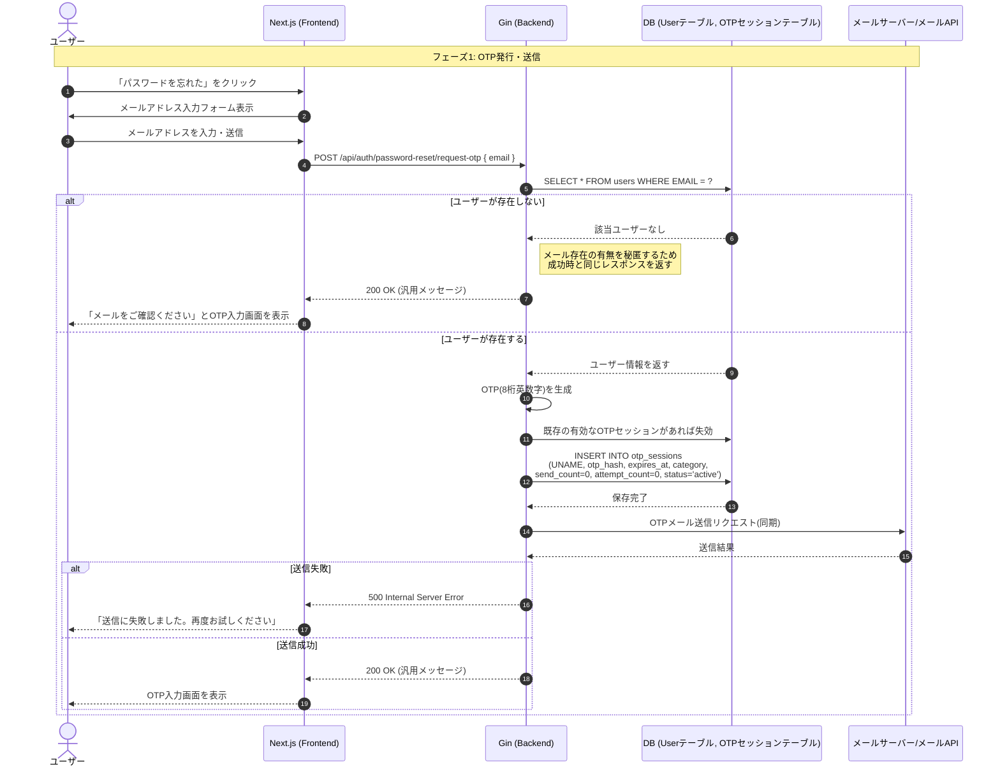
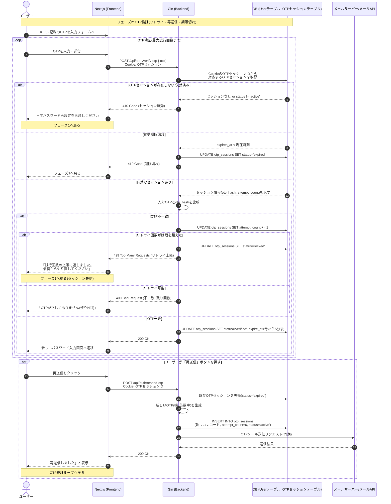
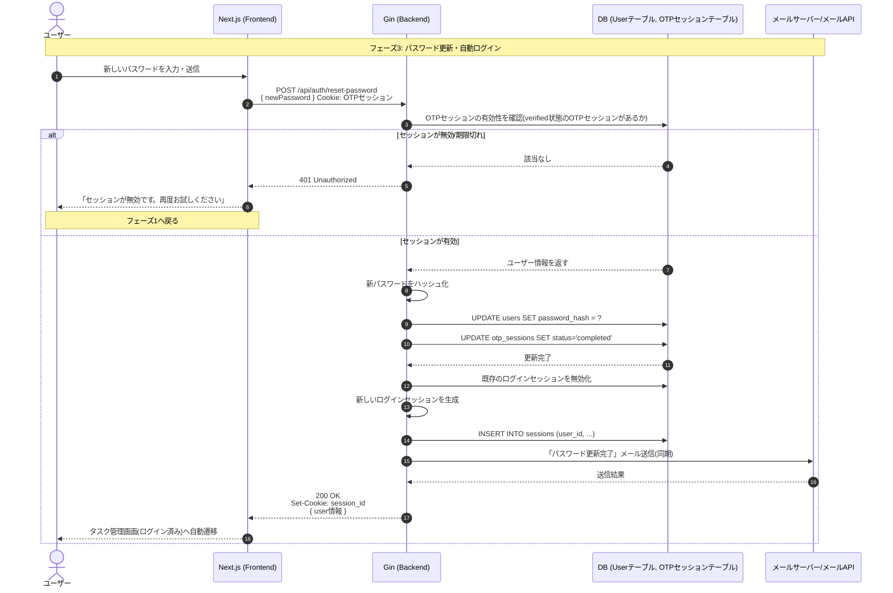

# 6. パスワードリセット (Password Reset)

## 1. パスワード再設定要求フェーズ

```mermaid
sequenceDiagram
	autonumber
	actor User as ユーザー
	participant FE as Next.js (Frontend)
	participant BE as Gin (Backend)
	participant DB as DB (Userテーブル, OTPセッションテーブル)
	participant Mail as メールサーバー/メールAPI

	Note over User,Mail: フェーズ1: OTP発行・送信
	User->>FE: 「パスワードを忘れた」をクリック
	FE->>User: メールアドレス入力フォーム表示
	User->>FE: メールアドレスを入力・送信

	FE->>BE: POST /api/auth/password-reset/request-otp { email }
	BE->>DB: SELECT * FROM users WHERE EMAIL = ?

	alt ユーザーが存在しない
		DB-->>BE: 該当ユーザーなし
		Note right of BE: メール存在の有無を秘匿するため<br/>成功時と同じレスポンスを返す
		BE-->>FE: 200 OK (汎用メッセージ)
		FE-->>User: 「メールをご確認ください」とOTP入力画面を表示
	else ユーザーが存在する
		DB-->>BE: ユーザー情報を返す

		BE->>BE: OTP(8桁英数字)を生成
		BE->>DB: 既存の有効なOTPセッションがあれば失効
		BE->>DB: INSERT INTO otp_sessions<br/>(UNAME, otp_hash, expires_at, category, <br>send_count=0, attempt_count=0, status='active')
		DB-->>BE: 保存完了

		BE->>Mail: OTPメール送信リクエスト(同期)
		Mail-->>BE: 送信結果

		alt 送信失敗
			BE-->>FE: 500 Internal Server Error
			FE-->>User: 「送信に失敗しました。再度お試しください」
		else 送信成功
			BE-->>FE: 200 OK (汎用メッセージ)
			FE-->>User: OTP入力画面を表示
		end
	end
```

## 2. OTP入力・検証フェーズ

```mermaid
sequenceDiagram
	autonumber
	actor User as ユーザー
	participant FE as Next.js (Frontend)
	participant BE as Gin (Backend)
	participant DB as DB (Userテーブル, OTPセッションテーブル)
	participant Mail as メールサーバー/メールAPI

	Note over User,DB: フェーズ2: OTP検証(リトライ・再送信・期限切れ)
	User->>FE: メール記載のOTPを入力フォームへ

	loop OTP検証(最大試行回数まで)
		User->>FE: OTPを入力・送信
		FE->>BE: POST /api/auth/verify-otp { otp } <br>Cookie: OTPセッション
		BE->>DB: CookieのOTPセッションIDから<br>対応するOTPセッションを取得

		alt OTPセッションが存在しない/失効済み
			DB-->>BE: セッションなし or status != 'active'
			BE-->>FE: 410 Gone (セッション無効)
			FE-->>User: 「再度パスワード再設定をお試しください」
			Note over User,FE: フェーズ1へ戻る
		else 有効期限切れ
			DB-->>BE: expires_at < 現在時刻
			BE->>DB: UPDATE otp_sessions SET status='expired'
			BE-->>FE: 410 Gone (期限切れ)
			FE-->>User: フェーズ1へ戻る
		else 有効なセッションあり
			DB-->>BE: セッション情報(otp_hash, attempt_count)を返す
			BE->>BE: 入力OTPとotp_hashを比較

			alt OTP不一致
				BE->>DB: UPDATE otp_sessions SET attempt_count += 1

				alt リトライ回数が制限を超えた
					BE->>DB: UPDATE otp_sessions SET status='locked'
					BE-->>FE: 429 Too Many Requests (リトライ上限)
					FE-->>User: 「試行回数の上限に達しました。<br/>最初からやり直してください」
					Note over User,FE: フェーズ1へ戻る(セッション失効)
				else リトライ可能
					BE-->>FE: 400 Bad Request (不一致, 残り回数)
					FE-->>User: 「OTPが正しくありません(残りN回)」
				end
			else OTP一致
				BE->>DB: UPDATE otp_sessions SET status='verified', expire_at=今から5分後
				BE-->>FE: 200 OK
				FE-->>User: 新しいパスワード入力画面へ遷移
			end
		end
	end

	opt ユーザーが「再送信」ボタンを押す
		User->>FE: 再送信をクリック
		FE->>BE: POST /api/auth/resend-otp<br>Cookie: OTPセッションID
		BE->>DB: 既存OTPセッションを失効(status='expired')
		BE->>BE: 新しいOTP(8桁英数字)を生成
		BE->>DB: INSERT INTO otp_sessions<br/>(新しいレコード, attempt_count=0, status='active')
		BE->>Mail: OTPメール送信リクエスト(同期)
		Mail-->>BE: 送信結果
		BE-->>FE: 200 OK
		FE-->>User: 「再送信しました」と表示
		Note over User,FE: OTP検証ループへ戻る
	end
```

## 3. パスワード更新フェーズ

```mermaid
sequenceDiagram
	autonumber
	actor User as ユーザー
	participant FE as Next.js (Frontend)
	participant BE as Gin (Backend)
	participant DB as DB (Userテーブル, OTPセッションテーブル)
	participant Mail as メールサーバー/メールAPI

	Note over User,Mail: フェーズ3: パスワード更新・自動ログイン
	User->>FE: 新しいパスワードを入力・送信
	FE->>BE: POST /api/auth/reset-password<br/>{ newPassword } Cookie: OTPセッション
 
	BE->>DB: OTPセッションの有効性を確認(verified状態のOTPセッションがあるか)
 
	alt セッションが無効/期限切れ
		DB-->>BE: 該当なし
		BE-->>FE: 401 Unauthorized
		FE-->>User: 「セッションが無効です。再度お試しください」
		Note over User,FE: フェーズ1へ戻る
	else セッションが有効
		DB-->>BE: ユーザー情報を返す
		BE->>BE: 新パスワードをハッシュ化
		BE->>DB: UPDATE users SET password_hash = ?
		BE->>DB: UPDATE otp_sessions SET status='completed'
		DB-->>BE: 更新完了
		
		BE->>DB: 既存のログインセッションを無効化
		BE->>BE: 新しいログインセッションを生成
		BE->>DB: INSERT INTO sessions (user_id, ...)
		BE->>Mail: 「パスワード更新完了」メール送信(同期)
		Mail-->>BE: 送信結果
 
		BE-->>FE: 200 OK<br/>Set-Cookie: session_id<br/>{ user情報 }
		FE-->>User: タスク管理画面(ログイン済み)へ自動遷移
	end
```
