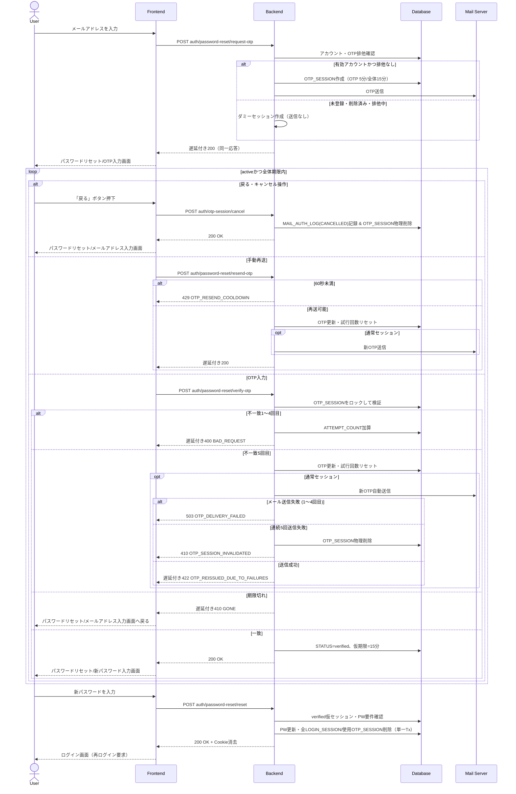

# 6. パスワードリセット (Password Reset)

## 6.1 対象画面・API

| フェーズ | API | 認証 / CSRF | 正常応答 |
| :--- | :--- | :--- | :--- |
| OTP発行 | `POST auth/password-reset/request-otp` | 不要 | `200 OK` |
| OTP検証 | `POST auth/password-reset/verify-otp` | 不要 | `200 OK` |
| OTP手動再送 | `POST auth/password-reset/resend-otp` | 不要 | `200 OK` |
| OTPセッション破棄・キャンセル | `POST auth/otp-session/cancel` | 不要 | `200 OK` |
| 新パスワード設定 | `POST auth/password-reset/reset` | OTP検証済み仮セッション | `200 OK` |

画面遷移は「ログイン画面」→「パスワードリセット/メールアドレス入力画面」→「パスワードリセット/OTP入力画面」→「パスワードリセット/新パスワード入力画面」→「ログイン画面」とする。完了時に自動ログインは行わない。

フロントエンドが有効期限内のパスワードリセット用 `otp_session_id` を保持している場合はOTP入力画面へ復帰し、`request-otp` を再実行しない。手続き完了・全体期限切れ・セッション失効時、またはユーザーによる戻る・キャンセル操作（`POST auth/otp-session/cancel` 呼び出し）時に保持状態を削除する。

全API応答には `Content-Type: application/json; charset=utf-8`、`Cache-Control: no-store, no-cache, must-revalidate`、`Pragma: no-cache` を付与する。エラー本文は共通の `error.code`、`error.message`、`error.details`（対象なしも `[]`）形式とする。

## 6.2 OTP発行

### 6.2.1 入力検証

`email` を必須とし、JSON構文・型・必須項目・メール形式・255文字以下を検証する。前後の空白文字を除去し、小文字へ正規化する。不備はOTP発行、応答遅延、試行回数加算を行わず `400 Bad Request`（`BAD_REQUEST`）とする。

### 6.2.2 通常・ダミー処理と排他

DBトランザクション内で、有効な `LOGIN_ACCOUNT` と `OTP_SESSION.PENDING_EMAIL` の排他状態を確認する。

- 通常処理: 正規化メールに一致する未削除アカウントが存在し、同メールに `STATUS IN ('active', 'verified')` のOTPセッションがない場合、英大文字・数字の許可26文字から暗号学的乱数で8桁OTPを生成する。大文字小文字を区別せず照合できるよう正規化し、ソルト付きハッシュのみを `OTP_HASH` に保存する。`PURPOSE='PASSWORD_RESET'`、対象 `USER_ID`、`PENDING_EMAIL`、`STATUS='active'`、`ATTEMPT_COUNT=0`、`SEND_COUNT=0`、`LAST_SENT_AT=NOW()`、`OTP_EXPIRES_AT=NOW()+5分`、`SESSION_EXPIRES_AT=NOW()+15分` を保存し、コミット後にメール送信する。
- ダミー処理: 未登録・論理削除済み・他の有効OTPセッションにより排他中、または既存セッションがある状態で `request-otp` が再度呼ばれた場合は、実OTPを発行・送信せず、新しい推測困難なダミー `otp_session_id` を `OTP_SESSION` に保存する。`IS_DUMMY=true` を最終判定とし、`USER_ID`、`PENDING_USERNAME`、`PENDING_EMAIL`、`PENDING_PASSWORD_HASH`、`OTP_HASH` はNULL、マスク済みメール、試行・送信回数、配信状態、個別・全体期限、作成日時は通常どおり保持する。
- 競合処理: 判定後にアカウント状態またはOTP排他が競合して一意制約に抵触した場合はロールバックしてダミー処理へ切り替え、内部状態を応答へ露出しない。

`request-otp` は、有効OTPや60秒クールダウンの存在時も `429` を返さない。既存セッションを更新せずダミー処理とし、通常・ダミーとも `1.0s ± 0.1s` 後に同一構造の `200 OK` を返す。`429 OTP_RESEND_COOLDOWN` は `otp_session_id` 付きの `resend-otp` のみに適用する。

```json
{
  "otp_session_id": "otp_sess_reset_12345",
  "masked_email": "user**********@example.com",
  "expires_in_seconds": 300,
  "cooldown_seconds": 60
}
```

OTP画面ではメールの先頭4文字とドメインだけを表示し、その他を10文字固定幅でマスクする。15分の全体タイマー、OTP入力欄、戻る・決定・再送ボタンを表示する。また、続くパスワードリセット/新パスワード入力画面においても15分の仮セッション有効期限タイマー（カウントダウン）を表示する。

## 6.3 OTP検証

1. `otp_session_id` と `otp` を必須とし、JSON構文・型とOTPの英数字8桁形式を検証する。不備は遅延・`ATTEMPT_COUNT` 加算なしの `400 BAD_REQUEST` とする。
2. OTPをトリムし大文字へ正規化する。対象 `OTP_SESSION` を更新ロックし、`PURPOSE='PASSWORD_RESET'`、`STATUS='active'`、`OTP_EXPIRES_AT` および `SESSION_EXPIRES_AT` を検証する。
3. セッション不在・用途不一致・非activeは遅延付き `400 BAD_REQUEST`、期限切れは遅延付き `410 GONE` とする。全体期限切れは物理削除し、メールアドレス入力画面へ戻す。個別5分期限切れは再送を促す。
4. OTP不一致1〜4回目は `ATTEMPT_COUNT` を加算し、`1.0s ± 0.1s` 後に `400 BAD_REQUEST` を返す。
5. 不一致5回目は、通常セッションでは新OTPを生成・送信し、`OTP_HASH`、`OTP_EXPIRES_AT=min(NOW()+5分, SESSION_EXPIRES_AT)`、`LAST_SENT_AT` を更新、`SEND_COUNT` を加算、`ATTEMPT_COUNT=0` とする。ダミーでは実生成・送信せず同等の状態遷移を行う。いずれも `AUTO_RESEND` を記録する。
   - 実メール送信に成功した場合（ダミー含む）: `1.0s ± 0.1s` 後に `422 OTP_REISSUED_DUE_TO_FAILURES` を返し、画面上に「入力試行回数の上限に達したため、新しい認証コードを再送信しました」と表示して入力欄をクリアし、60秒クールダウンを開始する。
   - 実メール送信に失敗した場合（1〜4回目の送信失敗）: `DELIVERY_STATUS='sendable'`、`SEND_FAILED_COUNT+=1` とし、`503 Service Unavailable`（code: `"OTP_DELIVERY_FAILED"`）を返却する。画面側では「新しい認証コードの送信に失敗しました。再送信ボタンから再試行してください」と案内する。
   - 自動再送を含めて5回連続で送信失敗となった場合: 対象セッションを物理削除し、`410 Gone`（code: `"OTP_SESSION_INVALIDATED"`）を返却してメールアドレス入力画面へ戻す。
6. OTP一致時は人工遅延を加えず、`STATUS='verified'`、`SESSION_EXPIRES_AT=NOW()+15分` とする。これを新パスワード設定APIだけに使用できる仮セッションとし、通常の認証必須APIへの権限は付与しない。`200 OK` を返してパスワードリセット/新パスワード入力画面へ遷移する。ダミーセッションは検証成功しない。

検証時の状態変更は更新ロックを用い、同一OTPの並行検証による試行回数欠落や二重成功を防止する。

## 6.4 OTP手動再送・セッションキャンセル

### 6.4.1 OTP手動再送
`POST auth/password-reset/resend-otp` は `otp_session_id` を必須とする。構文・必須違反は遅延なしの `400 BAD_REQUEST` とする。対象を更新ロックし、用途・active状態・全体期限を確認する。

- セッション不在・用途不一致・非active: 遅延付き `400 BAD_REQUEST`。
- `SESSION_EXPIRES_AT` 超過: セッションを物理削除し、遅延付き `410 GONE`。メールアドレス入力画面へ戻す。
- `LAST_SENT_AT` から60秒未満: `429 OTP_RESEND_COOLDOWN`。画面は残り秒数を表示して再送ボタンを非活性にする。
- 再送可能: 通常セッションでは新OTPを生成・送信し、ダミーでは送信しない。`OTP_HASH`、`OTP_EXPIRES_AT=min(NOW()+5分, SESSION_EXPIRES_AT)`、`LAST_SENT_AT` を更新し、`ATTEMPT_COUNT=0`、`SEND_COUNT=SEND_COUNT+1` とする。通常・ダミーとも `1.0s ± 0.1s` 後に同一構造の `200 OK` を返す。

実メール送信に失敗した場合は `DELIVERY_STATUS='sendable'`、`SEND_FAILED_COUNT=SEND_FAILED_COUNT+1` とし、`503 OTP_DELIVERY_FAILED` と同じ `otp_session_id` を返して再送操作を許可する。失敗送信には60秒クールダウンを適用しない。成功時は `DELIVERY_STATUS='sent'`、`SEND_FAILED_COUNT=0` とする。連続5回目の失敗では対象セッションを物理削除し、`410 OTP_SESSION_INVALIDATED` を返してメールアドレス入力画面へ戻す。

再送回数に上限は設けないが、初回発行から15分の全体期限は延長しない。

### 6.4.2 OTPセッション破棄・キャンセル
ユーザーが「戻る」ボタンを押下したり画面から離脱した場合、クライアント側の `otp_session_id` を破棄するとともに、`POST auth/otp-session/cancel` を呼び出す。
- サーバー側は対象の `OTP_SESSION` を特定し、`MAIL_AUTH_LOG` に `AUTH_TYPE='PASSWORD_RESET'`、`EVENT_TYPE='CANCELLED'` を記録した上で、`OTP_SESSION` レコードを DB から直ちに物理削除する。
- 処理完了後は遅延なしで `200 OK`（`{"message": "OTP session cancelled successfully."}`）を返却する。

## 6.5 新パスワード設定

### 6.5.1 評価順序

1. `otp_session_id` と `new_password` を必須とし、JSON構文・型、セッションID形式、8〜128文字、英大文字・英小文字・数字・許可記号（全32種、API共通仕様1.4節準拠）の4種類中3種類以上を検証する。違反は `400 BAD_REQUEST` とする。
2. `OTP_SESSION` を更新ロックし、`PURPOSE='PASSWORD_RESET'`、`STATUS='verified'`、検証成功から15分の `SESSION_EXPIRES_AT` 内であることを確認する。未検証・用途不一致・無効は `403 FORBIDDEN`、期限切れは `410 GONE` とする。
3. `USER_ID` に紐づく未削除アカウントを取得する。ユーザー名またはメールのローカル部が4文字以上の場合、それらを大文字小文字を区別せず新パスワードに含めない。新パスワードのハッシュを現在の `PASSWORD_HASH` と照合し、同一パスワードへの変更を禁止する。含有は `422 INVALID_PASSWORD_CONTENT`、同一は `422 SAME_AS_CURRENT_PASSWORD` とする。

### 6.5.2 更新トランザクション

次を単一DBトランザクションで実行し、途中失敗時は全件ロールバックする。

1. 新しい独立ソルトでパスワードをハッシュ化し、`LOGIN_ACCOUNT.PASSWORD_HASH` と `UPDATED_AT` を更新する。
2. 対象ユーザーのすべての `LOGIN_SESSION`（全端末・全ブラウザ）を物理削除する。
3. 使用したパスワードリセット用の検証済み `OTP_SESSION`、および当該ユーザーに紐づくすべてのアクティブな `OTP_SESSION` を一括物理削除する。
4. `ACCESS_LOG` を記録してコミットする。

成功時は次のCookie削除ヘッダーと `200 OK` を返す。新しいログインセッションは発行せず、ログイン画面へ遷移して新パスワードでの再ログインを要求する。

- `Set-Cookie: sync_task_sid=; HttpOnly; Secure; SameSite=Lax; Path=/; Max-Age=0`
- `Set-Cookie: XSRF-TOKEN=; Secure; SameSite=Lax; Path=/; Max-Age=0`

```json
{
  "message": "Password has been reset successfully. Please log in with your new password."
}
```

## 6.6 全体シーケンス



## 6.7 ログ・失効・異常時

- `MAIL_AUTH_LOG` に日時、対象UID（未登録・削除済み・ダミーは `null`）、対象メール、`AUTH_TYPE='PASSWORD_RESET'`、IP、`ISSUED` / `VERIFY_SUCCESS` / `VERIFY_FAILED` / `RESEND_REQUESTED` / `AUTO_RESEND` / `EXPIRED` / `CANCELLED`、成否、ダミー区分を記録する。平文OTP、パスワード、各ハッシュ、Cookieは記録しない。
- `ACCESS_LOG` に日時、UID（未特定時 `null`）、IP、メソッドを含むエンドポイント、OTPセッションID等の対象リソースIDを記録する。
- メール認証ログは365日、APIアクセスログは90日保持し、毎日02:00 JST / 01:00 JSTのCronで期限超過分を物理削除する。
- 完了時およびリクエスト中に検知した期限切れOTPは直ちに物理削除する。残存する期限切れOTPは15分ごとのCron（`*/15 * * * *`、JST）で物理削除する。
- DB例外時はトランザクションをロールバックする。メール送信失敗には上記の再送可能化・連続失敗回数・5回到達時の補償削除を適用する。機微情報や一意制約名を応答・ログへ露出しない。
