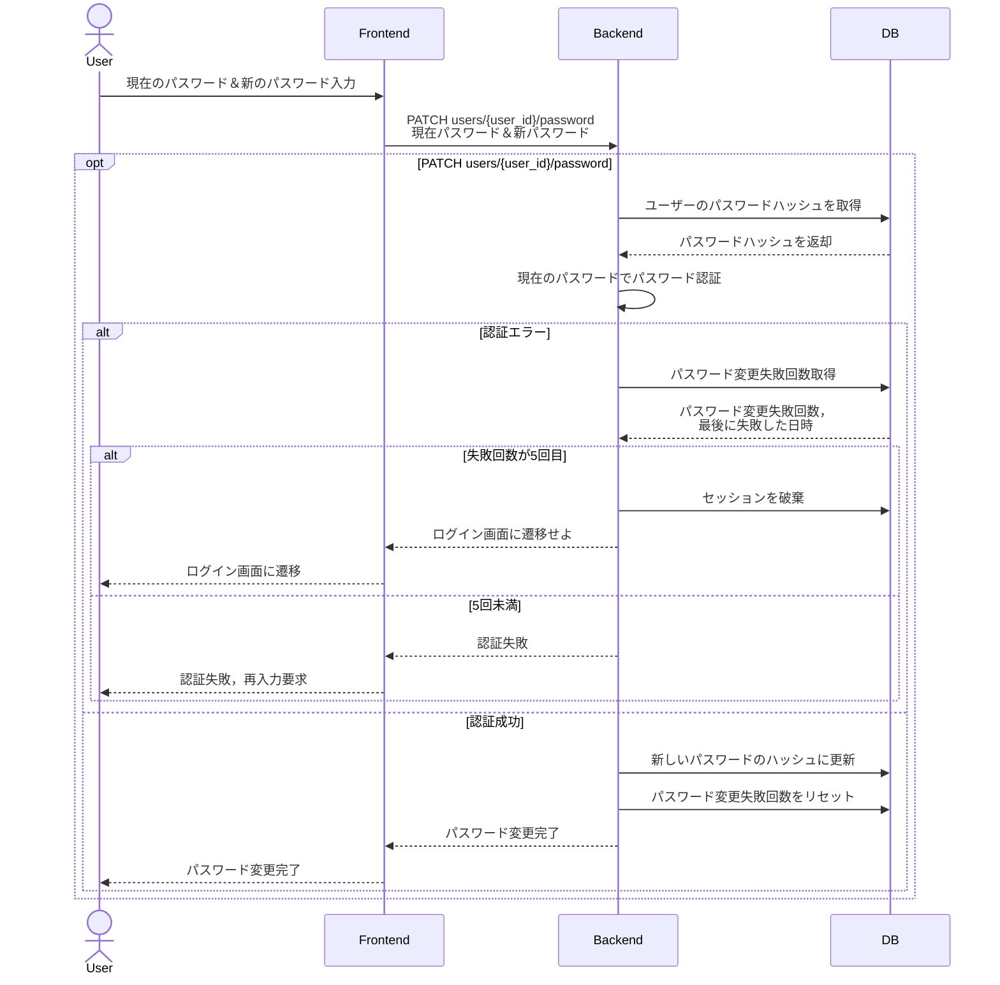

# 7. パスワード変更 (Password Change)

```mermaid
sequenceDiagram
	actor User
	participant Frontend
	participant Backend
	participant DB
	
	User->>Frontend: 現在のパスワード＆新のパスワード入力
	Frontend->>Backend: PATCH users/{user_id}/password<br>現在パスワード＆新パスワード
	opt PATCH users/{user_id}/password
		Backend->>DB: ユーザーのパスワードハッシュを取得
		DB-->>Backend: パスワードハッシュを返却
		Backend->>Backend: 現在のパスワードでパスワード認証
		alt 認証エラー
			Backend->>DB: パスワード変更失敗回数取得
			DB-->>Backend: パスワード変更失敗回数，<br>最後に失敗した日時
			alt 失敗回数が5回目
				Backend->>DB: セッションを破棄
				Backend-->>Frontend: ログイン画面に遷移せよ
				Frontend-->>User: ログイン画面に遷移
			else 5回未満
				Backend-->>Frontend: 認証失敗
				Frontend-->>User: 認証失敗，再入力要求
			end
		else 認証成功
			Backend->>DB: 新しいパスワードのハッシュに更新
			Backend->>DB: パスワード変更失敗回数をリセット
			Backend-->>Frontend: パスワード変更完了
			Frontend-->>User: パスワード変更完了
		end
	end
```
