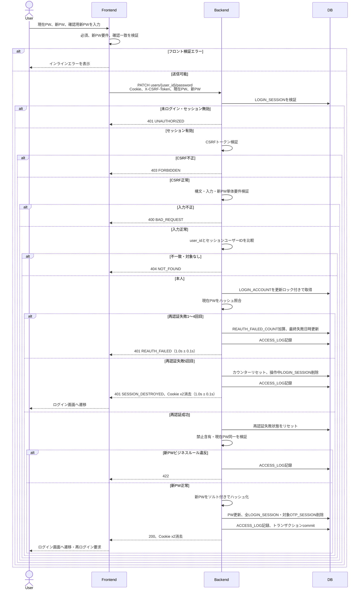

# 7. パスワード変更 (Password Change)

## 7.1 対象・前提

- 対象APIは `PATCH users/{user_id}/password`。
- 有効なログインセッションCookie `sync_task_sid` による認証と、Double Submit Cookie方式の `X-CSRF-Token` ヘッダー検証を必須とする。
- パスパラメータの `user_id` はセッションのユーザーIDと一致しなければならない。他ユーザーまたは存在しないユーザーは存在を秘匿して一律 `404 NOT_FOUND` とする。
- HTTPSを必須とし、パスワードの平文、ハッシュ、セッションID、CSRFトークンをログへ出力しない。
- パスワード変更画面は、現在のパスワード、新しいパスワード、新しいパスワード（確認）の入力欄と、決定・キャンセルボタンを持つ。確認欄はフロントエンド専用でAPIへ送信しない。

## 7.2 リクエスト・レスポンス

```json
{
  "current_password": "Password123!",
  "new_password": "NewSecurePassword456!"
}
```

| 項目 | 必須 | 検証 |
| --- | :---: | --- |
| `current_password` | ○ | 現在のパスワード。値をトリム・正規化せず保存済みハッシュと照合する |
| `new_password` | ○ | 8〜128文字。半角英大文字・半角英小文字・数字・指定記号の4種中3種以上を含む |

成功時は `200 OK` と次を返し、ログイン画面へ遷移して新しいパスワードでの再ログインを要求する。

```json
{
  "message": "Password has been updated successfully. Please log in again."
}
```

- `Set-Cookie: sync_task_sid=; HttpOnly; Secure; SameSite=Lax; Path=/; Max-Age=0`
- `Set-Cookie: XSRF-TOKEN=; Secure; SameSite=Lax; Path=/; Max-Age=0`

## 7.3 処理フロー



## 7.4 バックエンド処理詳細

### 7.4.1 評価順序

1. **認証**: `sync_task_sid` で `LOGIN_SESSION` を取得し、期限と未削除ユーザーを確認する。無効なら `401 UNAUTHORIZED`。
2. **CSRF**: Cookieの `XSRF-TOKEN` とヘッダー `X-CSRF-Token` を安全に比較する。欠落・不一致なら `403 FORBIDDEN`。
3. **構文・単体検証**: JSON、必須項目、型、新パスワードの8〜128文字と文字種要件を検証する。不正なら `400 BAD_REQUEST`。ここまでの失敗では再認証カウンターを加算しない。
4. **認可・IDOR/BOLA対策**: `user_id` とセッションユーザーIDを比較する。不一致または対象なしは `404 NOT_FOUND` とし、カウンターを加算しない。
5. **現在パスワード再認証**: `LOGIN_ACCOUNT.PASSWORD_HASH` と `current_password` を安全なハッシュ検証関数で照合する。
6. **新パスワードのビジネスルール**: 再認証成功後にユーザー固有の禁止含有と現在パスワードとの同一性を検証する。
7. **変更確定**: 新ハッシュを保存し、セッションを失効してCookieを消去する。

認証必須APIアクセスに伴う通常のSliding Expirationは行い得るが、成功または5回失敗で当該セッションを直ちに削除するため、その応答では延長Cookieを発行しない。

### 7.4.2 現在パスワード再認証の失敗・成功

並行要求による加算漏れや5回超過を防ぐため、対象 `LOGIN_ACCOUNT` 行をロックし、カウンター更新とセッション削除をトランザクションで行う。

- **1〜4回目の失敗**:
  - `REAUTH_FAILED_COUNT += 1`、`REAUTH_LAST_FAILED_AT = NOW()`。
  - `401 REAUTH_FAILED` を返し、現在のセッションは維持する。
- **5回目の失敗**:
  - `REAUTH_FAILED_COUNT = 0`、`REAUTH_LAST_FAILED_AT = NULL`。
  - リクエストで使用中の `LOGIN_SESSION` のみ物理削除する。他端末のセッションはこの失敗処理では削除しない。
  - 両Cookieを `Max-Age=0` で消去し、`401 SESSION_DESTROYED` を返してログイン画面へ遷移させる。
- **成功**:
  - ビジネスルール検証より先に `REAUTH_FAILED_COUNT = 0`、`REAUTH_LAST_FAILED_AT = NULL` とする。
  - 以降に新パスワード違反で `422` となっても、正しい現在パスワードによる再認証成功のためカウンターリセットは維持する。

再認証失敗の1〜4回目と5回目は、DB処理を含む総応答時間がランダムジッター付き `1.0s ± 0.1s` になるよう調整する。処理時間が上限を超えた場合は追加待機しない。再認証成功や構文・認証・認可エラーには人工遅延を加えない。

### 7.4.3 新パスワード検証

新パスワードは値をトリム・正規化せず、次をすべて満たすことを確認する。

- 8〜128文字。
- 半角英大文字 `A-Z`、半角英小文字 `a-z`、数字 `0-9`、指定記号の4種類中3種類以上を含む。
- ユーザー名が4文字以上の場合、その文字列を大文字・小文字を区別せず含まない。
- 正規化済みメールアドレスの `@` より前のローカル部が4文字以上の場合、その文字列を大文字・小文字を区別せず含まない。
- `current_password` と同一でない。再認証済みの平文同士を安全に比較し、同一なら `422 SAME_AS_CURRENT_PASSWORD`。

文字数・文字種違反は `400 BAD_REQUEST`、ユーザー名・メールローカル部含有は `422 INVALID_PASSWORD_CONTENT` とする。フロントエンドは確認用新パスワードとの一致も検証するが、バックエンドはクライアント検証を信用せずAPI定義項目を再検証する。

### 7.4.4 変更確定トランザクション

再認証成功と新パスワード検証成功後、単一トランザクションで次を実行する。

1. 新パスワードを一意なソルト付きの安全なパスワードハッシュ方式でハッシュ化する。
2. `LOGIN_ACCOUNT.PASSWORD_HASH` を新ハッシュへ更新し、`UPDATED_AT` を更新する。
3. `REAUTH_FAILED_COUNT = 0`、`REAUTH_LAST_FAILED_AT = NULL` を確定する。
4. 対象ユーザーの `LOGIN_SESSION` を、操作中・他端末・他ブラウザを含め全件物理削除する。
5. 対象ユーザーに紐づくアクティブな `OTP_SESSION` を物理削除し、並行中の認証手続きを失効させる。
6. `ACCESS_LOG` を記録してコミットする。

途中で失敗した場合はパスワード更新とセッション・OTP削除をすべてロールバックし、Cookie削除成功レスポンスを返さない。コミット後に両Cookieを消去し、再ログインを要求する。

## 7.5 エラー・画面制御

| HTTP / code | 条件 | Cookie・遷移 |
| --- | --- | --- |
| `400 / BAD_REQUEST` | JSON不正、必須項目欠落、新PWの文字数・文字種違反 | セッション維持、入力エラー表示 |
| `401 / UNAUTHORIZED` | 未ログイン、セッション無効・期限切れ | ログイン画面へ遷移 |
| `401 / REAUTH_FAILED` | 現在PW不一致1〜4回目 | セッション維持、共通再認証エラー |
| `401 / SESSION_DESTROYED` | 現在PW不一致5回目 | 操作中セッションと両Cookieを破棄しログイン画面へ遷移 |
| `403 / FORBIDDEN` | CSRF欠落・不一致 | セッション維持、フォーム上部にエラー |
| `404 / NOT_FOUND` | 他ユーザーIDまたは対象なし | 存在を秘匿した共通エラー |
| `422 / INVALID_PASSWORD_CONTENT` | ユーザー名・メールローカル部を含む | セッション維持、新PW欄にエラー |
| `422 / SAME_AS_CURRENT_PASSWORD` | 現在PWと新PWが同一 | セッション維持、新PW欄にエラー |
| `500 / INTERNAL_SERVER_ERROR` | 更新処理失敗 | ロールバックし汎用エラー |

エラー本文は共通形式 `error.code`, `error.message`, `error.details` とし、詳細なしでも `details: []` を返す。再認証エラーではパスワードに関する内部情報を返さない。送信中は決定ボタンを非活性化し、失敗後はパスワード各欄をクリアする。

## 7.6 ログ・監査

- `ACCESS_LOG` にユーザーID、アクセス元IP、`PATCH users/{user_id}/password`、対象ユーザーID、アクセス日時を、成功・各失敗について記録する。
- `ACCESS_LOG` は90日保持し、毎日01:00 JSTのCronで期限超過分を物理削除する。
- アプリケーション監査ログには、結果コード、再認証失敗回数到達区分、操作中セッション強制破棄または全セッション失効の事実を記録できる。ただしパスワード、ハッシュ、Cookie値、CSRFトークンは記録しない。
- ログ保存失敗は運用監視へ通知し、秘匿情報を含む内部詳細をクライアントへ返さない。
