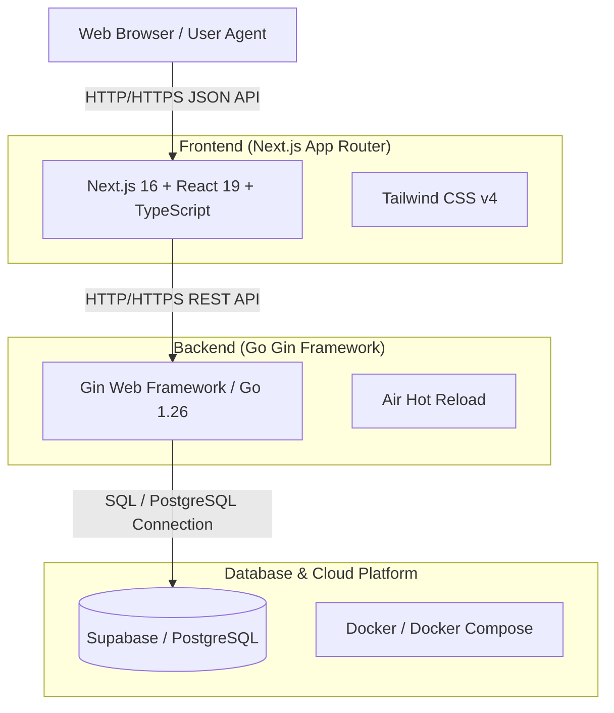

# Technology Stack (技術スタック)

本ドキュメントでは、 SyncTask プロジェクトにおいて採用されている技術スタック、選定理由、アーキテクチャ構成、および開発・運用環境を定義します。

---

## 1. 全体アーキテクチャ概要

SyncTask は、フロントエンドとバックエンドが分離された RESTful Web アプリケーション構成を採用しています。

---

## 2. フロントエンド (Frontend)

| カテゴリ | 技術 / ライブラリ | バージョン | 選定理由・目的 |
| --- | --- | --- | --- |
| **フレームワーク** | [Next.js](https://nextjs.org/) (App Router) | `16.2.6` | サーバーコンポーネント (RSC) による高速描画、ファイルベースルーティング、および高いパフォーマンスの実現 |
| **UIライブラリ** | [React](https://react.dev/) | `19.2.4` | コンポーネント指向 UI 構築、宣言的 UI 開発 |
| **言語** | [TypeScript](https://www.typescriptlang.org/) | `^5` | 型安全性、エディタ補完の強化、開発効率向上とランタイムエラー防止 |
| **スタイリング** | [Tailwind CSS](https://tailwindcss.com/) | `^4` | ユーティリティファーストなスタイリング、高速なレスポンシブ UI 実装 |
| **リンター / フォーマッタ** | [ESLint](https://eslint.org/) | `^9` | コード品質の保持、チーム間でのコーディングスタイルの統一 |

---

## 3. バックエンド (Backend)

| カテゴリ | 技術 / ライブラリ | バージョン | 選定理由・目的 |
| --- | --- | --- | --- |
| **言語** | [Go](https://go.dev/) | `1.26.1` | 高い実行速度、軽量なメモリ使用量、強力な並行処理能力 (Goroutine) |
| **Web フレームワーク** | [Gin](https://gin-gonic.com/) | `v1.12.0` | 高速で軽量な HTTP ルーティング、ミドルウェアサポート、レスポンス処理の容易さ |
| **バリデーション** | `go-playground/validator` | `v10.30.3` | リクエストボディやパラメータの厳密かつ宣言的なバリデーション |
| **開発環境** | [Air](https://github.com/air-verse/air) | - | バックエンド Go コードの変更検知と自動再ビルド (Hot Reload) |

---

## 4. データベース & インフラストラクチャ (Database & Infrastructure)

| カテゴリ | 技術 / サービス | 選定理由・目的 |
| --- | --- | --- |
| **BaaS / DB** | [Supabase](https://supabase.com/) | PostgreSQL データベースのマネージド環境の提供 |
| **RDBMS** | PostgreSQL | 高い信頼性、ACID 補償、リレーショナルデータ構造 (アカウント、タスク、セッション管理) の堅牢な保持 |
| **コンテナ化** | [Docker](https://www.docker.com/) / [Docker Compose](https://docs.docker.com/compose/) | 開発メンバー間における同一実行環境の容易な構築・再現性の確保 |

---

## 5. 開発環境・ツールチェーン

- **パッケージマネージャ**: Node.js (`npm`), Go Modules (`go.mod`)
- **コード管理**: Git / GitHub
- **API通信フォーマット**: `JSON` (application/json)
- **認証・セッション方式**: Cookie ベースセッション (`session_id`) + ワンタイムパスワード (OTP)
