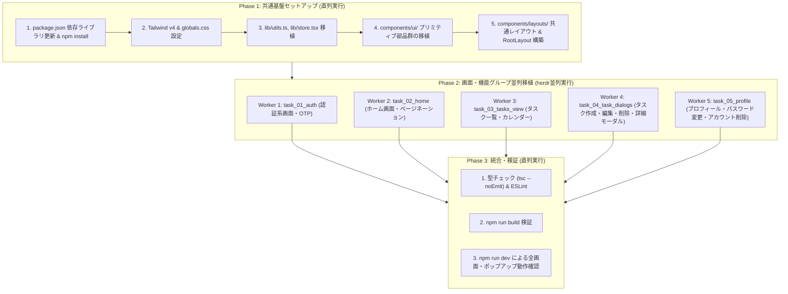

# 00. フロントエンド移行計画 概要 (Overview)

## 1. 目的とスコープ

本移行計画は、`SyncTask-Design-Idea` リポジトリで作成された Next.js (App Router) ベースのデザインプロトタイプを、本番リポジトリである `SyncTask/frontend` へ安全・迅速に移行するためのロードマップを定義します。

### スコープ定義

| 項目 | 今回のスコープ (Phase 1 & 2) | 今後のスコープ (Phase 3以降) |
| --- | --- | --- |
| **UI・スタイリング** | ✅ Tailwind v4 + shadcn/UI による完全移行（幾何学・Blueprint ダークテーマを再現） | 継続的な調整・アクセシビリティ向上 |
| **ルーティング・画面** | ✅ 全画面のルーティング、ページコンポーネントの配置 | 必要に応じた追加画面の作成 |
| **インタラクション** | ✅ 各種ダイアログ・ポップアップの開閉、タブ切り替え、カレンダー/リスト切り替え | 複雑なアニメーションやトランジション |
| **状態管理** | ✅ モックStore（React Context）によるインメモリ状態管理で動作確認 | APIクライアント連携、キャッシュ管理 |
| **バックエンド連携** | ❌ API連携・HTTPリクエストは実装しない（モックで代替） | ✅ Go/Gin バックエンドとのREST API連携 |
| **テスト** | ❌ 今回は実装しない（TypeScript型チェックとビルド検証のみ） | ✅ Vitest/RTL（単体）およびPlaywright（E2E） |

---

## 2. 移行アーキテクチャ & ディレクトリ構造

移行後の `SyncTask/frontend` のディレクトリ構造は以下のように構成します。

```
frontend/
├── app/
│   ├── globals.css                # Blueprintテーマ・Tailwind v4 / CSS変数
│   ├── layout.tsx                 # RootLayout (StoreProvider, Toaster, Meta)
│   ├── page.tsx                   # ルート画面（/home へリダイレクトまたはLP）
│   ├── home/
│   │   └── page.tsx               # ホーム画面（高優先度・締切・ピン止めタスクビュー）
│   ├── tasks/
│   │   └── page.tsx               # タスク一覧・カレンダー画面
│   ├── login/
│   │   └── page.tsx               # ログイン画面
│   ├── signup/
│   │   ├── page.tsx               # アカウント作成画面
│   │   └── otp/
│   │       └── page.tsx           # アカウント作成 OTP入力画面
│   ├── reset-password/
│   │   ├── page.tsx               # パスワードリセット（メール入力）画面
│   │   ├── otp/
│   │       └── page.tsx           # パスワードリセット OTP入力画面
│   │   └── new/
│   │       └── page.tsx           # パスワード再設定画面
│   └── profile/
│       ├── page.tsx               # プロフィール表示画面
│       ├── edit/
│       │   └── page.tsx           # プロフィール編集画面
│       ├── otp/
│       │   └── page.tsx           # メール変更 OTP入力画面
│       ├── password/
│       │   └── page.tsx           # パスワード変更画面
│       └── delete/
│           └── page.tsx           # アカウント削除（パスワード再認証）画面
├── components/
│   ├── ui/                        # shadcn/UI プリミティブ部品 (button, dialog, input等)
│   ├── layouts/                   # 共通シェル・ヘッダー (app-header, app-shell, auth-shell)
│   ├── auth/                      # 認証系コンポーネント (otp-input, otp-panel)
│   ├── common/                    # 汎用共通部品 (pagination 等)
│   ├── home/                      # ホーム画面用コンポーネント (home-view)
│   ├── tasks/                     # タスク系コンポーネント (tasks-view, task-card, dialogs...)
│   └── profile/                   # プロフィール系コンポーネント (profile-view, profile-edit-view)
├── lib/
│   ├── utils.ts                   # cn() ユーティリティ
│   └── store.tsx                  # モックデータ・状態管理 Context (Task, Profile 等)
├── public/                        # 静的アセット
├── components.json                # shadcn/UI 設定ファイル
├── package.json
└── tsconfig.json
```

---

## 3. フェーズ分けと実行戦略



---

## 4. 移行完了の受入基準 (Definition of Done)

1. `npm run build` がエラーなく成功すること。
2. `npm run dev` 実行時、全画面（`/login`, `/signup`, `/home`, `/tasks`, `/profile` 等）が正常に描画されること。
3. 画面設計書（`docs/design/screen_design.md`）に定義された主要なモーダル・ポップアップ（タスク作成・編集・削除、日付詳細、アカウント削除確認等）が開閉可能であること。
4. モックデータを用いたタスク一覧のフィルタリング、タブ切り替え、カレンダー/リスト表示切り替えが動作すること。
