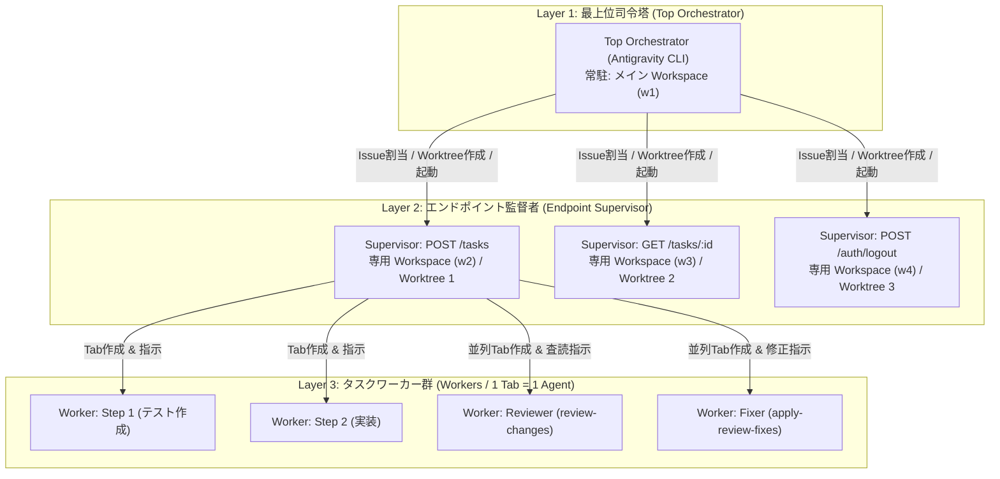
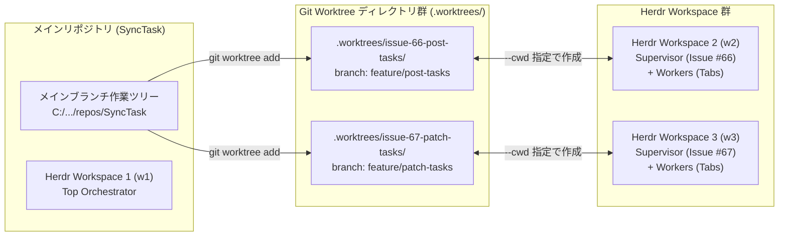
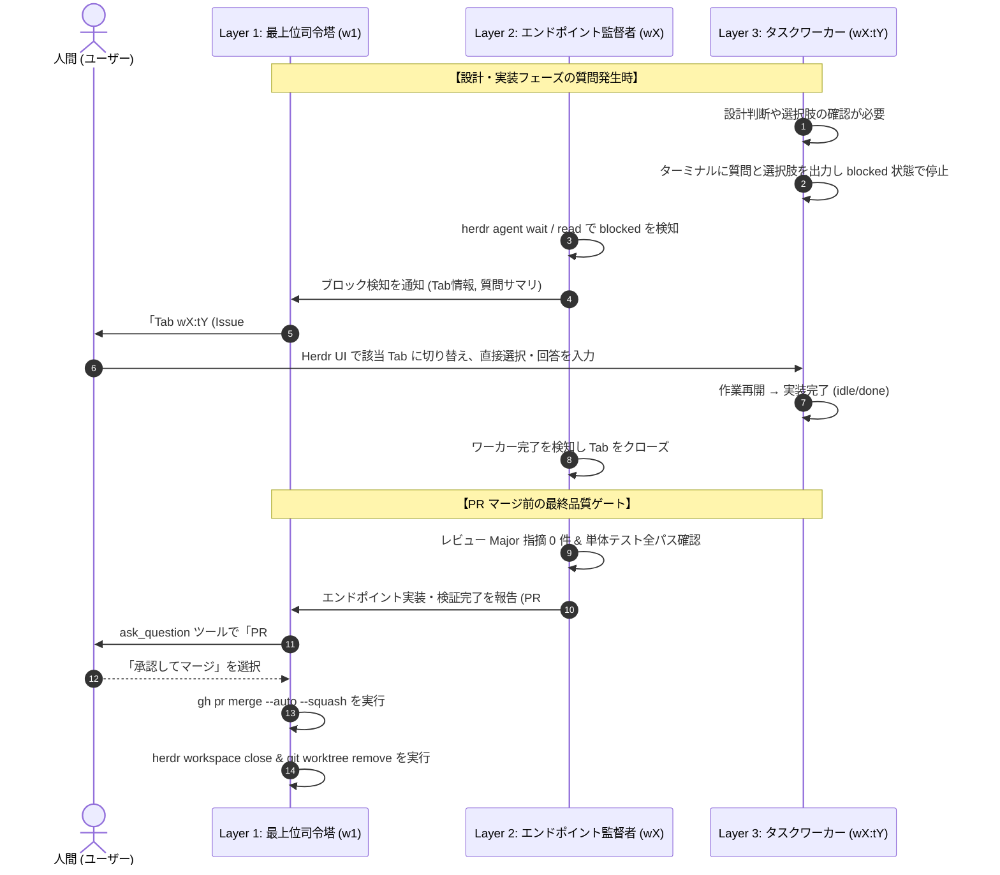
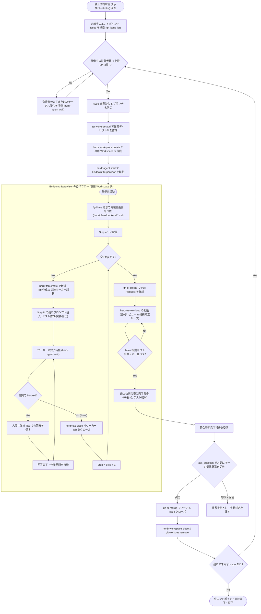

# バックエンド API 実装自動化オーケストレーションシステム設計書

- **文書名**: バックエンド API 実装自律オーケストレーションシステム詳細設計書
- **対象リポジトリ**: `SyncTask` (`TUS-TI-dev-team/SyncTask`)
- **作成日**: 2026-09-05
- **ステータス**: 設計承認済み (Approved)

---

## 1. 概要と目的

### 1.1 背景
現在、SyncTask バックエンド（Go / Gin / PostgreSQL / Supabase）において、各エンドポイントの開発は以下の 9 つのフェーズを手作業のプロンプト入力およびレビューによって進行している：
1. GitHub Issue から未着手のエンドポイントをアサイン
2. `/grill-me` による実装計画書（`docs/plans/backend/*.md`）の策定
3. 実装計画の各ステップ（テスト作成 → 実装 → テスト実行 → 修正）の指示と実行
4. `gh pr create` による Pull Request の作成
5. `/grill-me` による PR レビュー指示（観点 1〜4）
6. `/apply-review-fixes` によるレビュー指摘の修正
7. Major 指摘解消および単体テスト全パスまでのレビュー＆修正反復（5〜6 のループ）
8. PR のマージ
9. エンドポイントの完成

本手作業プロセスは高品質なコードを担保できる一方で、開発者のプロンプト投入や監視負担が大きく、複数エンドポイントを効率的に並行開発する際のボトルネックとなっている。

### 1.2 目的
**Herdr**（ターミナルマルチプレクサおよびエージェント自動化レイヤー）と **Antigravity CLI** を組み合わせ、上記の「計画 → 実装 → PR → レビュー → 修正 → マージ」の一連のライフサイクルを AI が完全自律で完遂する**3階層マルチエージェントオーケストレーションシステム**を構築・配備する。
さらに、複数の未着手エンドポイントを**プール上限付き並列（同時 2〜3 件）**で自律的に消化し、全エンドポイントの実装完了までを自律監督できる仕組みを確立する。

---

## 2. システムアーキテクチャ（3階層エージェントトポロジー）

システムは以下の 3 つの階層に責務を分離し、コンテキストの過負荷やプロセスの競合を防止する。



### 2.1 各階層の役割と責務

| 階層 | 名称 | 稼働場所 | 主な責務 |
| :--- | :--- | :--- | :--- |
| **Layer 1** | **最上位司令塔**<br>(Top Orchestrator) | メインリポジトリ直下<br>Herdr メイン Workspace (`w1`) | 1. GitHub Issue の自動走査・自己アサイン<br>2. 並列実行プール管理（同時 2〜3 件の空き監視）<br>3. `git worktree` および Herdr Workspace の作成・初期化<br>4. エンドポイント監督者の起動とライフサイクル監視<br>5. 監督者からの完了報告受領と、人間への PR マージ承認伺い（`ask_question`）<br>6. PR マージ実行および Workspace/Worktree の自動クリーンアップ<br>7. 全 Issue 消化までのループ継続 |
| **Layer 2** | **エンドポイント監督者**<br>(Endpoint Supervisor) | 専用 `git worktree` 配下<br>専用 Herdr Workspace (`w2`, `w3`..) | 1. 担当エンドポイントの実装計画策定（`docs/plans/backend/*.md`）<br>2. 計画書の Step 1〜N のステップ個別実行管理（Step ごとに Tab/ワーカー起動・完了確認・Tab 破棄）<br>3. `gh pr create` による Pull Request 作成<br>4. レビュー＆修正ループ（`herdr-review-loop`）の統括（Major 指摘ゼロ ＆ テスト全パスまで反復）<br>5. 最上位司令塔への完了報告 |
| **Layer 3** | **タスクワーカー群**<br>(Task / Review / Fix Workers) | 専用 Workspace 内の新規 Tab<br>(**1 Tab = 1 Agent**) | 1. **Step 実装ワーカー**: 単体テスト作成、本体コード実装、`go test ./...` によるテスト検証・修正<br>2. **レビューワーカー**: 仕様書・コードの査読と指摘ファイル生成（`review-changes`）<br>3. **修正ワーカー**: 指摘に基づくコード修正とテスト再検証（`apply-review-fixes`）<br>4. **質問待機**: 設計確認や判断が必要な場合はブロック状態で停止し、該当 Tab で人間の直接入力を受領 |

---

## 3. リソース・環境分離設計（Git Worktree × Herdr Workspace）

複数エンドポイントを並列実装する際、単一の作業ディレクトリではブランチ切り替え、未コミット変更、ハンドラーやルーティング定義の編集競合が発生する。これを完全に解決するため、**Git Worktree** と **Herdr Workspace** を 1 対 1 でマッピングして完全分離する。



### 3.1 ディレクトリおよび命名規則
- **Worktree 保存先**: メインリポジトリ直下の `.worktrees/` 配下に配置（`.gitignore` に `.worktrees/` を追加）。
- **Worktree ディレクトリ名**: `.worktrees/issue-<issue_number>-<kebab_endpoint_name>/`
  - 例: `.worktrees/issue-66-post-tasks/`
- **ブランチ名**: `feature/<kebab_endpoint_name>`（例: `feature/post-tasks`）
- **Herdr Workspace ラベル**: `ep-issue-<issue_number>`（例: `ep-issue-66`）
- **Herdr Tab ラベル**:
  - 監督者: `supervisor`
  - 実装ワーカー: `step-<N>-worker`
  - レビューワーカー: `review-worker-<N>`
  - 修正ワーカー: `fix-worker-<N>`

---

## 4. 人間との対話インターフェース（Human-in-the-Loop）

「自動化の最大化」と「人間の設計意思決定・品質ゲートの維持」を両立させるため、対話ポイントを明確に分離する。



1. **設計・実装中の疑問解消**:
   - 各ワーカーが `blocked` 状態となり、質問内容を画面に出力。
   - 司令塔/監督者がこれを検知し、ユーザーに**「対象の Workspace / Tab 番号」**を通知。
   - **ユーザーが Herdr の該当タブに直接フォーカスし、選択式または自由入力で回答**する。
   - 回答を受け取ったワーカーは自律的に作業を再開する。
2. **PR マージの最終承認（Quality Gate）**:
   - レビューの Major 指摘が 0 件になり、バックエンド単体テスト（`go test ./...`）が全件成功した段階で、
   - **最上位司令塔が `ask_question` ツールを起動し、モーダルでマージ可否を人間に確認**する。
   - 人間の承認をトリガーとして安全にマージが実行され、自動クリーンアップが行われる。

---

## 5. エンドツーエンド詳細ワークフロー

システム全体のシーケンスを以下の Mermaid 図に示す。



---

## 6. 各フェーズの詳細仕様とコマンド・プロンプト

### 6.1 Phase 1: Issue 取得 & Worktree/Workspace 準備 (Layer 1)

最上位司令塔が実行する処理：

```bash
# 1. 未着手のエンドポイント Issue を取得
ISSUE_JSON=$(gh issue list --state open --json number,title,labels --limit 10 | jq '[.[] | select(.labels[].name == "backend")] | .[0]')
ISSUE_NUM=$(printf '%s\n' "$ISSUE_JSON" | jq -r '.number')
ISSUE_TITLE=$(printf '%s\n' "$ISSUE_JSON" | jq -r '.title')

# 2. 自分にアサイン
gh issue edit "$ISSUE_NUM" --add-assignee "@me"

# 3. ブランチ名と worktree ディレクトリ名の定義
BRANCH_NAME="feature/issue-${ISSUE_NUM}-api"
WORKTREE_PATH=".worktrees/issue-${ISSUE_NUM}"

# 4. git worktree の作成
git worktree add -b "$BRANCH_NAME" "$WORKTREE_PATH" main

# 5. 専用 Herdr Workspace の作成 (作業ディレクトリを worktree に設定)
WS_RES=$(herdr workspace create --cwd "$PWD/$WORKTREE_PATH" --label "ep-issue-${ISSUE_NUM}" --no-focus)
WS_ID=$(printf '%s\n' "$WS_RES" | jq -r '.result.workspace.workspace_id')
ROOT_PANE_ID=$(printf '%s\n' "$WS_RES" | jq -r '.result.root_pane.pane_id')

# 6. エンドポイント監督者 (Endpoint Supervisor) の起動
SUPERVISOR_NAME="sup-issue-${ISSUE_NUM}"
herdr agent start "$SUPERVISOR_NAME" --kind agy --pane "$ROOT_PANE_ID"
```

### 6.2 Phase 2: 実装計画策定 (Layer 2)

監督者が自身のペインで実行するプロンプト：

```markdown
/grill-me @docs/design/ 配下の記述を参考に、Issue #{{ISSUE_NUM}}: {{ISSUE_TITLE}} のエンドポイントを開発するための詳細かつ具体的な実装計画書を作成してください。

開発は次の順番で行います：
1. テストデータ・テストプログラムの作成 (単体テストのみで構いません。backend/TESTING_GUIDE.md を厳守)
2. プログラム本体の実装 (handler, service, repository, model, router)
3. テスト実行 (backend/ で go test ./...)、成功すれば終了
4. プログラムの修正 → 3 に戻る

計画書は `docs/plans/backend/{{ENDPOINT_NAME}}.md` に記載してください。
疑問や設計上の確認点があれば質問してください。
```

### 6.3 Phase 3: ステップ別ワーカー制御 (Layer 2 ⇄ Layer 3)

監督者は作成された計画書の Step ごとに、専用 Tab を作成してワーカーを起動する。

```bash
# 1. Step N 専用の Tab を作成
TAB_RES=$(herdr tab create --cwd "$PWD" --label "step-${STEP_NUM}-worker" --no-focus)
TAB_ID=$(printf '%s\n' "$TAB_RES" | jq -r '.result.tab.tab_id')
PANE_ID=$(printf '%s\n' "$TAB_RES" | jq -r '.result.root_pane.pane_id')

# 2. ワーカーエージェント起動
WORKER_NAME="worker-${STEP_NUM}"
herdr agent start "$WORKER_NAME" --kind agy --pane "$PANE_ID"

# 3. Step N の指示プロンプト送信
PROMPT="docs/plans/backend/${ENDPOINT_NAME}.md の Step. ${STEP_NUM} を実行してください。
- backend/TESTING_GUIDE.md の命名規則・Code-as-Docs 原則を厳守すること。
- 検証は backend/ ディレクトリで 'go test -v ./...' を実行すること。
- 疑問点や設計確認があれば、このタブでユーザーに質問して停止すること。
完了したらテスト結果と変更サマリを報告してください。"

herdr agent prompt "$WORKER_NAME" "$PROMPT"

# 4. 完了待機
herdr agent wait "$WORKER_NAME" --timeout 600000

# 5. ワーカー Tab のクローズ
herdr tab close "$TAB_ID"
```

### 6.4 Phase 4: PR 作成 (Layer 2)

全ステップ完了後、監督者が PR を作成：

```bash
git add .
git commit -m "feat(backend): implement ${ENDPOINT_NAME} (closes #${ISSUE_NUM})"
git push -u origin "$BRANCH_NAME"

PR_URL=$(gh pr create \
  --title "feat(backend): ${ISSUE_TITLE}" \
  --body "## 概要
Issue #${ISSUE_NUM} のエンドポイント実装です。

## 実装内容
- 実装計画書: \`docs/plans/backend/${ENDPOINT_NAME}.md\`
- 単体テスト追加 (\`backend/TESTING_GUIDE.md\` 準拠)
- API ハンドラー・サービス・リポジトリ実装

## テスト結果
\`go test ./...\` 通過確認済み。" \
  --base main --head "$BRANCH_NAME")
```

### 6.5 Phase 5: レビュー＆修正ループ (Layer 2 ⇄ Layer 3)

既存の `herdr-review-loop` スキルを活用して査読と修正を反復する：

```bash
# レビュー＆修正ループの開始プロンプト
PROMPT="/herdr-review-loop
PR #${PR_NUM} のレビューを実施し、指摘事項の修正と再レビューを行ってください。
レビュー観点:
1. テストの内容は適切・十分か (backend/TESTING_GUIDE.md 準拠か)
2. 動作は正常か、単体テストは全パスしているか
3. コード品質・エラーハンドリング・保守性に問題はないか
4. @docs/design/ 配下の仕様と矛盾・欠落していないか

Major 指摘が 0 件になり、全単体テストがパスするまで修正・再レビューを反復してください。"

herdr agent prompt "$SUPERVISOR_NAME" "$PROMPT" --wait
```

### 6.6 Phase 6: 人間最終承認 & マージ (Layer 1)

最上位司令塔が監督者から「Major 指摘ゼロ ＆ テスト全パス」の報告を受領した後、`ask_question` ツールを起動：

```json
{
  "questions": [
    {
      "question": "Issue #66: タスク作成 (PR #123) のレビュー指摘が全て解消され、単体テストが通過しました。PR をマージして完了しますか？",
      "options": [
        "(Recommended) 承認して main ブランチにマージする",
        "マージを保留し、後で手動確認する",
        "追加の修正を指示する"
      ],
      "is_multi_select": false
    }
  ]
}
```

人間が「承認して main ブランチにマージする」を選択した場合：

```bash
# PR の自動マージと Issue のクローズ
gh pr merge "$PR_NUM" --squash --delete-branch
gh issue close "$ISSUE_NUM" --comment "PR #${PR_NUM} にて実装・マージ完了しました。"
```

### 6.7 Phase 7: 自動クリーンアップ (Layer 1)

```bash
# 1. Herdr Workspace の削除
herdr workspace close "$WS_ID"

# 2. Git Worktree の削除
git worktree remove "$WORKTREE_PATH" --force
```

---

## 7. リポジトリへの追加・変更一覧

SyncTask リポジトリに以下のファイル群を追加・構成する。

```
SyncTask/
├── .agents/
│   └── skills/
│       ├── orchestrate-backend/          # [新規] Layer 1: 最上位司令塔スキル
│       │   └── SKILL.md
│       ├── endpoint-supervisor/          # [新規] Layer 2: エンドポイント監督者スキル
│       │   └── SKILL.md
│       ├── herdr/                        # [既存] Herdr 操作基本スキル
│       │   └── SKILL.md
│       ├── herdr-review-loop/            # [既存] レビュー＆修正ループスキル
│       │   └── SKILL.md
│       ├── review-changes/               # [既存] 変更点レビュー指摘生成スキル
│       │   └── SKILL.md
│       └── apply-review-fixes/           # [既存] レビュー指摘修正適用スキル
│           └── SKILL.md
├── docs/
│   ├── design/                           # [既存] 設計書一式 (api, db, process 等)
│   └── plans/
│       ├── be-dev-automation-by-gemini.md# [新規] 本オーケストレーション設計書
│       └── backend/                      # [既存] 各エンドポイントの実装計画書
│           ├── post-tasks.md
│           └── ...
└── .gitignore                            # [変更] .worktrees/ を除外指定に追加
```

---

## 8. エラーハンドリングと安全性対策

1. **ワーカープロセスのストール検知**:
   - `herdr agent prompt` の `agent_prompt_stalled`（5秒間反応なし）やタイムアウト発生時、親エージェントは `herdr agent read` で最新画面を確認し、必要に応じて `herdr agent send-keys <name> enter` や `ctrl+c` を送信して復帰させる。
2. **テスト無限ループの防止**:
   - Step 3/4（修正 → テスト）の反復回数は最大 5 回とし、5 回連続でテストが通らない場合は監督者が作業を停止し、人間に該当 Tab での介入を依頼する。
3. **Git Worktree の孤立防止**:
   - 司令塔起動時に `git worktree list` をチェックし、すでにマージ済みまたは存在しないブランチに紐づく不要な worktree があれば `git worktree prune` を実行して整理する。
4. **ポート・データベースの競合防止**:
   - 本バックエンド開発規約（`backend/TESTING_GUIDE.md`）では、単体テスト（`go test ./...`）はモック/スタブを用いて独立して高速動作する方針を採用しているため、複数 worktree での並行テスト実行時もポートや DB の競合を起こさず安全に実行できる。
