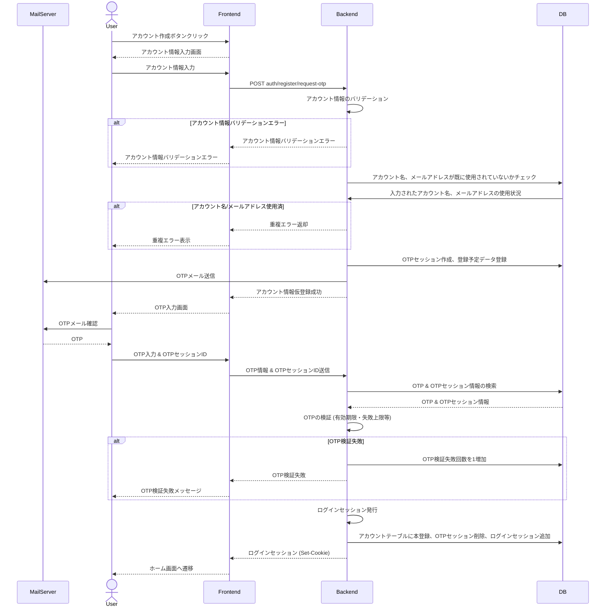
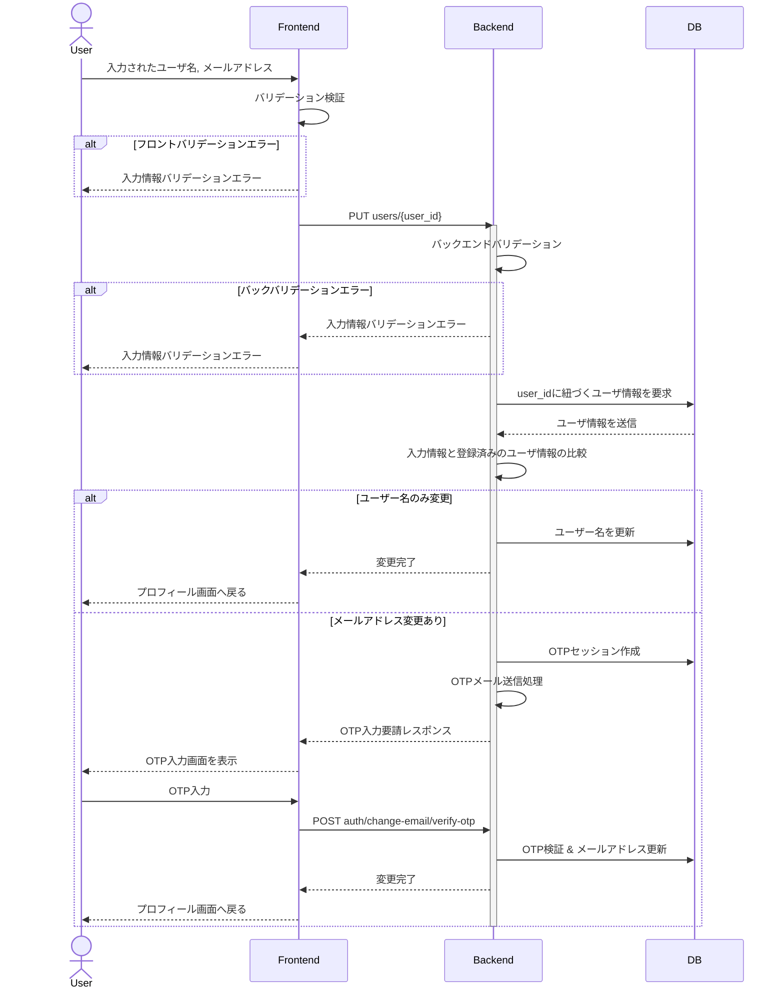
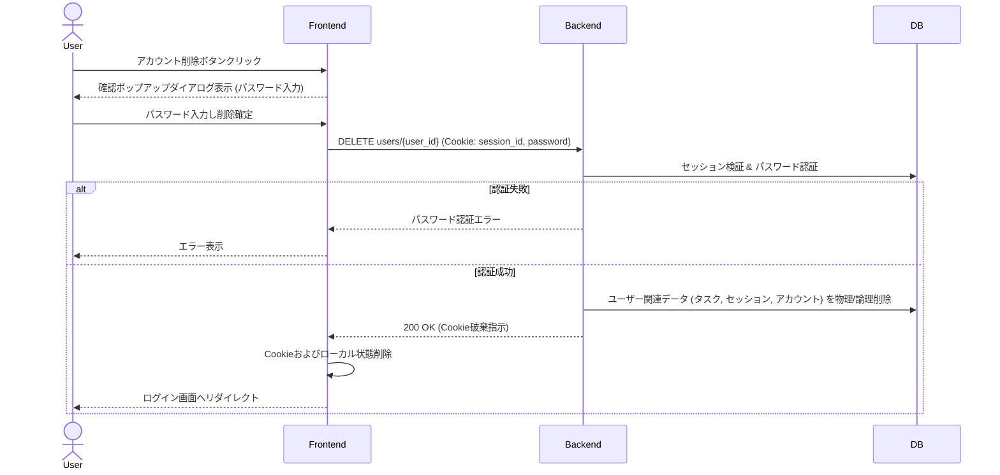
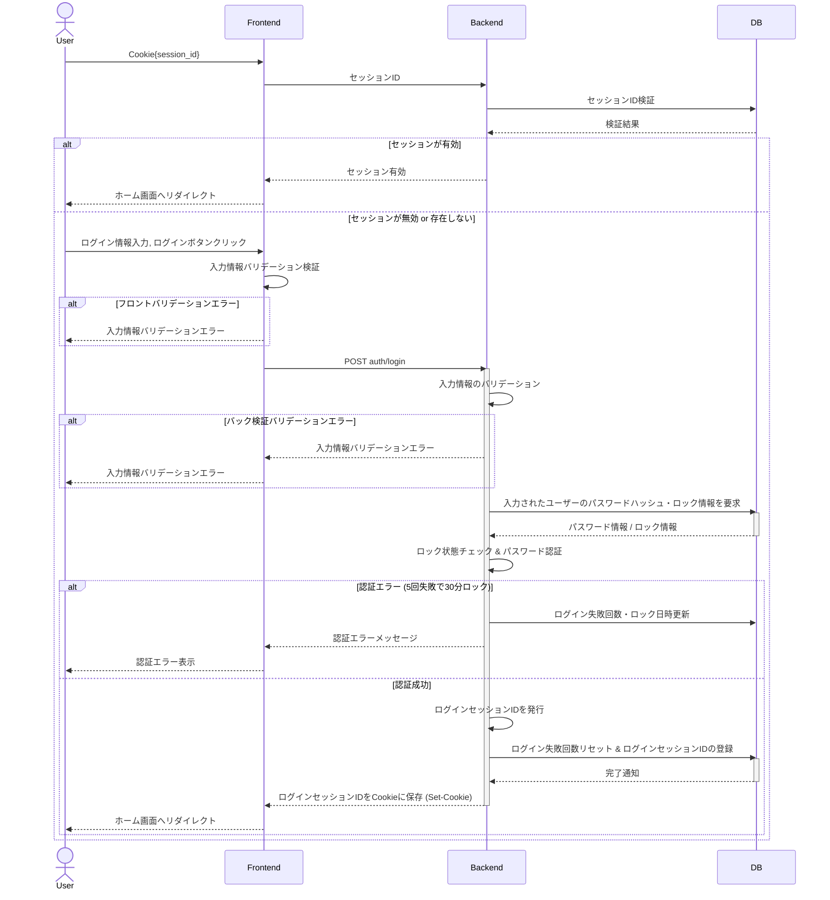
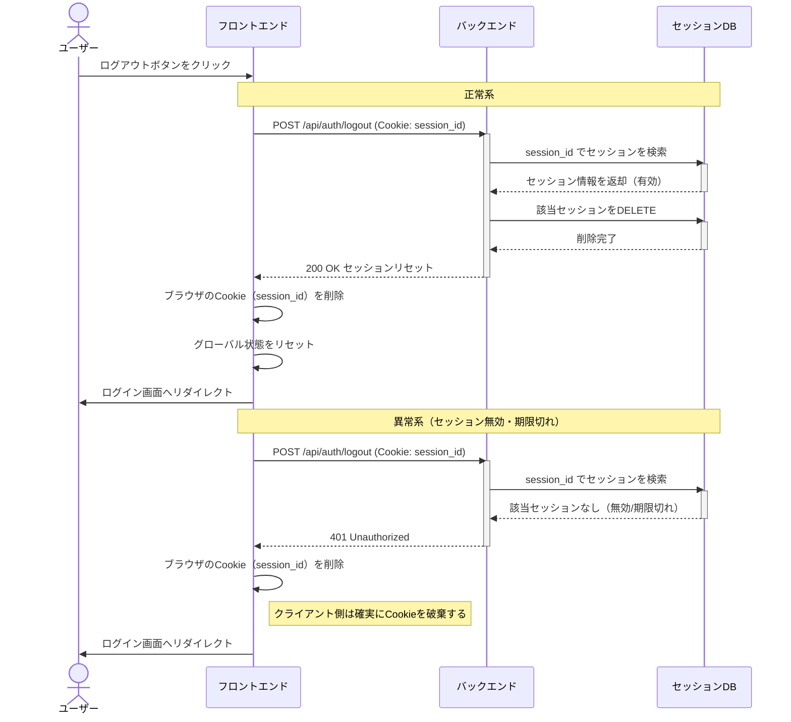
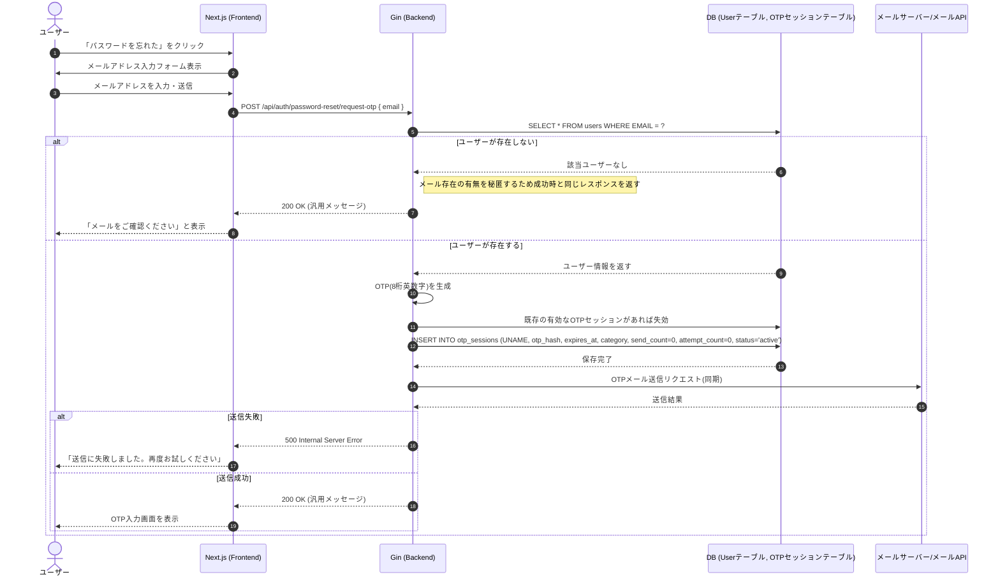
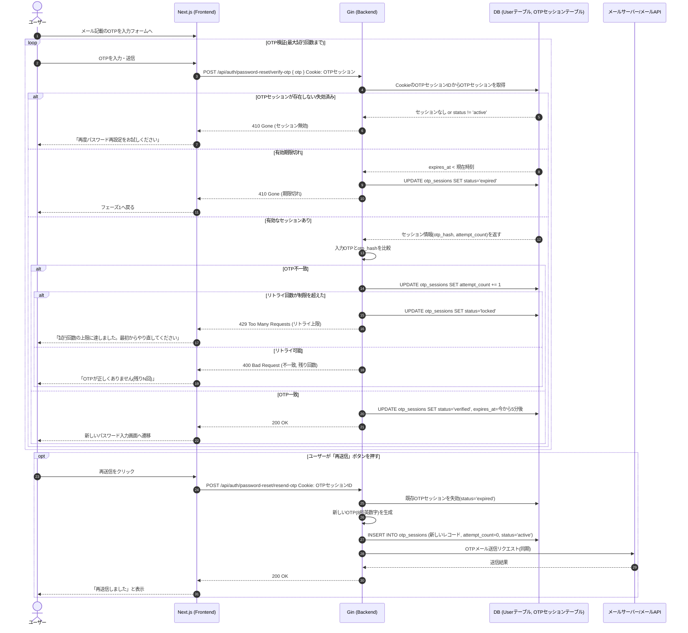
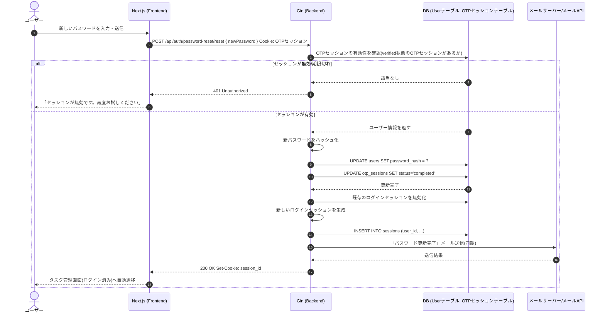
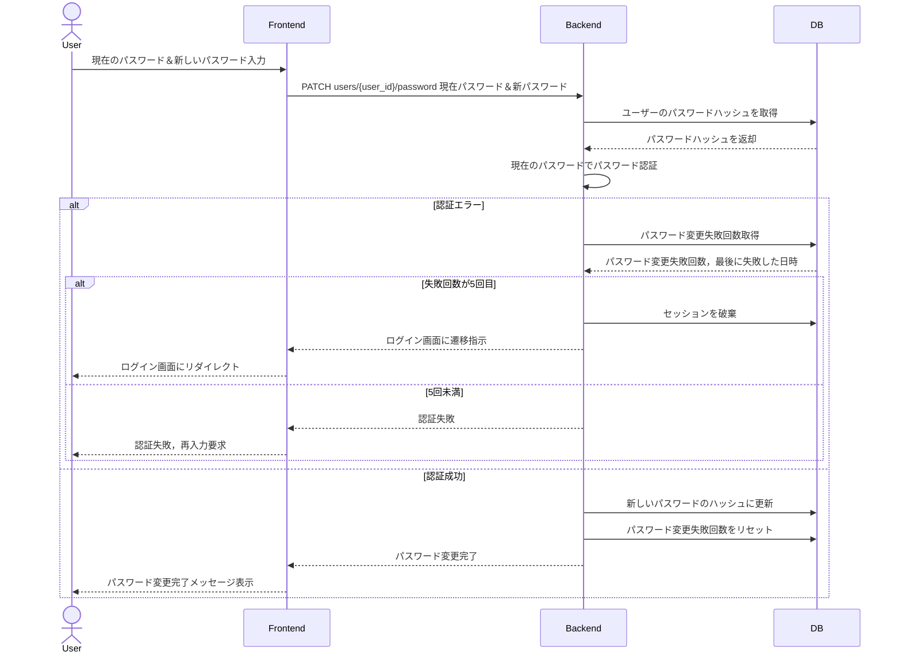

# Process Design (処理設計)

## 概要

システムの主要ユースケースにおける処理フローおよびシーケンス図です。

---

## 1. アカウント作成フロー

---

## 2. アカウント編集フロー

---

## 3. アカウント削除フロー

---

## 4. ログインフロー

---

## 5. ログアウトフロー

---

## 6. パスワードリセットフロー (3フェーズ)

### Phase 1: OTP発行・送信

### Phase 2: OTP検証

### Phase 3: パスワード更新

---

## 7. パスワード変更フロー (ログイン中)

