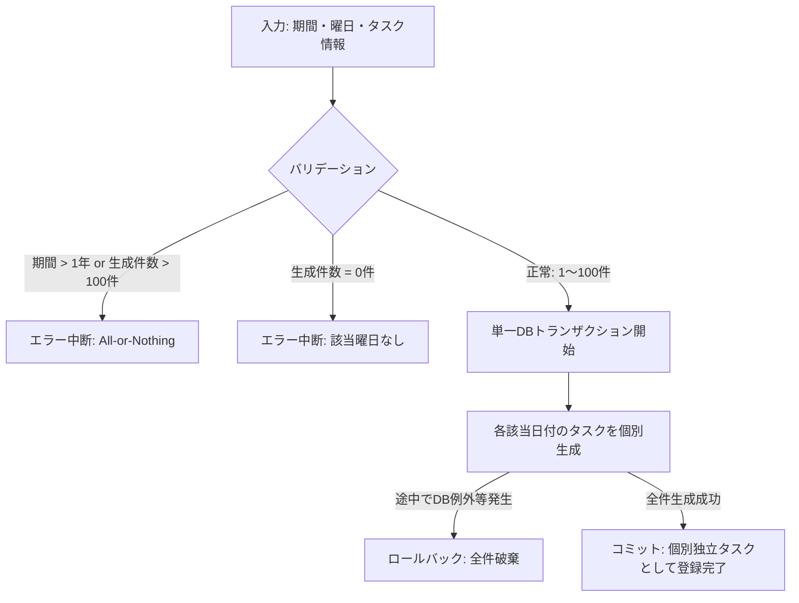

# 02. タスク管理機能要件

本ドキュメントでは、SyncTaskにおけるタスクのデータ構造、作成・編集・削除、繰り返し一括生成、各種一覧・カレンダー表示、検索機能、およびアクセス認可仕様について定義します。

---

## 1. タスクデータ仕様・属性

| 属性名 | 必須/任意 | 初期値 | 仕様・バリデーション制約 |
| :--- | :--- | :--- | :--- |
| **タスク名** | 必須 | - | ・前後の空白文字（半角・全角スペース、タブ、改行）を除去（トリム）した上で **1〜100文字**。 ・空白文字のみの入力はバリデーションエラー。 ・**1行テキスト**とし、文字列内部の改行コード（CR/LF）やタブ等の制御文字はバリデーションエラーとして拒否。 |
| **コメント** | 任意 | 空文字 | ・前後の空白文字をトリムして保持、**0〜1000文字**。 ・改行コードはシステム内部で一律 `\n`（LF）に正規化し、改行1つにつき1文字としてカウント。 |
| **優先度** | 必須 | `中` | `高` / `中` / `低` のいずれか。 |
| **締切日時** | 任意 | 未設定 (null) | ・形式: `YYYY/MM/DD hh:mm`（日本標準時: JST）。 ・時刻部分（`hh:mm`）が未指定（省略）の場合はデフォルト締切時刻として **`23:59 JST`** を適用。 |
| **ステータス** | 必須 | `未着手` | `未着手` / `進行中` / `完了` のいずれか。 |
| **ピン留め** | 必須 | `false` | `true`（ピン留め中） / `false`（通常）。 |

---

## 2. タスク操作機能

### 2.1 通常タスク作成（単一作成）
- ユーザー入力（タスク名、コメント、優先度、締切日時）に基づきタスクを1件作成する。
- 初期ステータスは `未着手`、ピン留めは `false` として登録される。

### 2.2 繰り返しタスク自動作成（即時一括生成）
指定した期間・曜日設定に基づき、毎週の該当日にタスクを一括即時生成する機能。

#### 2.2.1 設定パラメータとバリデーション
1. **期間指定**:
   - 開始日と終了日をそれぞれ `YYYY/MM/DD` 形式で入力（テキスト入力またはカレンダーポップアップから選択）。
   - **制約**: `開始日 <= 終了日`（開始日と終了日が同一日の場合も指定曜日に合致すれば1件作成可能）。
   - 開始日には過去日も指定可能。
   - **最大期間**: **1年間（最大52週）以内**。
2. **曜日指定**:
   - `日, 月, 火, 水, 木, 金, 土` より1つまたは複数選択可能（**1つ以上選択必須**）。
3. **生成件数バリデーション**:
   - 生成予定件数は **1件以上100件まで**。
   - 期間内に選択曜日が1日も含まれず生成件数が0件となる場合: 「指定された期間内に該当する曜日が存在しません」とエラー表示し処理を中断。
   - 生成予定件数が100件を超える場合: 送信前警告または送信時に「生成件数が上限（100件）を超えています」とエラー表示し、タスク一括作成処理を一切実行せず中断（**All-or-Nothing**）。

#### 2.2.2 タスク属性の適用と動作仕様
- **タスク属性のコピー**: 入力されたタスク名、優先度、コメント、初期ステータス（`未着手`）を各タスクへコピーする。締切時刻（`hh:mm JST`）は任意入力とし、指定がある場合はその時刻を各該当日付に適用、未指定時は該当日付の `23:59 JST` をデフォルト適用する。
- **生成後の個別独立性**: 生成されたタスクはそれぞれ独立した通常タスクとしてDBに個別登録される。以降は個別に編集・状態変更・削除が可能であり、繰り返しタスク間の一括連動更新機能は提供しない。
- **トランザクション原子性**: 複数件の一括タスク生成・登録処理は、バックエンドの単一データベーストランザクション内で実行する。一部でエラーが発生した場合は即座に全件ロールバック（All-or-Nothing）し、部分作成状態を防止する。

### 2.3 タスク編集
- ログイン中の所有者本人のみ編集可能。
- タスク名（1〜100文字、トリム、改行禁止）、優先度（高/中/低）、締切日時（日時の変更または解除）、コメント（0〜1000文字、LF正規化）の変更が可能。

### 2.4 タスク状態更新
- ステータスを `未着手`、`進行中`、`完了` の間で相互に変更可能。

### 2.5 タスク削除
- ユーザー操作によるタスクの削除は **物理削除** とする。

### 2.6 タスクピン留め状態更新
- タスクごとにピン留めの ON（`true`） / OFF（`false`） を切り替え可能。

---

## 3. タスク表示・検索機能

### 3.1 表示ビュー一覧と仕様

| ビュー名 | 抽出対象条件 | 並び順（ソート順） | ページネーション / フィルタ |
| :--- | :--- | :--- | :--- |
| **優先タスク表示** | 優先度が `高` のタスク | 1. 締切日時が早い順（昇順） 2. 作成日時の新しい順（降順） ※ピン留めソートは非適用 | ・デフォルト全ステータス表示 ・「完了」表示切替フィルタあり ・1ページ20件 |
| **締切間近タスク表示** | `未着手` または `進行中` のタスクで、締切日時が現在時刻から **72時間以内** または **超過** しているタスク（`締切日時 <= 現在時刻 + 72h`） | 1. 締切日時が早い順（昇順） 2. 作成日時の新しい順（降順） ※ピン留めソートは非適用 | ・完了タスクは除外 ・1ページ20件 |
| **ピン留めタスク表示** | ピン留め中（`is_pinned = true`）のタスク | 1. 締切日時が設定されているタスクを締切日時の早い順（昇順） 2. 締切日時未設定または同日時のタスクは作成日時の新しい順（降順） | ・デフォルト全ステータス表示 ・「完了」表示切替フィルタあり ・1ページ20件 |
| **タスク一覧表示** | ユーザーが所有する全タスク | 1. **ピン留めタスクを最上部に優先表示** 2. 締切日時の近い順（昇順） 3. 締切日時未設定または同日時のタスクは作成日時の新しい順（降順） | ・デフォルトは未完了（`未着手`/`進行中`）のみ表示 ・「完了タスクを含める / 除外する」切替フィルタあり ・1ページ20件 |

---

### 3.2 タスク検索機能
タスク一覧画面において、複数条件による絞り込み（**AND検索**）を提供する。

1. **キーワード検索（タスク名・コメント）**:
   - 入力文字列の前後の空白文字を自動除去（トリム）。
   - **Case-Insensitive 部分一致検索**: 英大文字/小文字、日本語全角/半角、ひらがな/カタカナを区別せず部分一致で検索する。
   - 未入力またはトリム後空文字の場合はキーワード絞り込みを行わない。
2. **優先度検索**: 完全一致（高、中、低）。未指定・全選択時は絞り込みなし。
3. **締切日検索**: 指定日当日まで（〜指定日 `23:59:59 JST`）の締切日時を持つタスクを検索。締切未設定（`null`）のタスクは除外する。未指定時は絞り込みなし。
4. **タスクステータス検索**: 完全一致（未着手、進行中、完了）。未指定時は一覧表示の完了表示フィルタ設定に従う。
5. **検索結果の表示制御**:
   - 並び順ルール（1. ピン留め優先、2. 締切日時 昇順、3. 作成日時 降順）およびページネーション（1ページ20件）を適用。
   - **新たな検索を実行した際は、常に1ページ目を初期表示**する。

---

### 3.3 カレンダー表示機能

締切日時が設定されているタスク（`未着手`, `進行中`, `完了`）を日本標準時（JST）の日付セル（`YYYY-MM-DD`）上に配置して表示する。

#### 3.3.1 カレンダー共通仕様
- **セル内並び順**:
  1. ピン留めされているタスク（優先）
  2. 締切時刻（`hh:mm:ss`）が早い順（昇順）
  3. 作成日時の新しい順（降順）
- **完了タスクの視覚表現**: 文字の打消し線やグレーアウト表示等で区別。
- **フィルタ**: 「完了タスクを含める / 除外する」の表示切り替えフィルタを提供。
- **セル上での直接操作**: カレンダー画面の日付セル上でタスクのステータス（未着手/進行中/完了）を直接変更可能（この操作時はポップアップ展開イベントを抑止する）。ピン留め操作は日付詳細ポップアップ内でのみ提供する。

#### 3.3.2 表示形式
1. **全体表示（デフォルト）**:
   - 日〜土曜日（日曜日始まり）グリッドで、対象月の初日（1日）から末日までの全日程が含まれる週（5〜6週間グリッド）を表示。
   - 上スクロール（前週へ） / 「前月（＜）」操作で前週・前月へ遷移。
   - 下スクロール（次週へ） / 「次月（＞）」操作で次週・次月へ遷移。
   - 次月または前月の1日を含む行を最上部にスクロール・フォーカス可能。
   - 「今日」ボタンにより現在日を含む週へ即座に復帰。
2. **週表示**:
   - 日〜土曜日（日曜日始まり）にて、現在または指定日を含む週（7日間）を表示。
   - 「前週（＜）」「翌週（＞）」ボタンや左右移動で切り替え。
   - 「今日」ボタンにより現在日を含む週へ即座に復帰。

#### 3.3.3 日付詳細ポップアップ
日付セルをクリックした際に表示される詳細ポップアップ。
- **表示内容**: 該当日のタスク一覧（タイトル、締切時刻、ステータス、優先度、コメント）。セル内並び順ルールに準拠。
- **操作**:
  - タスクのステータス変更（未着手 / 進行中 / 完了）。
  - ピン留め状態の変更。
  - クリックによるタスク詳細/編集画面への遷移。
  - 該当日を締切日とする新規タスク作成ボタン。

---

## 4. タスクセキュリティ・認可要件

### 4.1 BOLA / IDOR対策（アクセス認可）
- **所有者検証**: タスクの取得・編集・状態変更・削除・ピン留め等の**すべてのタスク操作API**において、リクエスト元ログインユーザーのUIDと操作対象タスクの所有ユーザーUIDの一致を検証する。
- **存在秘匿**: 存在しないタスクID、または他ユーザーが所有するタスクIDに対するアクセス・操作要求に対しては、タスクの存在有無を推測させないため一律 **`404 Not Found`** を返却し処理を拒否する。
